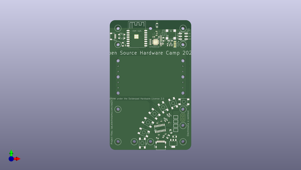

# oshcamp23_badge
 
## summary 
* id: electrolama_oshcamp23_badge_working
* user: electrolama
* name: oshcamp23_badge
* board: working
* repo: https://github.com/electrolama/oshcamp23-badge
* src_file_repo_kicad_pcb: oomp/version_current/working/working.kicad_pcb
* src_file_repo_kicad_pcb_link: https://github.com/electrolama/oshcamp23-badge/tree/main/oomp/version_current/working/working.kicad_pcb
* src_file_repo_kicad_sch: oomp/version_current/working/working.kicad_sch
* src_file_repo_kicad_sch_link: https://github.com/electrolama/oshcamp23-badge/tree/main/oomp/version_current/working/working.kicad_sch

* src_file_repo_sch: oomp/version_current/working/working.sch
*
 src_file_repo_sch_link: https://github.com/electrolama/oshcamp23-badge/tree/main/oomp/version_current/working/working.sch
* full details link: https://github.com/oomlout/oomlout_oomp_project_bot_v_2/tree/main/projects/electrolama_oshcamp23_badge_working/current_version/working  

## schematic  
  
[schematic (pdf)](working_schematic.pdf)  

## pcb  
 
  
  
  
[board (pdf)](working.pdf)  

## working_bom
| Id | Designator | Footprint | Quantity | Designation | Supplier and ref |  | None | 
| --- | --- | --- | --- | --- | --- | --- | --- | 
| 1 | @HOLE8,@HOLE4,@HOLE6,@HOLE2,@HOLE17,@HOLE10,@HOLE15,@HOLE13,@HOLE1,@HOLE14,@HOLE5,@HOLE9,@HOLE0,@HOLE3,@HOLE7,@HOLE16,@HOLE11,@HOLE12 |  | 18 |  |  |  | [''] | 
| 2 | R1 | _PKG_R_0603 | 1 | 220 |  |  | [''] | 
| 3 | C3,C10,C1,C2,C18 | _PKG_C_1206 | 5 | 47u |  |  | [''] | 
| 4 | SW4,SW3,SW1,SW7,SW6,SW2,SW5 | GENERIC_SPNO_4P_6X6MM | 7 |  |  |  | [''] | 
| 5 | C5,C19,C4,C6 | _PKG_C_0402 | 4 | 100n |  |  | [''] | 
| 6 | CON1 | USBC_C-31-M-12 | 1 |  |  |  | [''] | 
| 7 | SJ3,SJ4,SJ1,SJ2 | SJ-SHORT | 4 |  |  |  | [''] | 
| 8 | MOD1 | ESP-12S | 1 | ESP-12S |  |  | [''] | 
| 9 | R5,R4,R7,R9,R10,R6,R11,R8 | _PKG_R_0402 | 8 | 12k 1% |  |  | [''] | 
| 10 | D1 | _PKG_SOD123 | 1 |  |  |  | [''] | 
| 11 | ANT1 | YAGEO-ANT3216LL00R2400A | 1 | ANT3216LL00R2400A |  |  | [''] | 
| 12 | C7,C11 | _PKG_C_0402 | 2 | 8p |  |  | [''] | 
| 13 | LED1 | WS2812B | 1 | WS2812B5050 |  |  | [''] | 
| 14 | C17,C15,C20,C13,C16 | _PKG_C_0402_NOTHERMALS | 5 | 100n |  |  | [''] | 
| 15 | C14,C12 | _PKG_C_0402_NOTHERMALS | 2 | 4u7 |  |  | [''] | 
| 16 | Q1,Q2,Q3 | SOT96P237X111-3N | 3 | SS8050 |  |  | [''] | 
| 17 | C9,C8 | _PKG_C_0402_NOTHERMALS | 2 | TBD |  |  | [''] | 
| 18 | IC3 | QFN50P500X500X90-33N | 1 | WMCU-ESP8285H16 |  |  | [''] | 
| 19 | IC1 | _PKG_SOP16 | 1 |  |  |  | [''] | 
| 20 | P1 | MLT-8530 | 1 | Buzzer |  |  | [''] | 
| 21 | L1 | _PKG_L_0402 | 1 | TBD |  |  | [''] | 
| 22 | IC2 | _PKG_SOT223-4_TI-DCY4 | 1 | LD1117-3.3 |  |  | [''] | 
| 23 | J1 | 61030621121 | 1 |  61030621121  |  |  | [''] | 
| 24 | XT1 | XTAL-4P-2016 | 1 | 26MHz |  |  | [''] | 
| 25 | CON2 | JST_SH4 | 1 | STEMMA_I2C_QT |  |  | [''] | 
| 26 | R2,R3 | _PKG_R_0603 | 2 | 5k1 |  |  | [''] | 

## bom_schematic
no data

