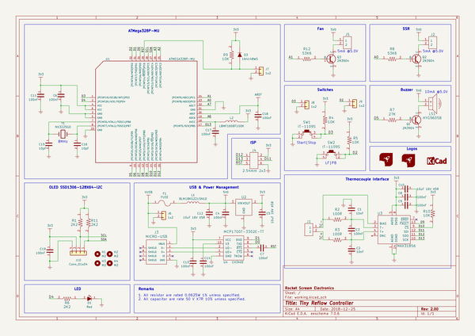
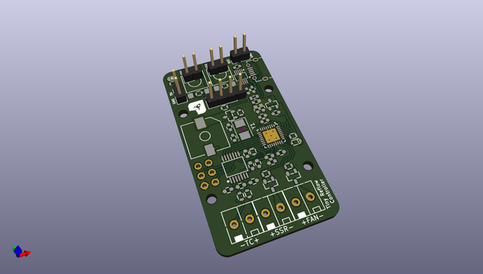
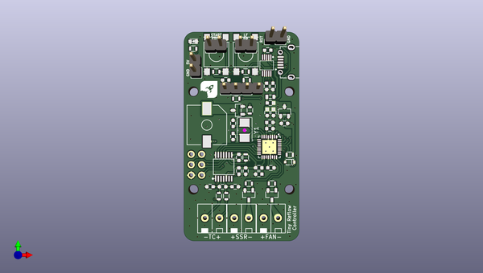
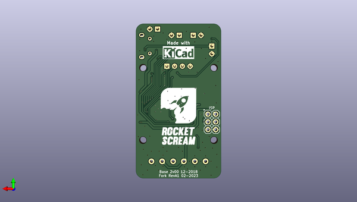

# tinyreflowcontroller
 
## summary 
* id: electrolama_tinyreflowcontroller_tiny_reflow_controller
* user: electrolama
* name: tinyreflowcontroller
* board: tiny_reflow_controller
* repo: https://github.com/electrolama/TinyReflowController
* src_file_repo_kicad_pcb: hardware/Revision A1/TINY-REFLOW-CONTROLLER.kicad_pcb
* src_file_repo_kicad_pcb_link: https://github.com/electrolama/TinyReflowController/tree/master/hardware/Revision A1/TINY-REFLOW-CONTROLLER.kicad_pcb
* src_file_repo_kicad_sch: hardware/Revision A1/TINY-REFLOW-CONTROLLER.kicad_sch
* src_file_repo_kicad_sch_link: https://github.com/electrolama/TinyReflowController/tree/master/hardware/Revision A1/TINY-REFLOW-CONTROLLER.kicad_sch

* src_file_repo_sch: 
*
 src_file_repo_sch_link: https://github.com/electrolama/TinyReflowController/tree/master/
* full details link: https://github.com/oomlout/oomlout_oomp_project_bot_v_2/tree/main/projects/electrolama_tinyreflowcontroller_tiny_reflow_controller/current_version/working  

## schematic  
  
[schematic (pdf)](working_schematic.pdf)  

## pcb  
 
  
  
  
[board (pdf)](working.pdf)  

## working_bom
| Id | Designator | Footprint | Quantity | Designation | Supplier and ref |  | None | 
| --- | --- | --- | --- | --- | --- | --- | --- | 
| 1 | U3 | TSSOP-14 | 1 | MAX31856 |  |  | [''] | 
| 2 | J2,J1,J5 | TB-1776275-2 | 3 | TERMINAL-BLOCK-1x2 |  |  | [''] | 
| 3 | Q2,Q1,Q3 | SOT-23 | 3 | 2N3904 |  |  | [''] | 
| 4 | R2,R3 | R_0603 | 2 | 100R |  |  | [''] | 
| 5 | R10,R9,R4,R5 | R_0603 | 4 | 10K |  |  | [''] | 
| 6 | R8,R12 | R_0603 | 2 | 53K6 |  |  | [''] | 
| 7 | R7 | R_0603 | 1 | 27K |  |  | [''] | 
| 8 | J3 | MICRO-USB | 1 | MICRO-USB |  |  | [''] | 
| 9 | LOGO1 | LOGO-ROCKET-SCREAM_Without_Text_XXXSmall | 1 | LOGO-ROCKET-SCREAM |  |  | [''] | 
| 10 | L1 | I_0603 | 1 | BLM18KG221SN1D |  |  | [''] | 
| 11 | SW2,SW1 | IT-1102W | 2 | IT-1109S |  |  | [''] | 
| 12 | LS1 | HYG9605B | 1 | HYG9605B |  |  | [''] | 
| 13 | C2,C1 | C_0603 | 2 | 10nF |  |  | [''] | 
| 14 | C9,C8,C7,C6,C4,C3,C13,C14,C18,C17,C11,C19 | C_0603 | 12 | 100nF |  |  | [''] | 
| 15 | C5,C12,C10 | C_0603 | 3 | 10uF 16V X5R |  |  | [''] | 
| 16 | D3 | SOD-323 | 1 | 1N4148WS |  |  | [''] | 
| 17 | R11,R1,R6 | R_0603 | 3 | 2K2 |  |  | [''] | 
| 18 | U1 | QFN-32_5x5mm_Pitch0.5mm | 1 | ATMEGA328P-MU |  |  | [''] | 
| 19 | U4 | MSOP-10 | 1 | CH340E |  |  | [''] | 
| 20 | F1 | MF-FSMF | 1 | FUSE |  |  | [''] | 
| 21 | L2 | I_0603 | 1 | LBMF1608T100K |  |  | [''] | 
| 22 | C16,C15 | C_0603 | 2 | 10pF |  |  | [''] | 
| 23 | D1 | LED_0603 | 1 | Red |  |  | [''] | 
| 24 | U2 | SOT-23 | 1 | MCP1700T-3302E-TT |  |  | [''] | 
| 25 | J9,J7,J8,J6 | PinHeader_1x02_P2.54mm_Vertical | 4 | 1x2 |  |  | [''] | 
| 26 | Y1 | Crystal_SMD_5032-2Pin_5.0x3.2mm | 1 | NX3225GD |  |  | [''] | 
| 27 | H1,H2,H4,H3 | MountingHole_2.2mm_M2 | 4 | M2 |  |  | [''] | 
| 28 | J10 | PinHeader_1x04_P2.54mm_Vertical | 1 | Conn_01x04 |  |  | [''] | 
| 29 | J4 | HDR_2x3_Pitch2.54mm | 1 | 2.54mm 2x3 |  |  | [''] | 
| 30 | LOGO2 | LOGO-KICAD_XSmall | 1 | LOGO-KICAD |  |  | [''] | 
| 31 | LOGO3 | LOGO-ROCKET-SCREAM_Vertical_Small | 1 | LOGO-ROCKET-SCREAM |  |  | [''] | 

## bom_schematic
| Ref | Qnty | Value | Cmp name | Footprint | Description | Vendor | DNP | 
| --- | --- | --- | --- | --- | --- | --- | --- | 
| C1, C2 | 2 | 10nF | CAPACITOR-CERAMIC-RocketScreamKiCadLib | RocketScreamKiCadLib:C_0603 |  |  |  | 
| C3, C4, C6, C7, C8, C9, C11, C13, C14, C17, C18, C19 | 12 | 100nF | CAPACITOR-CERAMIC-RocketScreamKiCadLib | RocketScreamKiCadLib:C_0603 |  |  |  | 
| C5, C10, C12 | 3 | 10uF 16V X5R | CAPACITOR-CERAMIC-RocketScreamKiCadLib | RocketScreamKiCadLib:C_0603 |  |  |  | 
| C15, C16 | 2 | 10pF | CAPACITOR-CERAMIC-RocketScreamKiCadLib | RocketScreamKiCadLib:C_0603 |  |  |  | 
| D1 | 1 | Red | LED-SINGLE-RocketScreamKiCadLib | RocketScreamKiCadLib:LED_0603 |  |  |  | 
| D3 | 1 | 1N4148WS | DIODE-RocketScreamKiCadLib | RocketScreamKiCadLib:SOD-323 |  |  |  | 
| F1 | 1 | FUSE | FUSE-RocketScreamKiCadLib | RocketScreamKiCadLib:MF-FSMF |  |  |  | 
| H1, H2, H3, H4 | 4 | M2 | MountingHole | MountingHole:MountingHole_2.2mm_M2 | Mounting Hole without connection |  |  | 
| J1, J2, J5 | 3 | TERMINAL-BLOCK-1x2 | TERMINAL-BLOCK-1x2-RocketScreamKiCadLib | RocketScreamKiCadLib:TB-1776275-2 |  |  |  | 
| J3 | 1 | MICRO-USB | MICRO-USB-RocketScreamKiCadLib | RocketScreamKiCadLib:MICRO-USB |  |  |  | 
| J4 | 1 | 2.54mm 2x3 | CONN-HDR-2x3-RocketScreamKiCadLib | RocketScreamKiCadLib:HDR_2x3_Pitch2.54mm |  |  |  | 
| J6, J7, J8, J9 | 4 | 1x2 | Conn_01x02 | Connector_PinHeader_2.54mm:PinHeader_1x02_P2.54mm_Vertical | Generic connector, single row, 01x02, script generated (kicad-library-utils/schlib/autogen/connector/) |  |  | 
| J10 | 1 | Conn_01x04 | Conn_01x04 | Connector_PinHeader_2.54mm:PinHeader_1x04_P2.54mm_Vertical | Generic connector, single row, 01x04, script generated (kicad-library-utils/schlib/autogen/connector/) |  |  | 
| L1 | 1 | BLM18KG221SN1D | INDUCTOR-RocketScreamKiCadLib | RocketScreamKiCadLib:I_0603 |  |  |  | 
| L2 | 1 | LBMF1608T100K | INDUCTOR-RocketScreamKiCadLib | RocketScreamKiCadLib:I_0603 |  |  |  | 
| LOGO1 | 1 | LOGO-ROCKET-SCREAM | LOGO-ROCKET-SCREAM-WITHOUT-TEXT-RocketScreamKiCadLib | RocketScreamKiCadLib:LOGO-ROCKET-SCREAM_Without_Text_XXXSmall |  |  |  | 
| LOGO2 | 1 | LOGO-KICAD | LOGO-KICAD-RocketScreamKiCadLib | RocketScreamKiCadLib:LOGO-KICAD_XSmall |  |  |  | 
| LOGO3 | 1 | LOGO-ROCKET-SCREAM | LOGO-ROCKET-SCREAM-WITHOUT-TEXT-RocketScreamKiCadLib | RocketScreamKiCadLib:LOGO-ROCKET-SCREAM_Vertical_Small |  |  |  | 
| LS1 | 1 | HYG9605B | BUZZER-RocketScreamKiCadLib | RocketScreamKiCadLib:HYG9605B |  |  |  | 
| Q1, Q2, Q3 | 3 | 2N3904 | BJT-NPN-RocketScreamKiCadLib | RocketScreamKiCadLib:SOT-23 |  |  |  | 
| R1, R6, R11 | 3 | 2K2 | RESISTOR-RocketScreamKiCadLib | RocketScreamKiCadLib:R_0603 |  |  |  | 
| R2, R3 | 2 | 100R | RESISTOR-RocketScreamKiCadLib | RocketScreamKiCadLib:R_0603 |  |  |  | 
| R4, R5, R9, R10 | 4 | 10K | RESISTOR-RocketScreamKiCadLib | RocketScreamKiCadLib:R_0603 |  |  |  | 
| R7 | 1 | 27K | RESISTOR-RocketScreamKiCadLib | RocketScreamKiCadLib:R_0603 |  |  |  | 
| R8, R12 | 2 | 53K6 | RESISTOR-RocketScreamKiCadLib | RocketScreamKiCadLib:R_0603 |  |  |  | 
| SW1, SW2 | 2 | IT-1109S | TACT-SWITCH_4Pins-RocketScreamKiCadLib | RocketScreamKiCadLib:IT-1102W |  |  |  | 
| U1 | 1 | ATMEGA328P-MU | ATMEGA328P-MU-RocketScreamKiCadLib | RocketScreamKiCadLib:QFN-32_5x5mm_Pitch0.5mm |  |  |  | 
| U2 | 1 | MCP1700T-3302E-TT | MCP1700T-XXX2E-TT-RocketScreamKiCadLib | RocketScreamKiCadLib:SOT-23 |  |  |  | 
| U3 | 1 | MAX31856 | MAX31856-RocketScreamKiCadLib | RocketScreamKiCadLib:TSSOP-14 |  |  |  | 
| U4 | 1 | CH340E | CH340E-RocketScreamKiCadLib | RocketScreamKiCadLib:MSOP-10 |  |  |  | 
| Y1 | 1 | NX3225GD | CRYSTAL-RocketScreamKiCadLib | Crystal:Crystal_SMD_5032-2Pin_5.0x3.2mm |  |  |  | 

