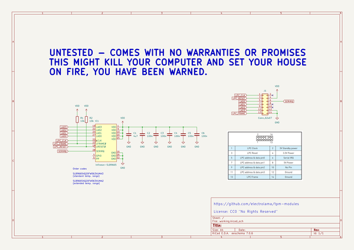
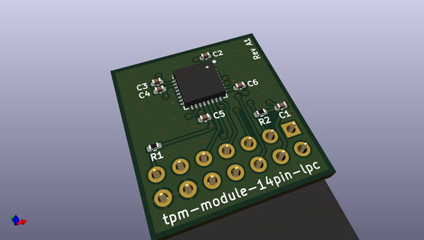
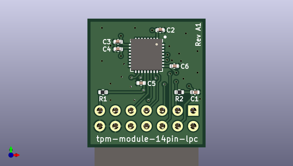
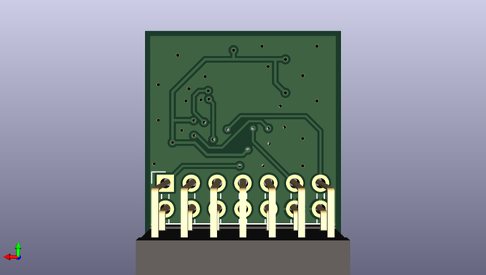

# tpm_modules
 
## summary 
* id: electrolama_tpm_modules_tpm_module_14pin_lpc_reva1
* user: electrolama
* name: tpm_modules
* board: tpm_module_14pin_lpc_reva1
* repo: https://github.com/electrolama/tpm-modules
* src_file_repo_kicad_pcb: tpm-module-14pin-lpc/Revision A1/tpm-module-14pin-lpc-RevA1.kicad_pcb
* src_file_repo_kicad_pcb_link: https://github.com/electrolama/tpm-modules/tree/main/tpm-module-14pin-lpc/Revision A1/tpm-module-14pin-lpc-RevA1.kicad_pcb
* src_file_repo_kicad_sch: tpm-module-14pin-lpc/Revision A1/tpm-module-14pin-lpc-RevA1.kicad_sch
* src_file_repo_kicad_sch_link: https://github.com/electrolama/tpm-modules/tree/main/tpm-module-14pin-lpc/Revision A1/tpm-module-14pin-lpc-RevA1.kicad_sch

* src_file_repo_sch: 
*
 src_file_repo_sch_link: https://github.com/electrolama/tpm-modules/tree/main/
* full details link: https://github.com/oomlout/oomlout_oomp_project_bot_v_2/tree/main/projects/electrolama_tpm_modules_tpm_module_14pin_lpc_reva1/current_version/working  

## schematic  
  
[schematic (pdf)](working_schematic.pdf)  

## pcb  
 
  
  
  
[board (pdf)](working.pdf)  

## working_bom
| Id | Designator | Footprint | Quantity | Designation | Supplier and ref |  | None | 
| --- | --- | --- | --- | --- | --- | --- | --- | 
| 1 | C5,C4,C2,C3,C6 | C_0402_1005Metric | 5 | 100n |  |  | [''] | 
| 2 | C1 | C_0402_1005Metric | 1 | 4u7 |  |  | [''] | 
| 3 | R2,R1 | R_0402_1005Metric | 2 | 10k |  |  | [''] | 
| 4 | IC1 | QFN-32-1EP_5x5mm_P0.5mm_EP3.1x3.1mm | 1 | Infineon-SLB9665 |  |  | [''] | 
| 5 | J1 | PinSocket_2x07_P2.54mm_Horizontal | 1 | Conn_02x07 |  |  | [''] | 

## bom_schematic
| Ref | Qnty | Value | Cmp name | Footprint | Description | Vendor | DNP | 
| --- | --- | --- | --- | --- | --- | --- | --- | 
| C1 | 1 | 4u7 | C | Capacitor_SMD:C_0402_1005Metric | Unpolarized capacitor |  |  | 
| C2, C3, C4, C5, C6 | 5 | 100n | C | Capacitor_SMD:C_0402_1005Metric | Unpolarized capacitor |  |  | 
| IC1 | 1 | Infineon-SLB9665 | Infineon-SLB9665 | Package_DFN_QFN:QFN-32-1EP_5x5mm_P0.5mm_EP3.1x3.1mm |  |  |  | 
| J1 | 1 | Conn_02x07 | Conn_02x07_Odd_Even | Connector_PinSocket_2.54mm:PinSocket_2x07_P2.54mm_Horizontal | Generic connector, double row, 02x07, odd/even pin numbering scheme (row 1 odd numbers, row 2 even numbers), script generated (kicad-library-utils/schlib/autogen/connector/) |  |  | 
| R1, R2 | 2 | 10k | R | Resistor_SMD:R_0402_1005Metric | Resistor |  |  | 

