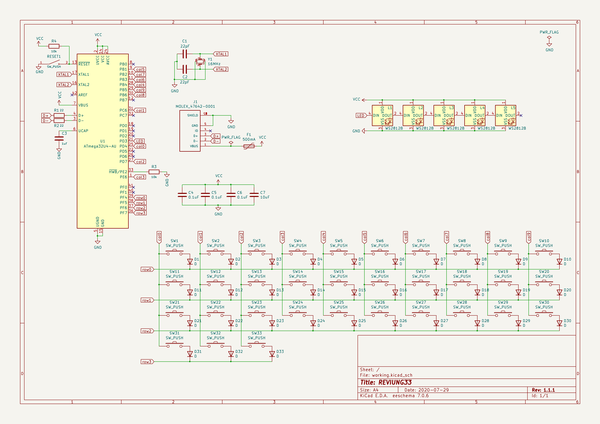
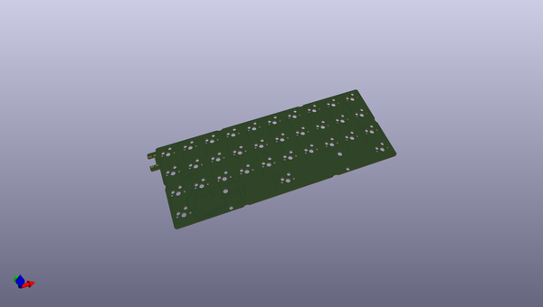
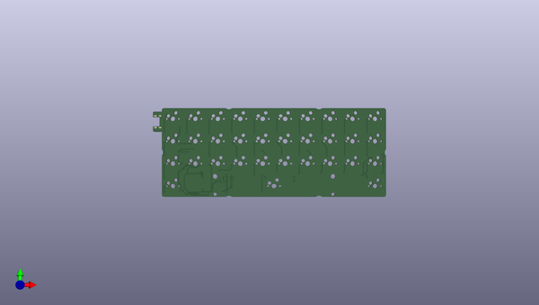
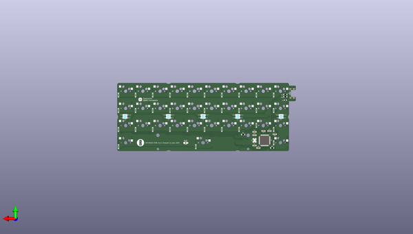

# reviung
 
## summary 
* id: gtips_reviung_reviung33
* user: gtips
* name: reviung
* board: reviung33
* repo: https://github.com/gtips/reviung
* src_file_repo_kicad_pcb: reviung33/pcb/reviung33.kicad_pcb
* src_file_repo_kicad_pcb_link: https://github.com/gtips/reviung/tree/master/reviung33/pcb/reviung33.kicad_pcb

* src_file_repo_sch: reviung33/pcb/reviung33.sch
*
 src_file_repo_sch_link: https://github.com/gtips/reviung/tree/master/reviung33/pcb/reviung33.sch
* full details link: https://github.com/oomlout/oomlout_oomp_project_bot_v_2/tree/main/projects/gtips_reviung_reviung33/current_version/working  

## schematic  
  
[schematic (pdf)](working_schematic.pdf)  

## pcb  
 
  
  
  
[board (pdf)](working.pdf)  

## working_bom
| Id | Designator | Footprint | Quantity | Designation | Supplier and ref |  | None | 
| --- | --- | --- | --- | --- | --- | --- | --- | 
| 1 | SW1,SW2,SW3,SW4,SW5,SW6,SW7,SW8,SW9,SW10,SW11,SW12,SW13,SW14,SW15,SW16,SW17,SW18,SW19,SW20,SW21,SW22,SW23,SW24,SW25,SW26,SW27,SW28,SW29,SW30,SW31,SW33 | MXOnly-1U-Hotswap | 32 | SW_PUSH |  |  | [''] | 
| 2 | SW32 | MXOnly-6.25U-Hotswap-ReversedStabilizers | 1 | SW_PUSH |  |  | [''] | 
| 3 | C6,C4,C5 | C_1206_3216Metric_Pad1.42x1.75mm_HandSolder | 3 | 0.1uF |  |  | [''] | 
| 4 | C7 | C_1206_3216Metric_Pad1.42x1.75mm_HandSolder | 1 | 10uF |  |  | [''] | 
| 5 | C3 | C_1206_3216Metric_Pad1.42x1.75mm_HandSolder | 1 | 1uF |  |  | [''] | 
| 6 | C1,C2 | C_1206_3216Metric_Pad1.42x1.75mm_HandSolder | 2 | 22pF |  |  | [''] | 
| 7 | D1,D2,D3,D4,D5,D6,D7,D8,D9,D10,D11,D12,D13,D14,D15,D16,D17,D18,D19,D20,D21,D22,D23,D24,D25,D26,D27,D28,D29,D30,D31,D32,D33 | D3_SMD_1side | 33 | D |  |  | [''] | 
| 8 | F1 | Fuse_0805_2012Metric_Pad1.15x1.40mm_HandSolder | 1 | 500mA |  |  | [''] | 
| 9 | R1,R2 | R_1206_3216Metric_Pad1.42x1.75mm_HandSolder | 2 | 22 |  |  | [''] | 
| 10 | R4,R3 | R_1206_3216Metric_Pad1.42x1.75mm_HandSolder | 2 | 10k |  |  | [''] | 
| 11 | L1,L2,L3,L4,L5 | LED_WS2812B_PLCC4_5.0x5.0mm_P3.2mm | 5 | WS2812B |  |  | [''] | 
| 12 | U1 | TQFP-44_10x10mm_P0.8mm | 1 | ATmega32U4-AU |  |  | [''] | 
| 13 | Y1 | Crystal_SMD_3225-4Pin_3.2x2.5mm_HandSoldering | 1 | 16MHz |  |  | [''] | 
| 14 | J1 | MOLEX_47642-0001_HandSoldering_cuts | 1 | MOLEX_47642-0001 |  |  | [''] | 
| 15 | G*** | QMK-x4-ver1 | 1 | LOGO |  |  | [''] | 
| 16 | G*** | R-x4-ver1 | 1 | LOGO |  |  | [''] | 
| 17 | RESET | SW_SPST_B3U-1000P | 1 | SW_PUSH |  |  | [''] | 

## bom_schematic
| Ref | Qnty | Value | Cmp name | Footprint | Description | Vendor | DNP | 
| --- | --- | --- | --- | --- | --- | --- | --- | 
| C1, C2 | 2 | 22pF | C | Capacitor_SMD:C_1206_3216Metric_Pad1.42x1.75mm_HandSolder | Unpolarized capacitor |  |  | 
| C3 | 1 | 1uF | C | Capacitor_SMD:C_1206_3216Metric_Pad1.42x1.75mm_HandSolder | Unpolarized capacitor |  |  | 
| C4, C5, C6 | 3 | 0.1uF | C | Capacitor_SMD:C_1206_3216Metric_Pad1.42x1.75mm_HandSolder | Unpolarized capacitor |  |  | 
| C7 | 1 | 10uF | C | Capacitor_SMD:C_1206_3216Metric_Pad1.42x1.75mm_HandSolder | Unpolarized capacitor |  |  | 
| D1, D2, D3, D4, D5, D6, D7, D8, D9, D10, D11, D12, D13, D14, D15, D16, D17, D18, D19, D20, D21, D22, D23, D24, D25, D26, D27, D28, D29, D30, D31, D32, D33 | 33 | D | D | _reviung-kbd:D3_SMD_1side | Diode |  |  | 
| F1 | 1 | 500mA | Polyfuse | Fuse:Fuse_0805_2012Metric_Pad1.15x1.40mm_HandSolder | Resettable fuse, polymeric positive temperature coefficient |  |  | 
| J1 | 1 | MOLEX_47642-0001 | MOLEX_47642-0001-_reviung-kbd | _reviung-kbd:MOLEX_47642-0001_HandSoldering_cuts |  |  |  | 
| L1, L2, L3, L4, L5 | 5 | WS2812B | WS2812B | _reviung-kbd:LED_WS2812B_PLCC4_5.0x5.0mm_P3.2mm | RGB LED with integrated controller |  |  | 
| R1, R2 | 2 | 22 | R | Resistor_SMD:R_1206_3216Metric_Pad1.42x1.75mm_HandSolder | Resistor |  |  | 
| R3, R4 | 2 | 10k | R | Resistor_SMD:R_1206_3216Metric_Pad1.42x1.75mm_HandSolder | Resistor |  |  | 
| RESET1 | 1 | SW_PUSH | B3U-1000P-_kbd_B3U-1000P | _reviung-kbd:SW_SPST_B3U-1000P |  |  |  | 
| SW1, SW2, SW3, SW4, SW5, SW6, SW7, SW8, SW9, SW10, SW11, SW12, SW13, SW14, SW15, SW16, SW17, SW18, SW19, SW20, SW21, SW22, SW23, SW24, SW25, SW26, SW27, SW28, SW29, SW30, SW31, SW33 | 32 | SW_PUSH | SW_PUSH-_reviung-kbd | _reviung-kbd:MXOnly-1U-Hotswap |  |  |  | 
| SW32 | 1 | SW_PUSH | SW_PUSH-_reviung-kbd | _reviung-kbd:MXOnly-6.25U-Hotswap-ReversedStabilizers |  |  |  | 
| U1 | 1 | ATmega32U4-AU | ATmega32U4-AU-MCU_Microchip_ATmega | Package_QFP:TQFP-44_10x10mm_P0.8mm |  |  |  | 
| Y1 | 1 | 16MHz | Crystal_GND24_Small | Crystal:Crystal_SMD_3225-4Pin_3.2x2.5mm_HandSoldering | Four pin crystal, GND on pins 2 and 4, small symbol |  |  | 

