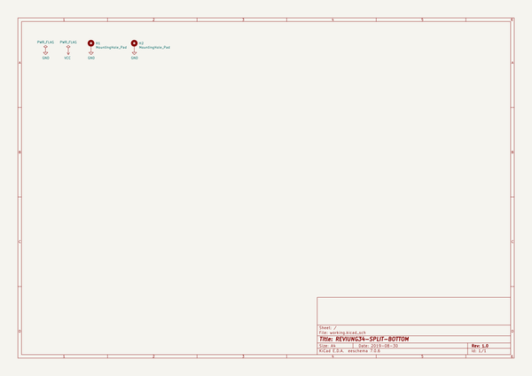
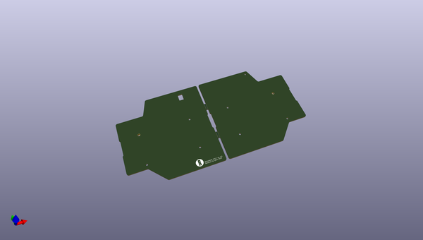
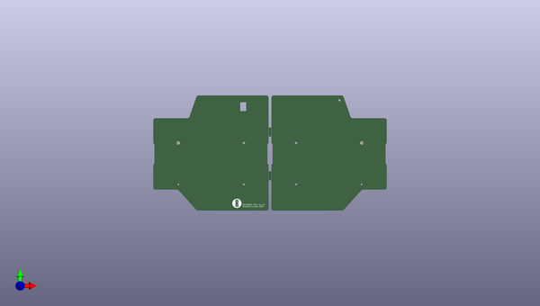
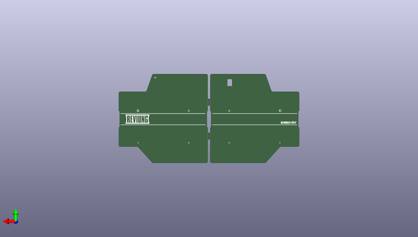

# reviung
 
## summary 
* id: gtips_reviung_reviung34_split_bottom
* user: gtips
* name: reviung
* board: reviung34_split_bottom
* repo: https://github.com/gtips/reviung
* src_file_repo_kicad_pcb: reviung34split_Mk-II/pcb/bottom-plate-pcb/reviung34-split-BOTTOM.kicad_pcb
* src_file_repo_kicad_pcb_link: https://github.com/gtips/reviung/tree/master/reviung34split_Mk-II/pcb/bottom-plate-pcb/reviung34-split-BOTTOM.kicad_pcb

* src_file_repo_sch: reviung34split_Mk-II/pcb/bottom-plate-pcb/reviung34-split-BOTTOM.sch
*
 src_file_repo_sch_link: https://github.com/gtips/reviung/tree/master/reviung34split_Mk-II/pcb/bottom-plate-pcb/reviung34-split-BOTTOM.sch
* full details link: https://github.com/oomlout/oomlout_oomp_project_bot_v_2/tree/main/projects/gtips_reviung_reviung34_split_bottom/current_version/working  

## schematic  
  
[schematic (pdf)](working_schematic.pdf)  

## pcb  
 
  
  
  
[board (pdf)](working.pdf)  

## working_bom
| Id | Designator | Footprint | Quantity | Designation | Supplier and ref |  | None | 
| --- | --- | --- | --- | --- | --- | --- | --- | 
| 1 | G*** | R-x4-ver1 | 1 | LOGO |  |  | [''] | 
| 2 | breakaway,breakaway,breakaway,breakaway | Stamp_Holes_7.5mm | 4 | Stamp_Holes_7.5mm |  |  | [''] | 
| 3 | G*** | REVIUNG34-split-BP-R-logo-ver2 | 1 | LOGO |  |  | [''] | 
| 4 | G*** | REVIUNG34-split-BP-L-logo-ver2 | 1 | LOGO |  |  | [''] | 

## bom_schematic
| Ref | Qnty | Value | Cmp name | Footprint | Description | Vendor | DNP | 
| --- | --- | --- | --- | --- | --- | --- | --- | 
| H1, H2 | 2 | MountingHole_Pad | MountingHole_Pad | MountingHole:MountingHole_2.2mm_M2_Pad | Mounting Hole with connection |  |  | 

