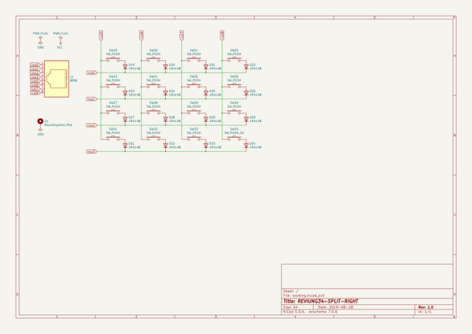
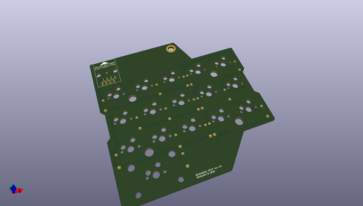
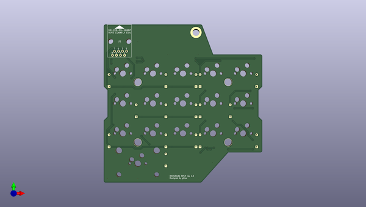
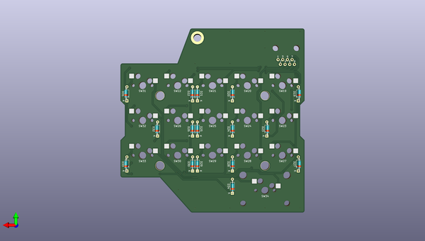

# reviung
 
## summary 
* id: gtips_reviung_reviung34_split_r
* user: gtips
* name: reviung
* board: reviung34_split_r
* repo: https://github.com/gtips/reviung
* src_file_repo_kicad_pcb: reviung34split/reviung34-split-R/reviung34-split-R.kicad_pcb
* src_file_repo_kicad_pcb_link: https://github.com/gtips/reviung/tree/master/reviung34split/reviung34-split-R/reviung34-split-R.kicad_pcb

* src_file_repo_sch: reviung34split/reviung34-split-R/reviung34-split-R.sch
*
 src_file_repo_sch_link: https://github.com/gtips/reviung/tree/master/reviung34split/reviung34-split-R/reviung34-split-R.sch
* full details link: https://github.com/oomlout/oomlout_oomp_project_bot_v_2/tree/main/projects/gtips_reviung_reviung34_split_r/current_version/working  

## schematic  
  
[schematic (pdf)](working_schematic.pdf)  

## pcb  
 
  
  
  
[board (pdf)](working.pdf)  

## working_bom
| Id | Designator | Footprint | Quantity | Designation | Supplier and ref |  | None | 
| --- | --- | --- | --- | --- | --- | --- | --- | 
| 1 | J1 | RJ45-DS1128-05-S8B8P | 1 | 8P8C |  |  | [''] | 
| 2 | SW19,SW20,SW21,SW22,SW23,SW24,SW25,SW26,SW27,SW28,SW29,SW30,SW31,SW32,SW33 | MXOnly-1U-Hotswap | 15 | SW_PUSH |  |  | [''] | 
| 3 | SW34 | MXOnly-2U-Hotswap-ReversedStabilizers | 1 | SW_PUSH_2U |  |  | [''] | 
| 4 | D19,D20,D21,D22,D23,D24,D25,D26,D27,D28,D29,D30,D31,D32,D33,D34 | D_DO-35_SOD27_P7.62mm_Horizontal | 16 | 1N4148 |  |  | [''] | 

## bom_schematic
| Ref | Qnty | Value | Cmp name | Footprint | Description | Vendor | DNP | 
| --- | --- | --- | --- | --- | --- | --- | --- | 
| D19, D20, D21, D22, D23, D24, D25, D26, D27, D28, D29, D30, D31, D32, D33, D34 | 16 | 1N4148 | 1N4148 | Diode_THT:D_DO-35_SOD27_P7.62mm_Horizontal | 100V 0.15A standard switching diode, DO-35 |  |  | 
| H1 | 1 | MountingHole_Pad | MountingHole_Pad | MountingHole:MountingHole_4.3mm_M4_ISO14580_Pad | Mounting Hole with connection |  |  | 
| J1 | 1 | 8P8C | 8P8C-_reviung-kbd | _reviung-kbd:RJ45-DS1128-05-S8B8P |  |  |  | 
| SW19, SW20, SW21, SW22, SW23, SW24, SW25, SW26, SW27, SW28, SW29, SW30, SW31, SW32, SW33 | 15 | SW_PUSH | SW_PUSH-_reviung-kbd | _reviung-kbd:MXOnly-1U-Hotswap |  |  |  | 
| SW34 | 1 | SW_PUSH_2U | SW_PUSH-_reviung-kbd | _reviung-kbd:MXOnly-2U-Hotswap-ReversedStabilizers |  |  |  | 

