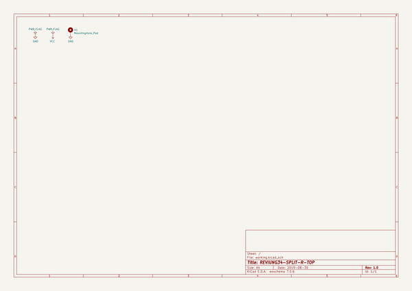

# reviung
 
## summary 
* id: gtips_reviung_reviung34_split_r_top
* user: gtips
* name: reviung
* board: reviung34_split_r_top
* repo: https://github.com/gtips/reviung
* src_file_repo_kicad_pcb: reviung34split/reviung34-split-R-TOP/reviung34-split-R-TOP.kicad_pcb
* src_file_repo_kicad_pcb_link: https://github.com/gtips/reviung/tree/master/reviung34split/reviung34-split-R-TOP/reviung34-split-R-TOP.kicad_pcb

* src_file_repo_sch: reviung34split/reviung34-split-R-TOP/reviung34-split-R-TOP.sch
*
 src_file_repo_sch_link: https://github.com/gtips/reviung/tree/master/reviung34split/reviung34-split-R-TOP/reviung34-split-R-TOP.sch
* full details link: https://github.com/oomlout/oomlout_oomp_project_bot_v_2/tree/main/projects/gtips_reviung_reviung34_split_r_top/current_version/working  

## schematic  
  
[schematic (pdf)](working_schematic.pdf)  

## pcb  
 
  
  
  
[board (pdf)](working.pdf)  

## working_bom
no data

## bom_schematic
| Ref | Qnty | Value | Cmp name | Footprint | Description | Vendor | DNP | 
| --- | --- | --- | --- | --- | --- | --- | --- | 
| H1 | 1 | MountingHole_Pad | MountingHole_Pad | MountingHole:MountingHole_2.2mm_M2_Pad | Mounting Hole with connection |  |  | 

