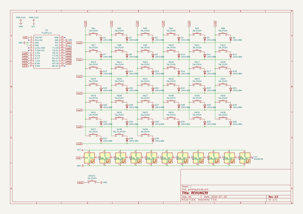
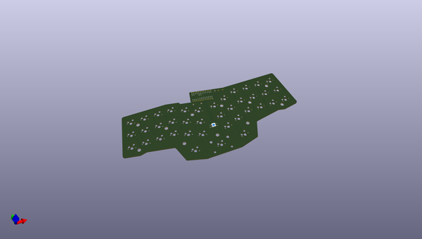
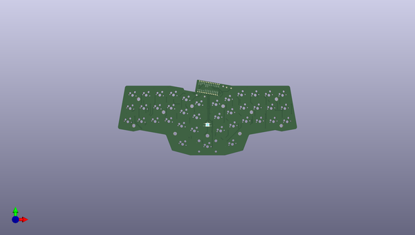
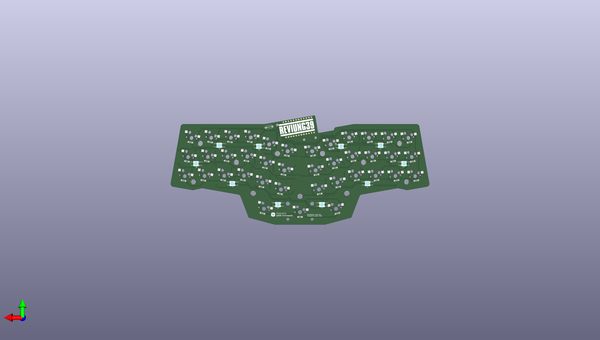

# reviung
 
## summary 
* id: gtips_reviung_reviung39
* user: gtips
* name: reviung
* board: reviung39
* repo: https://github.com/gtips/reviung
* src_file_repo_kicad_pcb: reviung39_Mk-II/pcb/reviung39.kicad_pcb
* src_file_repo_kicad_pcb_link: https://github.com/gtips/reviung/tree/master/reviung39_Mk-II/pcb/reviung39.kicad_pcb

* src_file_repo_sch: reviung39_Mk-II/pcb/reviung39.sch
*
 src_file_repo_sch_link: https://github.com/gtips/reviung/tree/master/reviung39_Mk-II/pcb/reviung39.sch
* full details link: https://github.com/oomlout/oomlout_oomp_project_bot_v_2/tree/main/projects/gtips_reviung_reviung39/current_version/working  

## schematic  
  
[schematic (pdf)](working_schematic.pdf)  

## pcb  
 
  
  
  
[board (pdf)](working.pdf)  

## working_bom
| Id | Designator | Footprint | Quantity | Designation | Supplier and ref |  | None | 
| --- | --- | --- | --- | --- | --- | --- | --- | 
| 1 | SW1,SW2,SW3,SW4,SW5,SW6,SW7,SW8,SW9,SW10,SW11,SW12,SW13,SW14,SW15,SW16,SW17,SW18,SW19,SW20,SW21,SW22,SW23,SW24,SW25,SW26,SW27,SW28,SW29,SW30,SW31,SW32,SW33,SW34,SW35,SW36,SW37,SW39 | MXOnly-1U-Hotswap | 38 | SW_PUSH |  |  | [''] | 
| 2 | U1 | ProMicro | 1 | ProMicro |  |  | [''] | 
| 3 | L11,L1,L2,L3,L4,L5,L6,L7,L8,L9,L10 | LED_WS2812B_PLCC4_5.0x5.0mm_P3.2mm | 11 | WS2812B |  |  | [''] | 
| 4 | SW38 | MXOnly-2U-Hotswap-ReversedStabilizers | 1 | SW_2U_PUSH |  |  | [''] | 
| 5 | D1,D2,D3,D4,D5,D6,D7,D8,D9,D10,D11,D12,D13,D14,D15,D16,D17,D18,D19,D20,D21,D22,D23,D24,D25,D26,D27,D28,D29,D30,D31,D32,D33,D34,D35,D36,D37,D38,D39 | D3_SMD_1side | 39 | 1N4148W |  |  | [''] | 
| 6 | RESET1 | ResetSW_1side | 1 | SW_PUSH |  |  | [''] | 
| 7 | G*** | QMK-x4-ver1 | 1 | LOGO |  |  | [''] | 
| 8 | G*** | REVIUNG39-B-logo | 1 | LOGO |  |  | [''] | 

## bom_schematic
| Ref | Qnty | Value | Cmp name | Footprint | Description | Vendor | DNP | 
| --- | --- | --- | --- | --- | --- | --- | --- | 
| D1, D2, D3, D4, D5, D6, D7, D8, D9, D10, D11, D12, D13, D14, D15, D16, D17, D18, D19, D20, D21, D22, D23, D24, D25, D26, D27, D28, D29, D30, D31, D32, D33, D34, D35, D36, D37, D38, D39 | 39 | 1N4148W | 1N4148W | _reviung-kbd:D3_SMD_1side | 75V 0.15A Fast Switching Diode, SOD-123 |  |  | 
| L1, L2, L3, L4, L5, L6, L7, L8, L9, L10, L11 | 11 | WS2812B | WS2812B | _reviung-kbd:LED_WS2812B_PLCC4_5.0x5.0mm_P3.2mm | RGB LED with integrated controller |  |  | 
| RESET1 | 1 | SW_PUSH | SW_PUSH-_reviung-kbd | _reviung-kbd:ResetSW_1side |  |  |  | 
| SW1, SW2, SW3, SW4, SW5, SW6, SW7, SW8, SW9, SW10, SW11, SW12, SW13, SW14, SW15, SW16, SW17, SW18, SW19, SW20, SW21, SW22, SW23, SW24, SW25, SW26, SW27, SW28, SW29, SW30, SW31, SW32, SW33, SW34, SW35, SW36, SW37, SW39 | 38 | SW_PUSH | SW_PUSH-_reviung-kbd | _reviung-kbd:MXOnly-1U-Hotswap |  |  |  | 
| SW38 | 1 | SW_2U_PUSH | SW_PUSH-_reviung-kbd | _reviung-kbd:MXOnly-2U-Hotswap-ReversedStabilizers |  |  |  | 
| U1 | 1 | ProMicro | ProMicro-_reviung-kbd | _reviung-kbd:ProMicro |  |  |  | 

