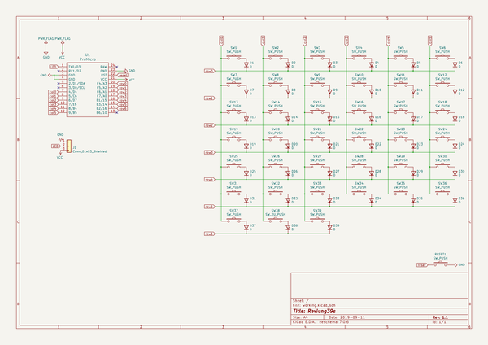

# reviung
 
## summary 
* id: gtips_reviung_reviung39s
* user: gtips
* name: reviung
* board: reviung39s
* repo: https://github.com/gtips/reviung
* src_file_repo_kicad_pcb: reviung39s/pcb/reviung39s.kicad_pcb
* src_file_repo_kicad_pcb_link: https://github.com/gtips/reviung/tree/master/reviung39s/pcb/reviung39s.kicad_pcb

* src_file_repo_sch: reviung39s/pcb/reviung39s.sch
*
 src_file_repo_sch_link: https://github.com/gtips/reviung/tree/master/reviung39s/pcb/reviung39s.sch
* full details link: https://github.com/oomlout/oomlout_oomp_project_bot_v_2/tree/main/projects/gtips_reviung_reviung39s/current_version/working  

## schematic  
  
[schematic (pdf)](working_schematic.pdf)  

## pcb  
 
  
  
  
[board (pdf)](working.pdf)  

## working_bom
| Id | Designator | Footprint | Quantity | Designation | Supplier and ref |  | None | 
| --- | --- | --- | --- | --- | --- | --- | --- | 
| 1 | U1 | ProMicro | 1 | ProMicro |  |  | [''] | 
| 2 | D1,D2,D3,D4,D5,D6,D7,D8,D9,D10,D11,D12,D13,D14,D15,D16,D17,D18,D19,D20,D21,D22,D23,D24,D25,D26,D27,D28,D29,D30,D31,D32,D33,D34,D35,D36,D37,D38,D39 | D3_TH | 39 | D |  |  | [''] | 
| 3 | SW1,SW2,SW3,SW4,SW5,SW6,SW7,SW8,SW9,SW10,SW11,SW12,SW13,SW14,SW15,SW16,SW17,SW18,SW19,SW20,SW21,SW22,SW23,SW24,SW25,SW26,SW27,SW28,SW29,SW30,SW31,SW32,SW33,SW34,SW35,SW36,SW37,SW39 | MXOnly-1U-NoLED | 38 | SW_PUSH |  |  | [''] | 
| 4 | SW38 | MXOnly-2.25U-ReversedStabilizers-NoLED | 1 | SW_2U_PUSH |  |  | [''] | 
| 5 | G*** | REVIUNG39s-FS-logo | 1 | LOGO |  |  | [''] | 
| 6 | RESET1 | ResetSW_1side | 1 | SW_PUSH |  |  | [''] | 
| 7 | J1 | StripLED_1side | 1 | Conn_01x03_Shielded |  |  | [''] | 
| 8 | G*** | REVIUNG39s-B-logo | 1 | LOGO |  |  | [''] | 

## bom_schematic
| Ref | Qnty | Value | Cmp name | Footprint | Description | Vendor | DNP | 
| --- | --- | --- | --- | --- | --- | --- | --- | 
| D1, D2, D3, D4, D5, D6, D7, D8, D9, D10, D11, D12, D13, D14, D15, D16, D17, D18, D19, D20, D21, D22, D23, D24, D25, D26, D27, D28, D29, D30, D31, D32, D33, D34, D35, D36, D37, D38, D39 | 39 | D | D | _reviung-kbd:D3_TH | Diode |  |  | 
| J1 | 1 | Conn_01x03_Shielded | Conn_01x03 | _reviung-kbd:StripLED_1side | Generic connector, single row, 01x03, script generated (kicad-library-utils/schlib/autogen/connector/) |  |  | 
| RESET1 | 1 | SW_PUSH | SW_PUSH-_reviung-kbd | _reviung-kbd:ResetSW_1side |  |  |  | 
| SW1, SW2, SW3, SW4, SW5, SW6, SW7, SW8, SW9, SW10, SW11, SW12, SW13, SW14, SW15, SW16, SW17, SW18, SW19, SW20, SW21, SW22, SW23, SW24, SW25, SW26, SW27, SW28, SW29, SW30, SW31, SW32, SW33, SW34, SW35, SW36, SW37, SW39 | 38 | SW_PUSH | SW_PUSH-_reviung-kbd | _reviung-kbd:MXOnly-1U-NoLED |  |  |  | 
| SW38 | 1 | SW_2U_PUSH | SW_PUSH-_reviung-kbd | _reviung-kbd:MXOnly-2.25U-ReversedStabilizers-NoLED |  |  |  | 
| U1 | 1 | ProMicro | ProMicro-_reviung-kbd | _reviung-kbd:ProMicro |  |  |  | 

