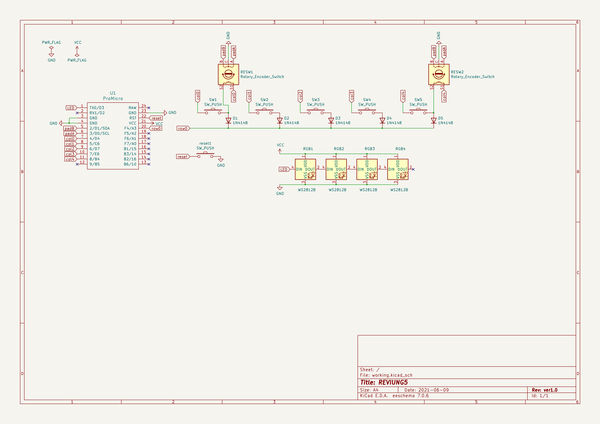
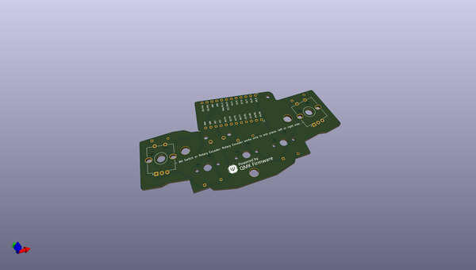
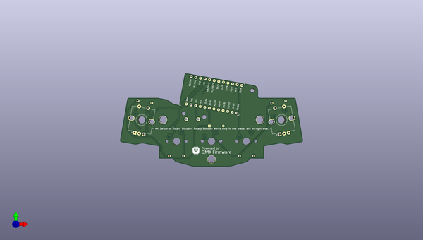
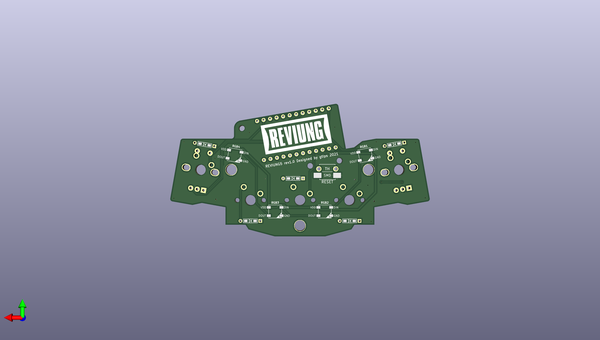

# reviung
 
## summary 
* id: gtips_reviung_reviung5
* user: gtips
* name: reviung
* board: reviung5
* repo: https://github.com/gtips/reviung
* src_file_repo_kicad_pcb: reviung5/pcb/ver1.0/reviung5.kicad_pcb
* src_file_repo_kicad_pcb_link: https://github.com/gtips/reviung/tree/master/reviung5/pcb/ver1.0/reviung5.kicad_pcb

* src_file_repo_sch: reviung5/pcb/ver1.0/reviung5.sch
*
 src_file_repo_sch_link: https://github.com/gtips/reviung/tree/master/reviung5/pcb/ver1.0/reviung5.sch
* full details link: https://github.com/oomlout/oomlout_oomp_project_bot_v_2/tree/main/projects/gtips_reviung_reviung5/current_version/working  

## schematic  
  
[schematic (pdf)](working_schematic.pdf)  

## pcb  
 
  
  
  
[board (pdf)](working.pdf)  

## working_bom
| Id | Designator | Footprint | Quantity | Designation | Supplier and ref |  | None | 
| --- | --- | --- | --- | --- | --- | --- | --- | 
| 1 | RESW1,RESW2 | RotaryEncoder_Alps_EC12E-Switch_Vertical_H20mm_CircularMountingHoles | 2 | Rotary_Encoder_Switch |  |  | [''] | 
| 2 | SW1,SW5 | MXOnly-1U-3pin | 2 | SW_PUSH |  |  | [''] | 
| 3 | SW2,SW3,SW4 | MXOnly-1U-NoLED | 3 | SW_PUSH |  |  | [''] | 
| 4 | U1 | ProMicro | 1 | ProMicro |  |  | [''] | 
| 5 | REF**,REF**,REF** | HOLE_4.2mm | 3 | HOLE_4.2mm |  |  | [''] | 
| 6 | G*** | QMK-x4-ver1 | 1 | LOGO |  |  | [''] | 
| 7 | D1,D2,D3,D4,D5 | D3_TH_SMD_1side | 5 | 1N4148 |  |  | [''] | 
| 8 | reset1 | ResetSW_TH_SMD | 1 | SW_PUSH |  |  | [''] | 
| 9 | RGB1,RGB2,RGB3,RGB4 | LED_WS2812B_PLCC4_5.0x5.0mm_P3.2mm | 4 | WS2812B |  |  | [''] | 
| 10 | G*** | reviung-logo | 1 | LOGO |  |  | [''] | 

## bom_schematic
| Ref | Qnty | Value | Cmp name | Footprint | Description | Vendor | DNP | 
| --- | --- | --- | --- | --- | --- | --- | --- | 
| D1, D2, D3, D4, D5 | 5 | 1N4148 | 1N4148 | _reviung-kbd:D3_TH_SMD_1side | 100V 0.15A standard switching diode, DO-35 |  |  | 
| reset1 | 1 | SW_PUSH | SW_PUSH-_reviung-kbd | _reviung-kbd:ResetSW_TH_SMD |  |  |  | 
| RESW1, RESW2 | 2 | Rotary_Encoder_Switch | Rotary_Encoder_Switch-Device | Rotary_Encoder:RotaryEncoder_Alps_EC12E-Switch_Vertical_H20mm_CircularMountingHoles |  |  |  | 
| RGB1, RGB2, RGB3, RGB4 | 4 | WS2812B | WS2812B | _reviung-kbd:LED_WS2812B_PLCC4_5.0x5.0mm_P3.2mm | RGB LED with integrated controller |  |  | 
| SW1, SW5 | 2 | SW_PUSH | SW_PUSH-_reviung-kbd | _reviung-kbd:MXOnly-1U-3pin |  |  |  | 
| SW2, SW3, SW4 | 3 | SW_PUSH | SW_PUSH-_reviung-kbd | _reviung-kbd:MXOnly-1U-NoLED |  |  |  | 
| U1 | 1 | ProMicro | ProMicro-_reviung-kbd | _reviung-kbd:ProMicro |  |  |  | 

## mounting_holes
| x | y | package | value | ref | size | 
| --- | --- | --- | --- | --- | --- | 
| 0.0 | 0.8599999999999994 | RotaryEncoder_Alps_EC12E-Switch_Vertical_H20mm_CircularMountingHoles | Rotary_Encoder_Switch | RESW1 | m3 | 
| 78.94 | 0.0 | RotaryEncoder_Alps_EC12E-Switch_Vertical_H20mm_CircularMountingHoles | Rotary_Encoder_Switch | RESW2 | m3 | 

