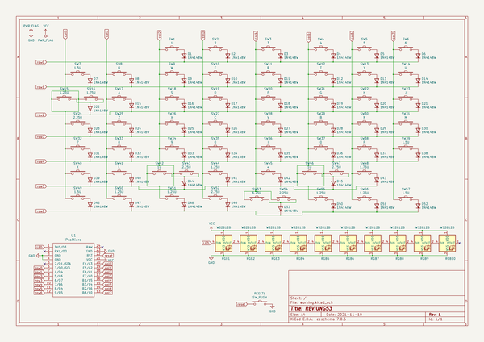
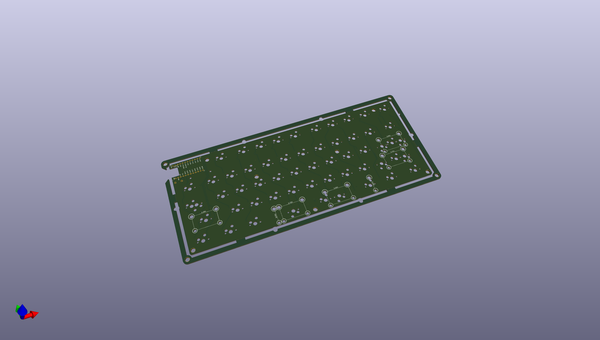
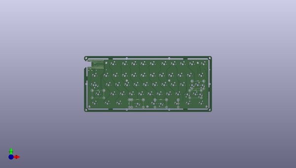
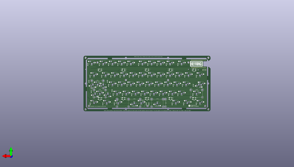

# reviung
 
## summary 
* id: gtips_reviung_reviung53
* user: gtips
* name: reviung
* board: reviung53
* repo: https://github.com/gtips/reviung
* src_file_repo_kicad_pcb: reviung53/pcb/main-pcb/reviung53-ver1.0/reviung53.kicad_pcb
* src_file_repo_kicad_pcb_link: https://github.com/gtips/reviung/tree/master/reviung53/pcb/main-pcb/reviung53-ver1.0/reviung53.kicad_pcb

* src_file_repo_sch: reviung53/pcb/main-pcb/reviung53-ver1.0/reviung53.sch
*
 src_file_repo_sch_link: https://github.com/gtips/reviung/tree/master/reviung53/pcb/main-pcb/reviung53-ver1.0/reviung53.sch
* full details link: https://github.com/oomlout/oomlout_oomp_project_bot_v_2/tree/main/projects/gtips_reviung_reviung53/current_version/working  

## schematic  
  
[schematic (pdf)](working_schematic.pdf)  

## pcb  
 
  
  
  
[board (pdf)](working.pdf)  

## working_bom
| Id | Designator | Footprint | Quantity | Designation | Supplier and ref |  | None | 
| --- | --- | --- | --- | --- | --- | --- | --- | 
| 1 | SW1 | MXOnly-1U-Hotswap | 1 | 1 |  |  | [''] | 
| 2 | SW2 | MXOnly-1U-Hotswap | 1 | 2 |  |  | [''] | 
| 3 | SW3 | MXOnly-1U-Hotswap | 1 | 3 |  |  | [''] | 
| 4 | SW4 | MXOnly-1U-Hotswap | 1 | 4 |  |  | [''] | 
| 5 | SW5 | MXOnly-1U-Hotswap | 1 | 5 |  |  | [''] | 
| 6 | SW6 | MXOnly-1U-Hotswap | 1 | 6 |  |  | [''] | 
| 7 | SW7,SW39,SW49,SW57 | MXOnly-1.5U-Hotswap | 4 | 1.5U |  |  | [''] | 
| 8 | SW8 | MXOnly-1U-Hotswap | 1 | Q |  |  | [''] | 
| 9 | SW9 | MXOnly-1U-Hotswap | 1 | W |  |  | [''] | 
| 10 | SW10 | MXOnly-1U-Hotswap | 1 | E |  |  | [''] | 
| 11 | SW11 | MXOnly-1U-Hotswap | 1 | R |  |  | [''] | 
| 12 | SW12 | MXOnly-1U-Hotswap | 1 | T |  |  | [''] | 
| 13 | SW13 | MXOnly-1U-Hotswap | 1 | Y |  |  | [''] | 
| 14 | SW14 | MXOnly-1U-Hotswap | 1 | U |  |  | [''] | 
| 15 | SW16,SW48 | MXOnly-1.75U-Hotswap | 2 | 1.75U |  |  | [''] | 
| 16 | SW17 | MXOnly-1U-Hotswap | 1 | A |  |  | [''] | 
| 17 | SW18 | MXOnly-1U-Hotswap | 1 | S |  |  | [''] | 
| 18 | SW19 | MXOnly-1U-Hotswap | 1 | D |  |  | [''] | 
| 19 | SW20 | MXOnly-1U-Hotswap | 1 | F |  |  | [''] | 
| 20 | SW21 | MXOnly-1U-Hotswap | 1 | G |  |  | [''] | 
| 21 | SW22 | MXOnly-1U-Hotswap | 1 | H |  |  | [''] | 
| 22 | SW23 | MXOnly-1U-Hotswap | 1 | J |  |  | [''] | 
| 23 | SW24,SW43 | MXOnly-2.25U-Hotswap-ReversedStabilizers | 2 | 2.25U |  |  | [''] | 
| 24 | SW25 | MXOnly-1U-Hotswap | 1 | Z |  |  | [''] | 
| 25 | SW26 | MXOnly-1U-Hotswap | 1 | X |  |  | [''] | 
| 26 | SW27 | MXOnly-1U-Hotswap | 1 | C |  |  | [''] | 
| 27 | SW28 | MXOnly-1U-Hotswap | 1 | V |  |  | [''] | 
| 28 | SW29 | MXOnly-1U-Hotswap | 1 | B |  |  | [''] | 
| 29 | SW30 | MXOnly-1U-Hotswap | 1 | N |  |  | [''] | 
| 30 | SW31 | MXOnly-1U-Hotswap | 1 | M |  |  | [''] | 
| 31 | SW32 | MXOnly-1U-Hotswap | 1 | 7 |  |  | [''] | 
| 32 | SW33 | MXOnly-1U-Hotswap | 1 | 8 |  |  | [''] | 
| 33 | SW34 | MXOnly-1U-Hotswap | 1 | 9 |  |  | [''] | 
| 34 | SW35,SW37 | MXOnly-1U-Hotswap | 2 | 0 |  |  | [''] | 
| 35 | SW36 | MXOnly-1U-Hotswap | 1 | I |  |  | [''] | 
| 36 | SW38 | MXOnly-1U-Hotswap | 1 | P |  |  | [''] | 
| 37 | SW40 | MXOnly-1U-Hotswap | 1 | K |  |  | [''] | 
| 38 | SW41 | MXOnly-1U-Hotswap | 1 | L |  |  | [''] | 
| 39 | SW42,SW46 | MXOnly-1U-Hotswap | 2 | 1U |  |  | [''] | 
| 40 | SW44,SW50,SW51,SW55,SW56,SW15 | MXOnly-1.25U-Hotswap | 6 | 1.25U |  |  | [''] | 
| 41 | SW53 | MXOnly-6.25U-Hotswap-ReversedStabilizers | 1 | 6.25U |  |  | [''] | 
| 42 | SW54 | MXOnly-2.25U-Hotswap | 1 | 2.25U |  |  | [''] | 
| 43 | U1 | ProMicro | 1 | ProMicro |  |  | [''] | 
| 44 | SW52 | MXOnly-2.75U-Hotswap | 1 | 2.75U |  |  | [''] | 
| 45 | SW45 | MXOnly-1U-Hotswap | 1 | < |  |  | [''] | 
| 46 | REF**,REF**,REF**,REF**,REF**,REF**,REF**,REF**,REF**,REF**,REF** | HOLE_4.2mm | 11 | HOLE_4.2mm |  |  | [''] | 
| 47 | breakaway,breakaway,breakaway,breakaway,breakaway,breakaway | Stamp_Holes_7.5mm | 6 | Stamp_Holes_7.5mm |  |  | [''] | 
| 48 | SW47 | MXOnly-2.75U-Hotswap-ReversedStabilizers | 1 | 2.75U |  |  | [''] | 
| 49 | D1,D2,D3,D4,D5,D6,D7,D8,D9,D10,D11,D12,D13,D14,D15,D16,D17,D18,D19,D20,D21,D22,D23,D24,D25,D26,D27,D28,D29,D30,D31,D32,D33,D34,D35,D36,D37,D38,D39,D40,D41,D42,D43,D44,D45,D46,D47,D48,D49,D50,D51,D52,D53 | D3_SMD_1side | 53 | 1N4148W |  |  | [''] | 
| 50 | RESET1 | ResetSW_1side | 1 | SW_PUSH |  |  | [''] | 
| 51 | RGB1,RGB2,RGB3,RGB4,RGB5,RGB6,RGB7,RGB8,RGB9,RGB10 | LED_WS2812B_PLCC4_5.0x5.0mm_P3.2mm_BigFoot | 10 | WS2812B |  |  | [''] | 
| 52 | G*** | reviung-logo | 1 | LOGO |  |  | [''] | 
| 53 | G*** | QMK-x4-ver1 | 1 | LOGO |  |  | [''] | 

## bom_schematic
| Ref | Qnty | Value | Cmp name | Footprint | Description | Vendor | DNP | 
| --- | --- | --- | --- | --- | --- | --- | --- | 
| D1, D2, D3, D4, D5, D6, D7, D8, D9, D10, D11, D12, D13, D14, D15, D16, D17, D18, D19, D20, D21, D22, D23, D24, D25, D26, D27, D28, D29, D30, D31, D32, D33, D34, D35, D36, D37, D38, D39, D40, D41, D42, D43, D44, D45, D46, D47, D48, D49, D50, D51, D52, D53 | 53 | 1N4148W | 1N4148W | _reviung-kbd:D3_SMD_1side | 75V 0.15A Fast Switching Diode, SOD-123 |  |  | 
| RESET1 | 1 | SW_PUSH | SW_PUSH-_reviung-kbd | _reviung-kbd:ResetSW_1side |  |  |  | 
| RGB1, RGB2, RGB3, RGB4, RGB5, RGB6, RGB7, RGB8, RGB9, RGB10 | 10 | WS2812B | WS2812B | _reviung-kbd:LED_WS2812B_PLCC4_5.0x5.0mm_P3.2mm_BigFoot | RGB LED with integrated controller |  |  | 
| SW1 | 1 | 1 | SW_PUSH-_reviung-kbd | _reviung-kbd:MXOnly-1U-Hotswap |  |  |  | 
| SW2 | 1 | 2 | SW_PUSH-_reviung-kbd | _reviung-kbd:MXOnly-1U-Hotswap |  |  |  | 
| SW3 | 1 | 3 | SW_PUSH-_reviung-kbd | _reviung-kbd:MXOnly-1U-Hotswap |  |  |  | 
| SW4 | 1 | 4 | SW_PUSH-_reviung-kbd | _reviung-kbd:MXOnly-1U-Hotswap |  |  |  | 
| SW5 | 1 | 5 | SW_PUSH-_reviung-kbd | _reviung-kbd:MXOnly-1U-Hotswap |  |  |  | 
| SW6 | 1 | 6 | SW_PUSH-_reviung-kbd | _reviung-kbd:MXOnly-1U-Hotswap |  |  |  | 
| SW7, SW39, SW49, SW57 | 4 | 1.5U | SW_PUSH-_reviung-kbd | _reviung-kbd:MXOnly-1.5U-Hotswap |  |  |  | 
| SW8 | 1 | Q | SW_PUSH-_reviung-kbd | _reviung-kbd:MXOnly-1U-Hotswap |  |  |  | 
| SW9 | 1 | W | SW_PUSH-_reviung-kbd | _reviung-kbd:MXOnly-1U-Hotswap |  |  |  | 
| SW10 | 1 | E | SW_PUSH-_reviung-kbd | _reviung-kbd:MXOnly-1U-Hotswap |  |  |  | 
| SW11 | 1 | R | SW_PUSH-_reviung-kbd | _reviung-kbd:MXOnly-1U-Hotswap |  |  |  | 
| SW12 | 1 | T | SW_PUSH-_reviung-kbd | _reviung-kbd:MXOnly-1U-Hotswap |  |  |  | 
| SW13 | 1 | Y | SW_PUSH-_reviung-kbd | _reviung-kbd:MXOnly-1U-Hotswap |  |  |  | 
| SW14 | 1 | U | SW_PUSH-_reviung-kbd | _reviung-kbd:MXOnly-1U-Hotswap |  |  |  | 
| SW15, SW44, SW50, SW51, SW55, SW56 | 6 | 1.25U | SW_PUSH-_reviung-kbd | _reviung-kbd:MXOnly-1.25U-Hotswap |  |  |  | 
| SW16, SW48 | 2 | 1.75U | SW_PUSH-_reviung-kbd | _reviung-kbd:MXOnly-1.75U-Hotswap |  |  |  | 
| SW17 | 1 | A | SW_PUSH-_reviung-kbd | _reviung-kbd:MXOnly-1U-Hotswap |  |  |  | 
| SW18 | 1 | S | SW_PUSH-_reviung-kbd | _reviung-kbd:MXOnly-1U-Hotswap |  |  |  | 
| SW19 | 1 | D | SW_PUSH-_reviung-kbd | _reviung-kbd:MXOnly-1U-Hotswap |  |  |  | 
| SW20 | 1 | F | SW_PUSH-_reviung-kbd | _reviung-kbd:MXOnly-1U-Hotswap |  |  |  | 
| SW21 | 1 | G | SW_PUSH-_reviung-kbd | _reviung-kbd:MXOnly-1U-Hotswap |  |  |  | 
| SW22 | 1 | H | SW_PUSH-_reviung-kbd | _reviung-kbd:MXOnly-1U-Hotswap |  |  |  | 
| SW23 | 1 | J | SW_PUSH-_reviung-kbd | _reviung-kbd:MXOnly-1U-Hotswap |  |  |  | 
| SW24, SW43 | 2 | 2.25U | SW_PUSH-_reviung-kbd | _reviung-kbd:MXOnly-2.25U-Hotswap-ReversedStabilizers |  |  |  | 
| SW25 | 1 | Z | SW_PUSH-_reviung-kbd | _reviung-kbd:MXOnly-1U-Hotswap |  |  |  | 
| SW26 | 1 | X | SW_PUSH-_reviung-kbd | _reviung-kbd:MXOnly-1U-Hotswap |  |  |  | 
| SW27 | 1 | C | SW_PUSH-_reviung-kbd | _reviung-kbd:MXOnly-1U-Hotswap |  |  |  | 
| SW28 | 1 | V | SW_PUSH-_reviung-kbd | _reviung-kbd:MXOnly-1U-Hotswap |  |  |  | 
| SW29 | 1 | B | SW_PUSH-_reviung-kbd | _reviung-kbd:MXOnly-1U-Hotswap |  |  |  | 
| SW30 | 1 | N | SW_PUSH-_reviung-kbd | _reviung-kbd:MXOnly-1U-Hotswap |  |  |  | 
| SW31 | 1 | M | SW_PUSH-_reviung-kbd | _reviung-kbd:MXOnly-1U-Hotswap |  |  |  | 
| SW32 | 1 | 7 | SW_PUSH-_reviung-kbd | _reviung-kbd:MXOnly-1U-Hotswap |  |  |  | 
| SW33 | 1 | 8 | SW_PUSH-_reviung-kbd | _reviung-kbd:MXOnly-1U-Hotswap |  |  |  | 
| SW34 | 1 | 9 | SW_PUSH-_reviung-kbd | _reviung-kbd:MXOnly-1U-Hotswap |  |  |  | 
| SW35, SW37 | 2 | 0 | SW_PUSH-_reviung-kbd | _reviung-kbd:MXOnly-1U-Hotswap |  |  |  | 
| SW36 | 1 | I | SW_PUSH-_reviung-kbd | _reviung-kbd:MXOnly-1U-Hotswap |  |  |  | 
| SW38 | 1 | P | SW_PUSH-_reviung-kbd | _reviung-kbd:MXOnly-1U-Hotswap |  |  |  | 
| SW40 | 1 | K | SW_PUSH-_reviung-kbd | _reviung-kbd:MXOnly-1U-Hotswap |  |  |  | 
| SW41 | 1 | L | SW_PUSH-_reviung-kbd | _reviung-kbd:MXOnly-1U-Hotswap |  |  |  | 
| SW42, SW46 | 2 | 1U | SW_PUSH-_reviung-kbd | _reviung-kbd:MXOnly-1U-Hotswap |  |  |  | 
| SW45 | 1 | < | SW_PUSH-_reviung-kbd | _reviung-kbd:MXOnly-1U-Hotswap |  |  |  | 
| SW47 | 1 | 2.75U | SW_PUSH-_reviung-kbd | _reviung-kbd:MXOnly-2.75U-Hotswap-ReversedStabilizers |  |  |  | 
| SW52 | 1 | 2.75U | SW_PUSH-_reviung-kbd | _reviung-kbd:MXOnly-2.75U-Hotswap |  |  |  | 
| SW53 | 1 | 6.25U | SW_PUSH-_reviung-kbd | _reviung-kbd:MXOnly-6.25U-Hotswap-ReversedStabilizers |  |  |  | 
| SW54 | 1 | 2.25U | SW_PUSH-_reviung-kbd | _reviung-kbd:MXOnly-2.25U-Hotswap |  |  |  | 
| U1 | 1 | ProMicro | ProMicro-_reviung-kbd | _reviung-kbd:ProMicro |  |  |  | 

