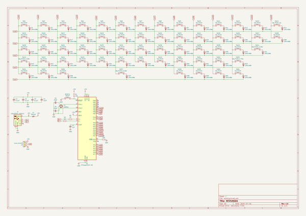
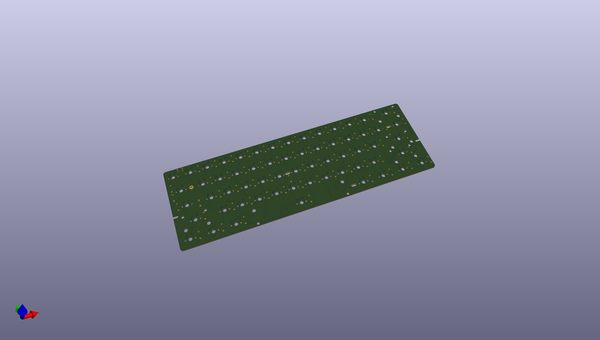
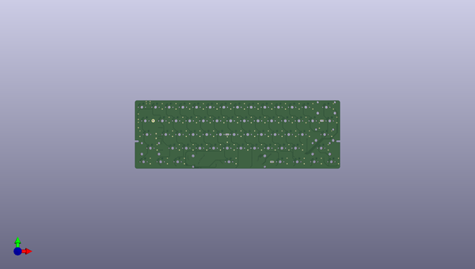
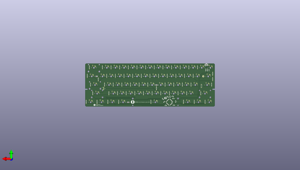

# reviung
 
## summary 
* id: gtips_reviung_reviung61
* user: gtips
* name: reviung
* board: reviung61
* repo: https://github.com/gtips/reviung
* src_file_repo_kicad_pcb: reviung61/pcb/reviung61.kicad_pcb
* src_file_repo_kicad_pcb_link: https://github.com/gtips/reviung/tree/master/reviung61/pcb/reviung61.kicad_pcb

* src_file_repo_sch: reviung61/pcb/reviung61.sch
*
 src_file_repo_sch_link: https://github.com/gtips/reviung/tree/master/reviung61/pcb/reviung61.sch
* full details link: https://github.com/oomlout/oomlout_oomp_project_bot_v_2/tree/main/projects/gtips_reviung_reviung61/current_version/working  

## schematic  
  
[schematic (pdf)](working_schematic.pdf)  

## pcb  
 
  
  
  
[board (pdf)](working.pdf)  

## working_bom
| Id | Designator | Footprint | Quantity | Designation | Supplier and ref |  | None | 
| --- | --- | --- | --- | --- | --- | --- | --- | 
| 1 | SW1,SW2,SW3,SW4,SW5,SW6,SW7,SW8,SW9,SW10,SW11,SW12,SW13,SW15,SW16,SW17,SW18,SW19,SW20,SW21,SW22,SW23,SW24,SW25,SW26,SW27,SW28,SW29,SW30,SW31,SW32,SW33,SW34,SW35,SW36,SW37,SW38,SW39,SW40,SW43,SW44,SW45,SW46,SW47,SW48,SW49,SW50,SW51,SW52,SW54,SW55,SW56,SW58,SW59,SW60,SW61 | MX-1U-NoLED | 56 | SW_PUSH |  |  | [''] | 
| 2 | SW14 | MX-2U-NoLED | 1 | SW_PUSH_2U |  |  | [''] | 
| 3 | SW41,SW42 | MX-2.25U-NoLED | 2 | SW_PUSH_2.25U |  |  | [''] | 
| 4 | SW53 | MX-2.75U-NoLED | 1 | SW_PUSH_2.75U |  |  | [''] | 
| 5 | SW57 | MX-6.25U-ReversedStabilizers-NoLED | 1 | SW_PUSH_6.25U |  |  | [''] | 
| 6 | H3,H4,H2 | HOLE_2.2mm_5.0mm | 3 | HOLE_2.2mm_5.0mm |  |  | [''] | 
| 7 | C1,C2,C3 | C_1206_3216Metric_Pad1.42x1.75mm_HandSolder | 3 | 0.1uF |  |  | [''] | 
| 8 | C4 | C_1206_3216Metric_Pad1.42x1.75mm_HandSolder | 1 | 10uF |  |  | [''] | 
| 9 | C5,C6 | C_1206_3216Metric_Pad1.42x1.75mm_HandSolder | 2 | 22pF |  |  | [''] | 
| 10 | C7 | C_1206_3216Metric_Pad1.42x1.75mm_HandSolder | 1 | 1uF |  |  | [''] | 
| 11 | F1 | Fuse_0805_2012Metric_Pad1.15x1.40mm_HandSolder | 1 | 500mA |  |  | [''] | 
| 12 | R1,R4 | R_1206_3216Metric_Pad1.42x1.75mm_HandSolder | 2 | 10k |  |  | [''] | 
| 13 | R2,R3 | R_1206_3216Metric_Pad1.42x1.75mm_HandSolder | 2 | 22 |  |  | [''] | 
| 14 | U1 | TQFP-44_10x10mm_P0.8mm | 1 | ATmega32U4-AU |  |  | [''] | 
| 15 | Y1 | Crystal_SMD_3225-4Pin_3.2x2.5mm_HandSoldering | 1 | 16MHz |  |  | [''] | 
| 16 | D1,D2,D3,D4,D5,D6,D7,D8,D9,D10,D11,D12,D13,D14,D15,D16,D17,D18,D19,D20,D21,D22,D23,D24,D25,D26,D27,D28,D29,D30,D31,D32,D33,D34,D35,D36,D37,D38,D39,D40,D41,D42,D43,D44,D45,D46,D47,D48,D49,D50,D51,D52,D53,D54,D55,D56,D57,D58,D59,D60,D61 | D3_TH_SMD_1side | 61 | 1N4148W |  |  | [''] | 
| 17 | J1 | USB_Micro-B_Amphenol_10103594-0001LF_Horizontal | 1 | 10103594-0001LF |  |  | [''] | 
| 18 | RESET1 | ResetSW_1side | 1 | RESET |  |  | [''] | 
| 19 | J2 | StripLED_1side | 1 | Conn_01x03 |  |  | [''] | 
| 20 | G*** | R-x4-ver1 | 1 | LOGO |  |  | [''] | 
| 21 | G*** | QMK-x4-ver1 | 1 | LOGO |  |  | [''] | 

## bom_schematic
| Ref | Qnty | Value | Cmp name | Footprint | Description | Vendor | DNP | 
| --- | --- | --- | --- | --- | --- | --- | --- | 
| C1, C2, C3 | 3 | 0.1uF | C_Small | Capacitor_SMD:C_1206_3216Metric_Pad1.42x1.75mm_HandSolder | Unpolarized capacitor, small symbol |  |  | 
| C4 | 1 | 10uF | C_Small | Capacitor_SMD:C_1206_3216Metric_Pad1.42x1.75mm_HandSolder | Unpolarized capacitor, small symbol |  |  | 
| C5, C6 | 2 | 22pF | C_Small | Capacitor_SMD:C_1206_3216Metric_Pad1.42x1.75mm_HandSolder | Unpolarized capacitor, small symbol |  |  | 
| C7 | 1 | 1uF | C_Small | Capacitor_SMD:C_1206_3216Metric_Pad1.42x1.75mm_HandSolder | Unpolarized capacitor, small symbol |  |  | 
| D1, D2, D3, D4, D5, D6, D7, D8, D9, D10, D11, D12, D13, D14, D15, D16, D17, D18, D19, D20, D21, D22, D23, D24, D25, D26, D27, D28, D29, D30, D31, D32, D33, D34, D35, D36, D37, D38, D39, D40, D41, D42, D43, D44, D45, D46, D47, D48, D49, D50, D51, D52, D53, D54, D55, D56, D57, D58, D59, D60, D61 | 61 | 1N4148W | 1N4148W | _reviung-kbd:D3_TH_SMD_1side | 75V 0.15A Fast Switching Diode, SOD-123 |  |  | 
| F1 | 1 | 500mA | Polyfuse_Small | Fuse:Fuse_0805_2012Metric_Pad1.15x1.40mm_HandSolder | Resettable fuse, polymeric positive temperature coefficient, small symbol |  |  | 
| J1 | 1 | 10103594-0001LF | USB_B_Micro-Connector | Connector_USB:USB_Micro-B_Amphenol_10103594-0001LF_Horizontal |  |  |  | 
| J2 | 1 | Conn_01x03 | Conn_01x03 | _reviung-kbd:StripLED_1side | Generic connector, single row, 01x03, script generated (kicad-library-utils/schlib/autogen/connector/) |  |  | 
| R1, R4 | 2 | 10k | R_Small | Resistor_SMD:R_1206_3216Metric_Pad1.42x1.75mm_HandSolder | Resistor, small symbol |  |  | 
| R2, R3 | 2 | 22 | R_Small | Resistor_SMD:R_1206_3216Metric_Pad1.42x1.75mm_HandSolder | Resistor, small symbol |  |  | 
| RESET1 | 1 | RESET | SW_PUSH-_reviung-kbd | _reviung-kbd:ResetSW_1side |  |  |  | 
| SW1, SW2, SW3, SW4, SW5, SW6, SW7, SW8, SW9, SW10, SW11, SW12, SW13, SW15, SW16, SW17, SW18, SW19, SW20, SW21, SW22, SW23, SW24, SW25, SW26, SW27, SW28, SW29, SW30, SW31, SW32, SW33, SW34, SW35, SW36, SW37, SW38, SW39, SW40, SW43, SW44, SW45, SW46, SW47, SW48, SW49, SW50, SW51, SW52, SW54, SW55, SW56, SW58, SW59, SW60, SW61 | 56 | SW_PUSH | SW_PUSH-_reviung-kbd | _MX_Alps_Hybrid:MX-1U-NoLED |  |  |  | 
| SW14 | 1 | SW_PUSH_2U | SW_PUSH-_reviung-kbd | _MX_Alps_Hybrid:MX-2U-NoLED |  |  |  | 
| SW41, SW42 | 2 | SW_PUSH_2.25U | SW_PUSH-_reviung-kbd | _MX_Alps_Hybrid:MX-2.25U-NoLED |  |  |  | 
| SW53 | 1 | SW_PUSH_2.75U | SW_PUSH-_reviung-kbd | _MX_Alps_Hybrid:MX-2.75U-NoLED |  |  |  | 
| SW57 | 1 | SW_PUSH_6.25U | SW_PUSH-_reviung-kbd | _MX_Alps_Hybrid:MX-6.25U-ReversedStabilizers-NoLED |  |  |  | 
| U1 | 1 | ATmega32U4-AU | ATmega32U4-AU-MCU_Microchip_ATmega | Package_QFP:TQFP-44_10x10mm_P0.8mm |  |  |  | 
| Y1 | 1 | 16MHz | Crystal_GND24_Small | Crystal:Crystal_SMD_3225-4Pin_3.2x2.5mm_HandSoldering | Four pin crystal, GND on pins 2 and 4, small symbol |  |  | 

