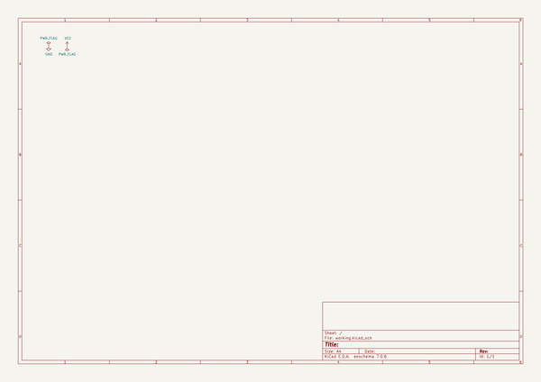
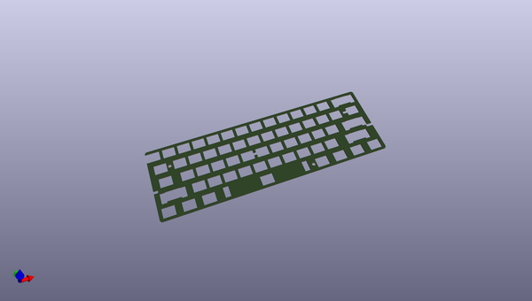
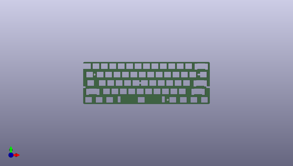
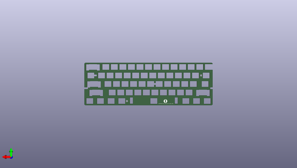

# reviung
 
## summary 
* id: gtips_reviung_reviung61_top_plate
* user: gtips
* name: reviung
* board: reviung61_top_plate
* repo: https://github.com/gtips/reviung
* src_file_repo_kicad_pcb: reviung61/pcb-top-plate-ALPS/reviung61-top-plate.kicad_pcb
* src_file_repo_kicad_pcb_link: https://github.com/gtips/reviung/tree/master/reviung61/pcb-top-plate-ALPS/reviung61-top-plate.kicad_pcb

* src_file_repo_sch: reviung61/pcb-top-plate-ALPS/reviung61-top-plate.sch
*
 src_file_repo_sch_link: https://github.com/gtips/reviung/tree/master/reviung61/pcb-top-plate-ALPS/reviung61-top-plate.sch
* full details link: https://github.com/oomlout/oomlout_oomp_project_bot_v_2/tree/main/projects/gtips_reviung_reviung61_top_plate/current_version/working  

## schematic  
  
[schematic (pdf)](working_schematic.pdf)  

## pcb  
 
  
  
  
[board (pdf)](working.pdf)  

## working_bom
| Id | Designator | Footprint | Quantity | Designation | Supplier and ref |  | None | 
| --- | --- | --- | --- | --- | --- | --- | --- | 
| 1 | Ref** | HOLE_4.2mm | 1 | Val** |  |  | [''] | 
| 2 | H1 | HOLE_4.2mm | 1 | MountingHole |  |  | [''] | 
| 3 | G*** | R-x4-ver1 | 1 | LOGO |  |  | [''] | 

## bom_schematic
no data

