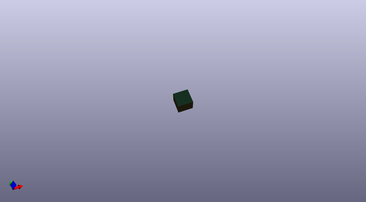
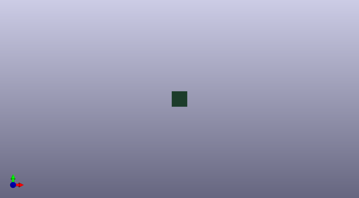
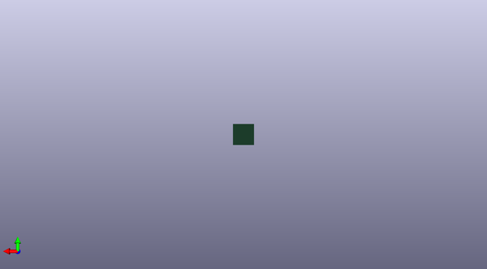

# ok_kicad_libs
 
## summary 
* id: omerk_ok_kicad_libs_ok_project
* user: omerk
* name: ok_kicad_libs
* board: ok_project
* repo: https://github.com/omerk/ok-kicad-libs
* src_file_repo_kicad_pcb: templates/ok_project/ok_project.kicad_pcb
* src_file_repo_kicad_pcb_link: https://github.com/omerk/ok-kicad-libs/tree/main/templates/ok_project/ok_project.kicad_pcb
* src_file_repo_kicad_sch: templates/ok_project/ok_project.kicad_sch
* src_file_repo_kicad_sch_link: https://github.com/omerk/ok-kicad-libs/tree/main/templates/ok_project/ok_project.kicad_sch

* src_file_repo_sch: 
*
 src_file_repo_sch_link: https://github.com/omerk/ok-kicad-libs/tree/main/
* full details link: https://github.com/oomlout/oomlout_oomp_project_bot_v_2/tree/main/projects/omerk_ok_kicad_libs_ok_project/current_version/working  

## schematic  
  
[schematic (pdf)](working_schematic.pdf)  

## pcb  
 
  
  
  
[board (pdf)](working.pdf)  

## bom_schematic
no data

