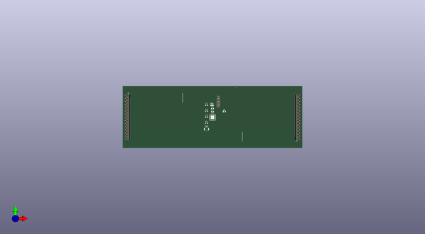

# dadb
 
## summary 
* id: oomlout_dadb_dadb_0001
* user: oomlout
* name: dadb
* board: dadb_0001
* repo: https://github.com/oomlout/DADB
* src_file_repo_kicad_pcb: working/DADB_0001/DADB_0001.kicad_pcb
* src_file_repo_kicad_pcb_link: https://github.com/oomlout/DADB/tree/main/working/DADB_0001/DADB_0001.kicad_pcb
* src_file_repo_kicad_sch: working/DADB_0001/DADB_0001.kicad_sch
* src_file_repo_kicad_sch_link: https://github.com/oomlout/DADB/tree/main/working/DADB_0001/DADB_0001.kicad_sch

* src_file_repo_sch: 
*
 src_file_repo_sch_link: https://github.com/oomlout/DADB/tree/main/
* full details link: https://github.com/oomlout/oomlout_oomp_project_bot_v_2/tree/main/projects/oomlout_dadb_dadb_0001/current_version/working  

## schematic  
  
[schematic (pdf)](working_schematic.pdf)  

## pcb  
 
  
  
  
[board (pdf)](working.pdf)  

## working_bom
| Id | Designator | Footprint | Quantity | Designation | Supplier and ref |  | None | 
| --- | --- | --- | --- | --- | --- | --- | --- | 
| 1 | C1 | C_0603_1608Metric | 1 | 100nF |  |  | [''] | 
| 2 | U1,U1,U4,U1 | MODULE-CONN-DADB-PI16-01 | 4 | MODULE-CONN-DADB-PI16-01 |  |  | [''] | 
| 3 | C4,C3 | C_0603_1608Metric | 2 | 1uF |  |  | [''] | 
| 4 | R2,R3,R4,R1 | R_0603_1608Metric | 4 | 1k |  |  | [''] | 
| 5 | D1 | LED_0603_1608Metric | 1 | GREEN |  |  | [''] | 
| 6 | U2 | MODULE-CONN-DADB-PI02-01 | 1 | MODULE-CONN-DADB-PI02-01 |  |  | [''] | 
| 7 | SW1 | SW_SPST_B3U-1000P | 1 | SW_Push |  |  | [''] | 
| 8 | C2 | C_0603_1608Metric | 1 | 4.7uF |  |  | [''] | 
| 9 | J1,J1 | PinHeader_1x15_P2.54mm_Vertical | 2 | Conn_01x15 |  |  | [''] | 
| 10 | U3 | QFN-32-1EP_5x5mm_P0.5mm_EP3.1x3.1mm | 1 | ATmega328P-M |  |  | [''] | 
| 11 | Y1 | PinHeader_1x03_P2.54mm_Vertical | 1 | Crystal_GND2 |  |  | [''] | 

## bom_schematic
no data

