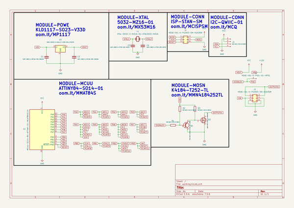
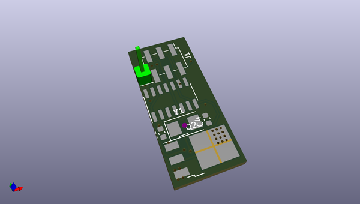
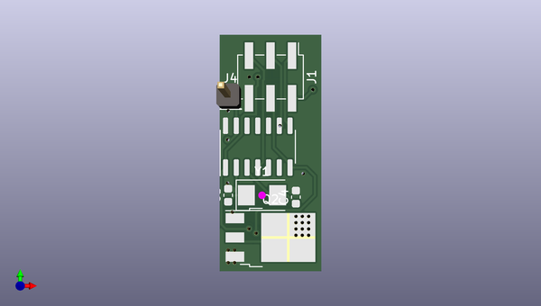
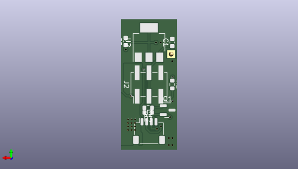

# dlsb_driverboard_v1
 
## summary 
* id: oomlout_dlsb_driverboard_v1_dlsb_driverboard_v1
* user: oomlout
* name: dlsb_driverboard_v1
* board: dlsb_driverboard_v1
* repo: https://github.com/oomlout/DLSB-DRIVERBOARD-V1
* src_file_repo_kicad_pcb: DLSB-DRIVERBOARD-V1.kicad_pcb
* src_file_repo_kicad_pcb_link: https://github.com/oomlout/DLSB-DRIVERBOARD-V1/tree/main/DLSB-DRIVERBOARD-V1.kicad_pcb
* src_file_repo_kicad_sch: DLSB-DRIVERBOARD-V1.kicad_sch
* src_file_repo_kicad_sch_link: https://github.com/oomlout/DLSB-DRIVERBOARD-V1/tree/main/DLSB-DRIVERBOARD-V1.kicad_sch

* src_file_repo_sch: 
*
 src_file_repo_sch_link: https://github.com/oomlout/DLSB-DRIVERBOARD-V1/tree/main/
* full details link: https://github.com/oomlout/oomlout_oomp_project_bot_v_2/tree/main/projects/oomlout_dlsb_driverboard_v1_dlsb_driverboard_v1/current_version/working  

## schematic  
  
[schematic (pdf)](working_schematic.pdf)  

## pcb  
 
  
  
  
[board (pdf)](working.pdf)  

## working_bom
| Id | Designator | Footprint | Quantity | Designation | Supplier and ref |  | None | 
| --- | --- | --- | --- | --- | --- | --- | --- | 
| 1 | C4,C3 | CAPC-0603-X-PF20-V50-C6P20 | 2 | CAPC-0603-X-PF20-V50-C6P20 |  |  | [''] | 
| 2 | J4 | HEAD-I01-X-PI01-01-HP01 | 1 | HEAD-I01-X-PI01-01-HP01 |  |  | [''] | 
| 3 | J1,J2 | HEAD-I01-X-PI2X03-SM-H2X3SM | 2 | HEAD-I01-X-PI2X03-SM-H2X3SM |  |  | [''] | 
| 4 | U1 | MCUU-SC14-84-ATTINY-01-MCAT84SC14 | 1 | MCUU-SC14-84-ATTINY-01-MCAT84SC14 |  |  | [''] | 
| 5 | Q2 | MOSN-T252-X-K4184-01-MN2524184A | 1 | MOSN-T252-X-K4184-01-MN2524184A |  |  | [''] | 
| 6 | Y1 | XTAL-5032-X-MZ16-01-XTAL5032-MZ16 | 1 | XTAL-5032-X-MZ16-01-XTAL5032-MZ16 |  |  | [''] | 
| 7 | C2,C1 | CAPC-0603-X-NF100-V50-C6N100 | 2 | CAPC-0603-X-NF100-V50-C6N100 |  |  | [''] | 
| 8 | R1 | RESE-0603-X-O271-01-R6O271 | 1 | RESE-0603-X-O271-01-R6O271 |  |  | [''] | 
| 9 | J3 | HEAD-JSTSH-X-PI04-RS-HSH04RS | 1 | HEAD-JSTSH-X-PI04-RS-HSH04RS |  |  | [''] | 
| 10 | R3,R2 | RESE-0603-X-O103-01-R6O1301 | 2 | RESE-0603-X-O103-01-R6O1301 |  |  | [''] | 
| 11 | Q1 | TRNN-SO23-X-KS8050-01-TRNN-SO23-KS8050 | 1 | TRNN-SO23-X-KS8050-01-TRNN-SO23-KS8050 |  |  | [''] | 
| 12 | U2 | VREG-SO223-X-KLD1117-V33D-VR111722333 | 1 | VREG-SO223-X-KLD1117-V33D-VR111722333 |  |  | [''] | 

## bom_schematic
| Ref | Qnty | Value | Cmp name | Footprint | Description | Vendor | DNP | 
| --- | --- | --- | --- | --- | --- | --- | --- | 
| C1, C2 | 2 | CAPC-0603-X-NF100-V50-C6N100 | CAPC-0603-X-NF100-V50-C6N100_1 | oomlout_OOMP_parts:CAPC-0603-X-NF100-V50-C6N100 | oompID: CAPC-0603-X-NF100-V50;name: SMD (0603) 100 nF Capacitor (Ceramic) 50v;hexID: C6N100;{'code': 'C-JLCC', 'name': 'JLC Parts Library', 'partID': 'C14663', 'partName': '50V 100nF X7R ??10% 0603  Multilayer Ceramic Capacitors MLCC - SMD/SMT ROHS'}{'dpnKey': 'DPN-C-LCSC-C1591', 'DISTRIBUTOR': 'LCSC', 'DISTRCODE': 'C-LCSC', 'DPN': 'C1591', 'MPN': 'MPN-C-SAMSUN-CL10B104KB8NNNC', 'TAGS': ['STOCK:1000K'], 'LINK': 'https://www.lcsc.com/product-detail/C1591.html', 'OOMPID': 'CAPC-0603-X-NF100-V50'}{'dpnKey': 'DPN-C-LCSC-C1688', 'DISTRIBUTOR': 'LCSC', 'DISTRCODE': 'C-LCSC', 'DPN': 'C1688', 'MPN': 'MPN-C-SAMSUN-CL10F104ZB8NNNC', 'TAGS': [], 'LINK': 'https://www.lcsc.com/product-detail/C1688.html', 'OOMPID': 'CAPC-0603-X-NF100-V50'}{'dpnKey': 'DPN-C-LCSC-C14663', 'DISTRIBUTOR': 'LCSC', 'DISTRCODE': 'C-LCSC', 'DPN': 'C14663', 'MPN': 'MPN-C-YAGEO-CC0603KRX7R9BB104', 'TAGS': ['STOCK:1000K'], 'LINK': 'https://www.lcsc.com/product-detail/C14663.html', 'OOMPID': 'CAPC-0603-X-NF100-V50'}{'MPNKEY': 'MPN-C-SAMSUN-CL10B104KB8NNNC', 'MANUFACTURER': 'Samsung Electro-Mechanics', 'MANUCODE': 'C-SAMSUN', 'MPN': 'CL10B104KB8NNNC', 'OOMPIDPARTIAL': 'CAPC-0603-X-NF100-V50', 'OOMPID': 'CAPC-0603-X-NF100-V50', 'LINK': '', 'DESCRIPTION': '', 'TAGS': ['STOCK:1000K']}{'MPNKEY': 'MPN-C-SAMSUN-CL10F104ZB8NNNC', 'MANUFACTURER': 'Samsung Electro-Mechanics', 'MANUCODE': 'C-SAMSUN', 'MPN': 'CL10F104ZB8NNNC', 'OOMPIDPARTIAL': 'CAPC-0603-X-NF100-V50', 'OOMPID': 'CAPC-0603-X-NF100-V50', 'LINK': '', 'DESCRIPTION': '', 'TAGS': []}{'MPNKEY': 'MPN-C-YAGEO-CC0603KRX7R9BB104', 'MANUFACTURER': 'YAGEO', 'MANUCODE': 'C-YAGEO', 'MPN': 'CC0603KRX7R9BB104', 'OOMPIDPARTIAL': 'CAPC-0603-X-NF100-V50', 'OOMPID': 'CAPC-0603-X-NF100-V50', 'LINK': '', 'DESCRIPTION': '', 'TAGS': ['STOCK:1000K']}Unpolarized capacitor |  |  | 
| C3, C4 | 2 | CAPC-0603-X-PF20-V50-C6P20 | CAPC-0603-X-PF20-V50-C6P20 | oomlout_OOMP_parts:CAPC-0603-X-PF20-V50-C6P20 | oompID: CAPC-0603-X-PF20-V50;name: SMD (0603) 20 pF Capacitor (Ceramic) 50v;hexID: C6P20;{'code': 'C-JLCC', 'name': 'JLC Parts Library', 'partID': 'C1648', 'partName': '50V 20pF C0G ??5% 0603  Multilayer Ceramic Capacitors MLCC - SMD/SMT ROHS'}{'dpnKey': 'DPN-C-LCSC-C1603', 'DISTRIBUTOR': 'LCSC', 'DISTRCODE': 'C-LCSC', 'DPN': 'C1603', 'MPN': 'MPN-C-SAMSUN-CL10B221KB8NNNC', 'TAGS': ['STOCK:100K'], 'LINK': 'https://www.lcsc.com/product-detail/C1603.html', 'OOMPID': 'CAPC-0603-X-PF20-V50'}{'dpnKey': 'DPN-C-LCSC-C1632', 'DISTRIBUTOR': 'LCSC', 'DISTRCODE': 'C-LCSC', 'DPN': 'C1632', 'MPN': 'MPN-C-FHGUAN-0603B821K500NT', 'TAGS': ['STOCK:1K'], 'LINK': 'https://www.lcsc.com/product-detail/C1632.html', 'OOMPID': 'CAPC-0603-X-PF20-V50'}{'dpnKey': 'DPN-C-LCSC-C1643', 'DISTRIBUTOR': 'LCSC', 'DISTRCODE': 'C-LCSC', 'DPN': 'C1643', 'MPN': 'MPN-C-FHGUAN-0603CG121J500NT', 'TAGS': ['STOCK:1K'], 'LINK': 'https://www.lcsc.com/product-detail/C1643.html', 'OOMPID': 'CAPC-0603-X-PF20-V50'}{'MPNKEY': 'MPN-C-SAMSUN-CL10B221KB8NNNC', 'MANUFACTURER': 'Samsung Electro-Mechanics', 'MANUCODE': 'C-SAMSUN', 'MPN': 'CL10B221KB8NNNC', 'OOMPIDPARTIAL': 'CAPC-0603-X-PF20-V50', 'OOMPID': 'CAPC-0603-X-PF20-V50', 'LINK': '', 'DESCRIPTION': '', 'TAGS': ['STOCK:100K']}{'MPNKEY': 'MPN-C-FHGUAN-0603B821K500NT', 'MANUFACTURER': 'FH (Guangdong Fenghua Advanced Tech)', 'MANUCODE': 'C-FHGUAN', 'MPN': '0603B821K500NT', 'OOMPIDPARTIAL': 'CAPC-0603-X-PF20-V50', 'OOMPID': 'CAPC-0603-X-PF20-V50', 'LINK': '', 'DESCRIPTION': '', 'TAGS': ['STOCK:1K']}{'MPNKEY': 'MPN-C-FHGUAN-0603CG121J500NT', 'MANUFACTURER': 'FH (Guangdong Fenghua Advanced Tech)', 'MANUCODE': 'C-FHGUAN', 'MPN': '0603CG121J500NT', 'OOMPIDPARTIAL': 'CAPC-0603-X-PF20-V50', 'OOMPID': 'CAPC-0603-X-PF20-V50', 'LINK': '', 'DESCRIPTION': '', 'TAGS': ['STOCK:1K']}Unpolarized capacitor |  |  | 
| J1, J2 | 2 | HEAD-I01-X-PI2X03-SM-H2X3SM | HEAD-I01-X-PI2X03-SM-H2X3SM | oomlout_OOMP_parts:HEAD-I01-X-PI2X03-SM-H2X3SM | oompID: HEAD-I01-X-PI2X03-SM;name: 2.54 mm 6 Pin (2x3) Header (SMD);hexID: H2X3SM;Generic connector, double row, 02x03, odd/even pin numbering scheme (row 1 odd numbers, row 2 even numbers), script generated (kicad-library-utils/schlib/autogen/connector/) |  |  | 
| J3 | 1 | HEAD-JSTSH-X-PI04-RS-HSH04RS | HEAD-JSTSH-X-PI04-RS-HSH04RS | oomlout_OOMP_parts:HEAD-JSTSH-X-PI04-RS-HSH04RS | oompID: HEAD-JSTSH-X-PI04-RS;name: JST SH (1 mm) 4 Pin Header Right Angle (SMD);hexID: HSH04RS;{'partLink': 'https://www.jst.co.uk/productSeries.php?pid=93'}Generic connector, single row, 01x04, script generated (kicad-library-utils/schlib/autogen/connector/) |  |  | 
| J4 | 1 | HEAD-I01-X-PI01-01-HP01 | HEAD-I01-X-PI01-01-HP01 | oomlout_OOMP_parts:HEAD-I01-X-PI01-01-HP01 | oompID: HEAD-I01-X-PI01-01;name: 2.54 mm 1 Pin Header;hexID: HP01;Generic connector, single row, 01x01, script generated (kicad-library-utils/schlib/autogen/connector/) |  |  | 
| Q1 | 1 | TRNN-SO23-X-KS8050-01-TRNN-SO23-KS8050 | TRNN-SO23-X-KS8050-01-TRNN-SO23-KS8050 | oomlout_OOMP_parts:TRNN-SO23-X-KS8050-01-TRNN-SO23-KS8050 | oompID: TRNN-SO23-X-KS8050-01;name: SMD (SOT-23) S8050 NPN Transistor;hexID: TRNN-SO23-KS8050;{'code': 'C-JLCC', 'name': 'JLC Parts Library', 'partID': 'C2146', 'partName': 'Basic'}{'dpnKey': 'DPN-C-LCSC-C2146', 'DISTRIBUTOR': 'LCSC', 'DISTRCODE': 'C-LCSC', 'DPN': 'C2146', 'MPN': 'MPN-C-JIANGS-S8050 J3Y', 'TAGS': ['STOCK:1000K'], 'LINK': 'https://www.lcsc.com/product-detail/C2146.html', 'OOMPID': 'TRNN-SO23-X-KS8050-01'}{'MPNKEY': 'MPN-C-JIANGS-S8050 J3Y', 'MANUFACTURER': 'Jiangsu Changjing Electronics Technology Co., Ltd.', 'MANUCODE': 'C-JIANGS', 'MPN': 'S8050 J3Y', 'OOMPIDPARTIAL': 'TRNN-SO23-X-KS8050-01', 'OOMPID': 'TRNN-SO23-X-KS8050-01', 'LINK': '', 'DESCRIPTION': '', 'TAGS': ['STOCK:1000K']}{'MPNKEY': 'MPN-C-JIANGS-S8050 J3Y', 'MANUFACTURER': 'Jiangsu Changjing Electronics Technology Co., Ltd.', 'MANUCODE': 'C-JIANGS', 'MPN': 'S8050 J3Y', 'OOMPIDPARTIAL': 'TRNN-SO23-X-KS8050-01', 'OOMPID': 'TRNN-SO23-X-KS8050-01', 'LINK': '', 'DESCRIPTION': '', 'TAGS': ['STOCK:1000K']}NPN transistor, base/emitter/collector |  |  | 
| Q2 | 1 | MOSN-T252-X-K4184-01-MN2524184A | MOSN-T252-X-K4184-01-MN2524184A | oomlout_OOMP_parts:MOSN-T252-X-K4184-01-MN2524184A | oompID: MOSN-T252-X-K4184-01;name: TO-252 (SMD) MNAOD4184A N-Ch. MOSFET;hexID: MN2524184A;N-MOSFET transistor, gate/drain/source |  |  | 
| R1 | 1 | RESE-0603-X-O271-01-R6O271 | RESE-0603-X-O271-01-R6O271 | oomlout_OOMP_parts:RESE-0603-X-O271-01-R6O271 | oompID: RESE-0603-X-O271-01;name: SMD (0603) 270 Ohm Resistor;hexID: R6O271;{'code': 'C-JLCC', 'name': 'JLC Parts Library', 'partID': 'C22966', 'partName': '100mW Thick Film Resistors 75V ??100ppm/?? ??1% -55??~+155?? 270?? 0603  Chip Resistor - Surface Mount ROHS'}{'dpnKey': 'DPN-C-LCSC-C22966', 'DISTRIBUTOR': 'LCSC', 'DISTRCODE': 'C-LCSC', 'DPN': 'C22966', 'MPN': 'MPN-C-UNIROY-0603WAF2700T5E', 'TAGS': ['STOCK:100K'], 'LINK': 'https://www.lcsc.com/product-detail/C22966.html', 'OOMPID': 'RESE-0603-X-O271-01'}{'dpnKey': 'DPN-C-LCSC-C25223', 'DISTRIBUTOR': 'LCSC', 'DISTRCODE': 'C-LCSC', 'DPN': 'C25223', 'MPN': 'MPN-C-UNIROY-0603WAJ0271T5E', 'TAGS': ['STOCK:10K'], 'LINK': 'https://www.lcsc.com/product-detail/C25223.html', 'OOMPID': 'RESE-0603-X-O271-01'}{'dpnKey': 'DPN-C-LCSC-C100917', 'DISTRIBUTOR': 'LCSC', 'DISTRCODE': 'C-LCSC', 'DPN': 'C100917', 'MPN': 'MPN-C-LIZELE-CR0603FA2700G', 'TAGS': ['STOCK:1K'], 'LINK': 'https://www.lcsc.com/product-detail/C100917.html', 'OOMPID': 'RESE-0603-X-O271-01'}{'MPNKEY': 'MPN-C-UNIROY-0603WAF2700T5E', 'MANUFACTURER': 'UNI-ROYAL(Uniroyal Elec)', 'MANUCODE': 'C-UNIROY', 'MPN': '0603WAF2700T5E', 'OOMPIDPARTIAL': 'RESE-0603-X-O271-01', 'OOMPID': 'RESE-0603-X-O271-01', 'LINK': '', 'DESCRIPTION': '', 'TAGS': ['STOCK:100K']}{'MPNKEY': 'MPN-C-UNIROY-0603WAJ0271T5E', 'MANUFACTURER': 'UNI-ROYAL(Uniroyal Elec)', 'MANUCODE': 'C-UNIROY', 'MPN': '0603WAJ0271T5E', 'OOMPIDPARTIAL': 'RESE-0603-X-O271-01', 'OOMPID': 'RESE-0603-X-O271-01', 'LINK': '', 'DESCRIPTION': '', 'TAGS': ['STOCK:10K']}{'MPNKEY': 'MPN-C-LIZELE-CR0603FA2700G', 'MANUFACTURER': 'LIZ Elec', 'MANUCODE': 'C-LIZELE', 'MPN': 'CR0603FA2700G', 'OOMPIDPARTIAL': 'RESE-0603-X-O271-01', 'OOMPID': 'RESE-0603-X-O271-01', 'LINK': '', 'DESCRIPTION': '', 'TAGS': ['STOCK:1K']}Resistor |  |  | 
| R2, R3 | 2 | RESE-0603-X-O103-01-R6O1301 | RESE-0603-X-O103-01-R6O1301_1 | oomlout_OOMP_parts:RESE-0603-X-O103-01-R6O1301 | oompID: RESE-0603-X-O103-01;name: SMD (0603) 10k Ohm Resistor;hexID: R6O1301;{'code': 'C-JLCC', 'name': 'JLC Parts Library', 'partID': 'C25804', 'partName': '100mW Thick Film Resistors 75V ??100ppm/?? ??1% -55??~+155?? 10k?? 0603  Chip Resistor - Surface Mount ROHS'}{'dpnKey': 'DPN-C-LCSC-C15401', 'DISTRIBUTOR': 'LCSC', 'DISTRCODE': 'C-LCSC', 'DPN': 'C15401', 'MPN': 'MPN-C-UNIROY-0603WAJ0103T5E', 'TAGS': ['STOCK:1000K'], 'LINK': 'https://www.lcsc.com/product-detail/C15401.html', 'OOMPID': 'RESE-0603-X-O103-01'}{'dpnKey': 'DPN-C-LCSC-C25804', 'DISTRIBUTOR': 'LCSC', 'DISTRCODE': 'C-LCSC', 'DPN': 'C25804', 'MPN': 'MPN-C-UNIROY-0603WAF1002T5E', 'TAGS': ['STOCK:1000K'], 'LINK': 'https://www.lcsc.com/product-detail/C25804.html', 'OOMPID': 'RESE-0603-X-O103-01'}{'dpnKey': 'DPN-C-LCSC-C39050', 'DISTRIBUTOR': 'LCSC', 'DISTRCODE': 'C-LCSC', 'DPN': 'C39050', 'MPN': 'MPN-C-UNIROY-TC0325B1002T5E', 'TAGS': [], 'LINK': 'https://www.lcsc.com/product-detail/C39050.html', 'OOMPID': 'RESE-0603-X-O103-01'}{'MPNKEY': 'MPN-C-UNIROY-0603WAF1002T5E', 'MANUFACTURER': 'UNI-ROYAL(Uniroyal Elec)', 'MANUCODE': 'C-UNIROY', 'MPN': '0603WAF1002T5E', 'OOMPIDPARTIAL': 'RESE-0603-X-O103-01', 'OOMPID': 'RESE-0603-X-O103-01', 'LINK': '', 'DESCRIPTION': '', 'TAGS': ['STOCK:1000K']}{'MPNKEY': 'MPN-C-UNIROY-TC0325B1002T5E', 'MANUFACTURER': 'UNI-ROYAL(Uniroyal Elec)', 'MANUCODE': 'C-UNIROY', 'MPN': 'TC0325B1002T5E', 'OOMPIDPARTIAL': 'RESE-0603-X-O103-01', 'OOMPID': 'RESE-0603-X-O103-01', 'LINK': '', 'DESCRIPTION': '', 'TAGS': []}{'MPNKEY': 'MPN-C-UNIROY-TC0350D1002T5E', 'MANUFACTURER': 'UNI-ROYAL(Uniroyal Elec)', 'MANUCODE': 'C-UNIROY', 'MPN': 'TC0350D1002T5E', 'OOMPIDPARTIAL': 'RESE-0603-X-O103-01', 'OOMPID': 'RESE-0603-X-O103-01', 'LINK': '', 'DESCRIPTION': '', 'TAGS': ['STOCK:1K']}Resistor |  |  | 
| U1 | 1 | MCUU-SC14-84-ATTINY-01-MCAT84SC14 | MCUU-SC14-84-ATTINY-01-MCAT84SC14 | oomlout_OOMP_parts:MCUU-SC14-84-ATTINY-01-MCAT84SC14 | oompID: MCUU-SC14-84-ATTINY-01;name: 14 Pin SMD (SOIC) ATTiny 84 MCU;hexID: MCAT84SC14;12MHz, 2kB Flash, 128B SRAM, No EEPROM, SOIC-14 |  |  | 
| U2 | 1 | VREG-SO223-X-KLD1117-V33D-VR111722333 | VREG-SO223-X-KLD1117-V33D-VR111722333 | oomlout_OOMP_parts:VREG-SO223-X-KLD1117-V33D-VR111722333 | oompID: VREG-SO223-X-KLD1117-V33D;name: SMD (SOT-223) LD1117 Voltage Regulator 3.3v;hexID: VR111722333;{'dpnKey': 'DPN-C-LCSC-C6186', 'DISTRIBUTOR': 'LCSC', 'DISTRCODE': 'C-LCSC', 'DPN': 'C6186', 'MPN': 'MPN-C-ADVANC-AMS1117-3.3', 'TAGS': ['STOCK:100K'], 'LINK': 'https://www.lcsc.com/product-detail/C6186.html', 'OOMPID': 'VREG-SO223-X-KLD1117-V33D'}{'dpnKey': 'DPN-C-LCSC-C86781', 'DISTRIBUTOR': 'LCSC', 'DISTRCODE': 'C-LCSC', 'DPN': 'C86781', 'MPN': '', 'TAGS': [], 'LINK': 'https://www.lcsc.com/product-detail/C8678101.html', 'OOMPID': 'VREG-SO223-X-KLD1117-V33D'}{'dpnKey': 'DPN-C-LCSC-C35879', 'DISTRIBUTOR': 'LCSC', 'DISTRCODE': 'C-LCSC', 'DPN': 'C35879', 'MPN': '', 'TAGS': [], 'LINK': 'https://www.lcsc.com/product-detail/C3587901.html', 'OOMPID': 'VREG-SO223-X-KLD1117-V33D'}{'MPNKEY': 'MPN-C-ADVANC-AMS1117-3.3', 'MANUFACTURER': 'Advanced Monolithic Systems', 'MANUCODE': 'C-ADVANC', 'MPN': 'AMS1117-3.3', 'OOMPIDPARTIAL': 'VREG-SO223-X-KLD1117-V33D', 'OOMPID': 'VREG-SO223-X-KLD1117-V33D', 'LINK': '', 'DESCRIPTION': '', 'TAGS': ['STOCK:100K']}{'MPNKEY': 'MPN-C-ADVANC-AMS1117-3.3', 'MANUFACTURER': 'Advanced Monolithic Systems', 'MANUCODE': 'C-ADVANC', 'MPN': 'AMS1117-3.3', 'OOMPIDPARTIAL': 'VREG-SO223-X-KLD1117-V33D', 'OOMPID': 'VREG-SO223-X-KLD1117-V33D', 'LINK': '', 'DESCRIPTION': '', 'TAGS': ['STOCK:100K']}1A Low Dropout regulator, positive, 1.5V fixed output, SOT-223 |  |  | 
| Y1 | 1 | XTAL-5032-X-MZ16-01-XTAL5032-MZ16 | XTAL-5032-X-MZ16-01-XTAL5032-MZ16 | oomlout_OOMP_parts:XTAL-5032-X-MZ16-01-XTAL5032-MZ16 | oompID: XTAL-5032-X-MZ16-01;name: SMD (5032) 16 MHz Crystal;hexID: XTAL5032-MZ16;Two pin crystal |  |  | 

