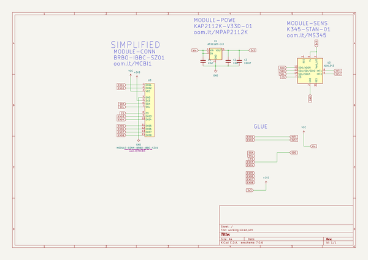
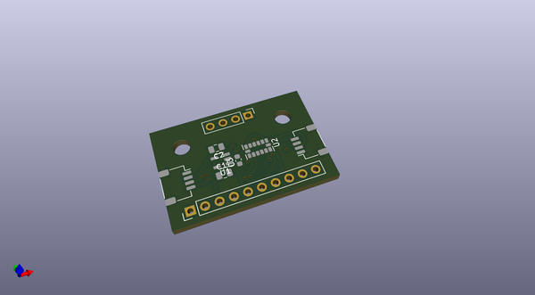
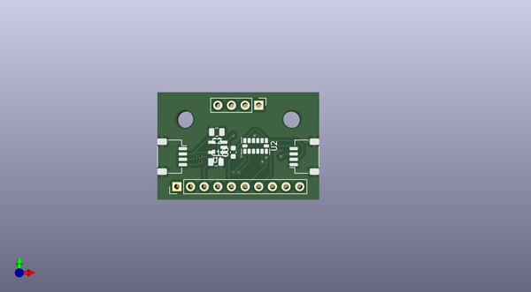
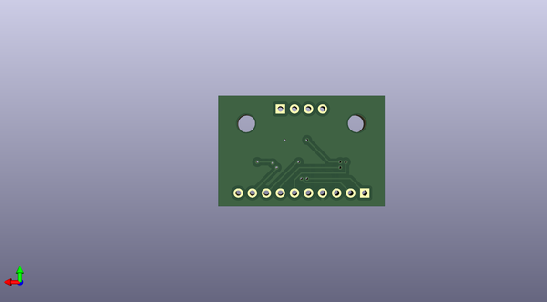

# ibbc_0001
 
## summary 
* id: oomlout_ibbc_0001_ibbc_0001
* user: oomlout
* name: ibbc_0001
* board: ibbc_0001
* repo: https://github.com/oomlout/IBBC_0001
* src_file_repo_kicad_pcb: working/IBBC_0001.kicad_pcb
* src_file_repo_kicad_pcb_link: https://github.com/oomlout/IBBC_0001/tree/main/working/IBBC_0001.kicad_pcb
* src_file_repo_kicad_sch: working/IBBC_0001.kicad_sch
* src_file_repo_kicad_sch_link: https://github.com/oomlout/IBBC_0001/tree/main/working/IBBC_0001.kicad_sch

* src_file_repo_sch: 
*
 src_file_repo_sch_link: https://github.com/oomlout/IBBC_0001/tree/main/
* full details link: https://github.com/oomlout/oomlout_oomp_project_bot_v_2/tree/main/projects/oomlout_ibbc_0001_ibbc_0001/current_version/working  

## schematic  
  
[schematic (pdf)](working_schematic.pdf)  

## pcb  
 
  
  
  
[board (pdf)](working.pdf)  

## working_bom
| Id | Designator | Footprint | Quantity | Designation | Supplier and ref |  | None | 
| --- | --- | --- | --- | --- | --- | --- | --- | 
| 1 | C2,C1 | C_0805_2012Metric | 2 | 10uf |  |  | [''] | 
| 2 | U1 | SOT-23-5 | 1 | AP2112K-3.3 |  |  | [''] | 
| 3 | U2 | LGA-14_3x5mm_P0.8mm_LayoutBorder1x6y | 1 | ADXL343 |  |  | [''] | 
| 4 | U3 | MODULE-CONN-BRBO-IBBC-SZ01 | 1 | MODULE-CONN-BRBO-IBBC-SZ01 |  |  | [''] | 
| 5 | C3 | C_0603_1608Metric | 1 | 100nf |  |  | [''] | 

## bom_schematic
| Ref | Qnty | Value | Cmp name | Footprint | Description | Vendor | DNP | 
| --- | --- | --- | --- | --- | --- | --- | --- | 
| C1, C2 | 2 | 10uf | C | Capacitor_SMD:C_0805_2012Metric | Unpolarized capacitor |  |  | 
| C3 | 1 | 100nf | C | Capacitor_SMD:C_0603_1608Metric | Unpolarized capacitor |  |  | 
| U1 | 1 | AP2112K-3.3 | AP2112K-3.3 | Package_TO_SOT_SMD:SOT-23-5 | 600mA low dropout linear regulator, with enable pin, 3.8V-6V input voltage range, 3.3V fixed positive output, SOT-23-5 |  |  | 
| U2 | 1 | ADXL343 | ADXL343 | Package_LGA:LGA-14_3x5mm_P0.8mm_LayoutBorder1x6y | 3-Axis MEMS Accelerometer, 2/4/8/16g range, I2C/SPI, LGA-14 |  |  | 
| U3 | 1 | MODULE-CONN-BRBO-IBBC-SZ01 | MODULE-CONN-BRBO-IBBC-SZ01 | oomlout_OOMP_modules:MODULE-CONN-BRBO-IBBC-SZ01 |  |  |  | 

