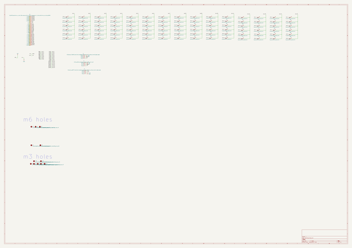
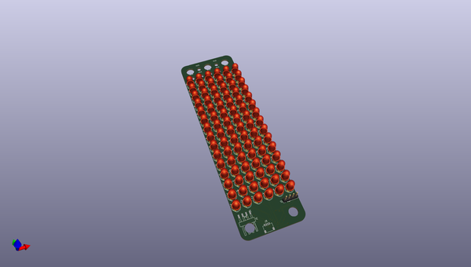
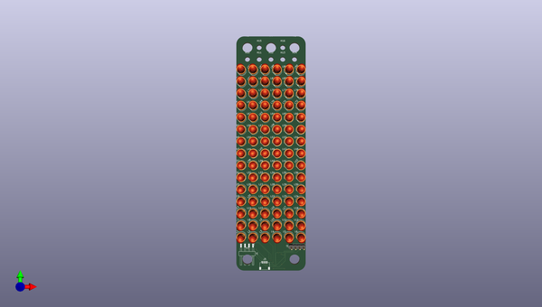
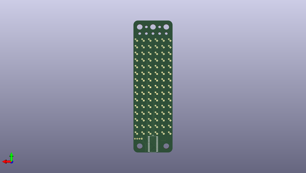

# oomlout_electronics_oobb_led_matrix
 
## summary 
* id: oomlout_oomlout_electronics_oobb_led_matrix_working
* user: oomlout
* name: oomlout_electronics_oobb_led_matrix
* board: working
* repo: https://github.com/oomlout/oomlout_electronics_oobb_led_matrix
* src_file_repo_kicad_pcb: oomp/current_version/working/working.kicad_pcb
* src_file_repo_kicad_pcb_link: https://github.com/oomlout/oomlout_electronics_oobb_led_matrix/tree/main/oomp/current_version/working/working.kicad_pcb
* src_file_repo_kicad_sch: oomp/current_version/working/working.kicad_sch
* src_file_repo_kicad_sch_link: https://github.com/oomlout/oomlout_electronics_oobb_led_matrix/tree/main/oomp/current_version/working/working.kicad_sch

* src_file_repo_sch: 
*
 src_file_repo_sch_link: https://github.com/oomlout/oomlout_electronics_oobb_led_matrix/tree/main/
* full details link: https://github.com/oomlout/oomlout_oomp_project_bot_v_2/tree/main/projects/oomlout_oomlout_electronics_oobb_led_matrix_working/current_version/working  

## schematic  
  
[schematic (pdf)](working_schematic.pdf)  

## pcb  
 
  
  
  
[board (pdf)](working.pdf)  

## working_bom
| Id | Designator | Footprint | Quantity | Designation | Supplier and ref |  | None | 
| --- | --- | --- | --- | --- | --- | --- | --- | 
| 1 | L74,L17,L88,L90,L10,L70,L80,L13,L9,L86,L71,L69,L72,L63,L20,L87,L58,L42,L16,L79,L45,L38,L85,L1,L61,L89,L4,L50,L75,L3,L76,L27,L7,L64,L35,L12,L65,L53,L60,L78,L23,L41,L83,L2,L15,L6,L22,L48,L55,L66,L5,L34,L30,L59,L11,L46,L82,L19,L73,L44,L33,L21,L31,L25,L40,L24,L57,L43,L36,L77,L51,L8,L49,L18,L14,L28,L37,L81,L29,L52,L84,L56,L32,L39,L26,L47,L62,L68,L54,L67 | l5_7297cd_electronic_led_5_mm | 90 | l5_electronic_led_5_mm |  |  | [''] | 
| 2 | J3 | h4psmra_adfe77_electronic_header_1_mm_jst_sh_4_pin_surface_mount_right_angle | 1 | h4psmra_adfe77_electronic_header_1_mm_jst_sh_4_pin_surface_mount_right_angle |  |  | [''] | 
| 3 | J2 | hi14p_abf4a4_electronic_header_2d54_mm_4_pin | 1 | hi14p_abf4a4_electronic_header_2d54_mm_4_pin |  |  | [''] | 
| 4 | H13,H12,H10,H14,H15,H16,H11 | mhm3_872f01_electronic_mounting_hole_m3 | 7 | mhm3_872f01_electronic_mounting_hole_m3 |  |  | [''] | 
| 5 | H2,H5,H4,H1,H3 | mhm6_fbea65_electronic_mounting_hole_m6 | 5 | mhm6_fbea65_electronic_mounting_hole_m6 |  |  | [''] | 
| 6 | J1 | hi14psmra_70c043_electronic_header_2d54_mm_4_pin_surface_mount_right_angle | 1 | hi14psmra_70c043_electronic_header_2d54_mm_4_pin_surface_mount_right_angle |  |  | [''] | 
| 7 | REF** | oobb_10_03 | 1 | oobb_10_03 |  |  | [''] | 
| 8 | U1 | iaip1640_fe0f02_electronic_ic_soic_28_wide_led_matrix_driver_16_x_8_wuxi_i_core_electronics_co_ltd_aip1640 | 1 | iaip1640_electronic_ic_soic_28_wide_led_matrix_driver_16_x_8_wuxi_i_core_electronics_co_ltd_aip1640 |  |  | [''] | 

## bom_schematic
| Ref | Qnty | Value | Cmp name | Footprint | Description | Vendor | DNP | 
| --- | --- | --- | --- | --- | --- | --- | --- | 
| H1, H2, H3, H4, H5 | 5 | mhm6_fbea65_electronic_mounting_hole_m6 | mhm6_fbea65_electronic_mounting_hole_m6 | oomlout_oomp_footprints:mhm6_fbea65_electronic_mounting_hole_m6 | Mounting Hole without connection |  |  | 
| H10, H11, H12, H13, H14, H15, H16 | 7 | mhm3_872f01_electronic_mounting_hole_m3 | mhm3_872f01_electronic_mounting_hole_m3 | oomlout_oomp_footprints:mhm3_872f01_electronic_mounting_hole_m3 | Mounting Hole without connection |  |  | 
| J1 | 1 | hi14psmra_70c043_electronic_header_2d54_mm_4_pin_surface_mount_right_angle | hi14psmra_70c043_electronic_header_2d54_mm_4_pin_surface_mount_right_angle | oomlout_oomp_footprints:hi14psmra_70c043_electronic_header_2d54_mm_4_pin_surface_mount_right_angle | Generic connector, single row, 01x04, script generated (kicad-library-utils/schlib/autogen/connector/) |  |  | 
| J2 | 1 | hi14p_abf4a4_electronic_header_2d54_mm_4_pin | hi14p_abf4a4_electronic_header_2d54_mm_4_pin | oomlout_oomp_footprints:hi14p_abf4a4_electronic_header_2d54_mm_4_pin | Generic connector, single row, 01x04, script generated (kicad-library-utils/schlib/autogen/connector/) |  |  | 
| J3 | 1 | h4psmra_adfe77_electronic_header_1_mm_jst_sh_4_pin_surface_mount_right_angle | h4psmra_adfe77_electronic_header_1_mm_jst_sh_4_pin_surface_mount_right_angle | oomlout_oomp_footprints:h4psmra_adfe77_electronic_header_1_mm_jst_sh_4_pin_surface_mount_right_angle | Generic connector, single row, 01x04, script generated (kicad-library-utils/schlib/autogen/connector/) |  |  | 
| L1, L2, L3, L4, L5, L6, L7, L8, L9, L10, L11, L12, L13, L14, L15, L16, L17, L18, L19, L20, L21, L22, L23, L24, L25, L26, L27, L28, L29, L30, L31, L32, L33, L34, L35, L36, L37, L38, L39, L40, L41, L42, L43, L44, L45, L46, L47, L48, L49, L50, L51, L52, L53, L54, L55, L56, L57, L58, L59, L60, L61, L62, L63, L64, L65, L66, L67, L68, L69, L70, L71, L72, L73, L74, L75, L76, L77, L78, L79, L80, L81, L82, L83, L84, L85, L86, L87, L88, L89, L90 | 90 | l5_electronic_led_5_mm | l5_7297cd_electronic_led_5_mm | oomlout_oomp_footprints:l5_7297cd_electronic_led_5_mm | Light emitting diode |  |  | 
| U1 | 1 | iaip1640_electronic_ic_soic_28_wide_led_matrix_driver_16_x_8_wuxi_i_core_electronics_co_ltd_aip1640 | iaip1640_fe0f02_electronic_ic_soic_28_wide_led_matrix_driver_16_x_8_wuxi_i_core_electronics_co_ltd_aip1640 | oomlout_oomp_footprints:iaip1640_fe0f02_electronic_ic_soic_28_wide_led_matrix_driver_16_x_8_wuxi_i_core_electronics_co_ltd_aip1640 | Generic connector, single row, 01x28, script generated (kicad-library-utils/schlib/autogen/connector/) |  |  | 

