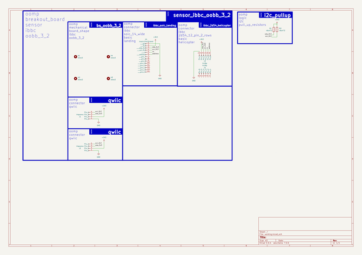
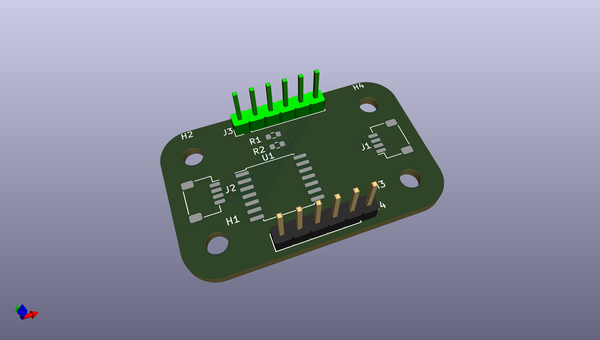
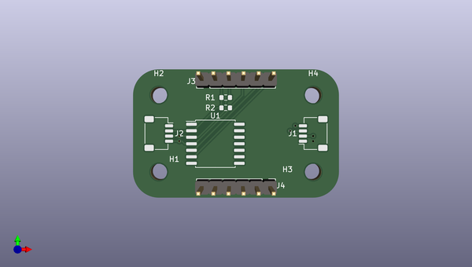
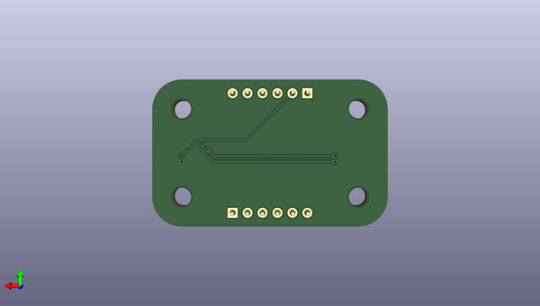

# oomlout_ibbc_breakout_board_holder_oobb_3_2
 
## summary 
* id: oomlout_oomlout_ibbc_breakout_board_holder_oobb_3_2_working
* user: oomlout
* name: oomlout_ibbc_breakout_board_holder_oobb_3_2
* board: working
* repo: https://github.com/oomlout/oomlout_ibbc_breakout_board_holder_oobb_3_2
* src_file_repo_kicad_pcb: kicad/current_version/working/working.kicad_pcb
* src_file_repo_kicad_pcb_link: https://github.com/oomlout/oomlout_ibbc_breakout_board_holder_oobb_3_2/tree/main/kicad/current_version/working/working.kicad_pcb
* src_file_repo_kicad_sch: kicad/current_version/working/working.kicad_sch
* src_file_repo_kicad_sch_link: https://github.com/oomlout/oomlout_ibbc_breakout_board_holder_oobb_3_2/tree/main/kicad/current_version/working/working.kicad_sch

* src_file_repo_sch: 
*
 src_file_repo_sch_link: https://github.com/oomlout/oomlout_ibbc_breakout_board_holder_oobb_3_2/tree/main/
* full details link: https://github.com/oomlout/oomlout_oomp_project_bot_v_2/tree/main/projects/oomlout_oomlout_ibbc_breakout_board_holder_oobb_3_2_working/current_version/working  

## schematic  
  
[schematic (pdf)](working_schematic.pdf)  

## pcb  
 
  
  
  
[board (pdf)](working.pdf)  

## working_bom
| Id | Designator | Footprint | Quantity | Designation | Supplier and ref |  | None | 
| --- | --- | --- | --- | --- | --- | --- | --- | 
| 1 | H2,H4,H3,H1 | mhm3_electronic_mounting_hole_m3 | 4 | mhm3 |  |  | [''] | 
| 2 | R1,R2 | r6o472_electronic_resistor_0603_4700_ohm | 2 | r6o472 |  |  | [''] | 
| 3 | J3,J4 | hi16p_electronic_header_2d54_mm_6_pin | 2 | hi16p |  |  | [''] | 
| 4 | J2,J1 | h4psmra_electronic_header_1_mm_jst_sh_4_pin_surface_mount_right_angle | 2 | h4psmra |  |  | [''] | 
| 5 | U1 | insoic14wi2cland_electronic_interposer_soic_14_wide_i2c_landing | 1 | insoic14wi2cland |  |  | [''] | 

## bom_schematic
| Ref | Qnty | Value | Cmp name | Footprint | Description | Vendor | DNP | 
| --- | --- | --- | --- | --- | --- | --- | --- | 
| H1, H2, H3, H4 | 4 | mhm3 | mhm3_electronic_mounting_hole_m3 | oomlout_oomp_part_footprints:mhm3_electronic_mounting_hole_m3 | Mounting Hole without connection |  |  | 
| J1, J2 | 2 | h4psmra | h4psmra_electronic_header_1_mm_jst_sh_4_pin_surface_mount_right_angle | oomlout_oomp_part_footprints:h4psmra_electronic_header_1_mm_jst_sh_4_pin_surface_mount_right_angle | Generic connector, single row, 01x04, script generated |  |  | 
| J3, J4 | 2 | hi16p | hi16p_electronic_header_2d54_mm_6_pin | oomlout_oomp_part_footprints:hi16p_electronic_header_2d54_mm_6_pin | Generic connector, single row, 01x06, script generated |  |  | 
| R1, R2 | 2 | r6o472 | r6o472_electronic_resistor_0603_4700_ohm | oomlout_oomp_part_footprints:r6o472_electronic_resistor_0603_4700_ohm | Resistor |  |  | 
| U1 | 1 | insoic14wi2cland | insoic14wi2cland_electronic_interposer_soic_14_wide_i2c_landing | oomlout_oomp_part_footprints:insoic14wi2cland_electronic_interposer_soic_14_wide_i2c_landing | Generic connector, single row, 01x14, script generated |  |  | 

