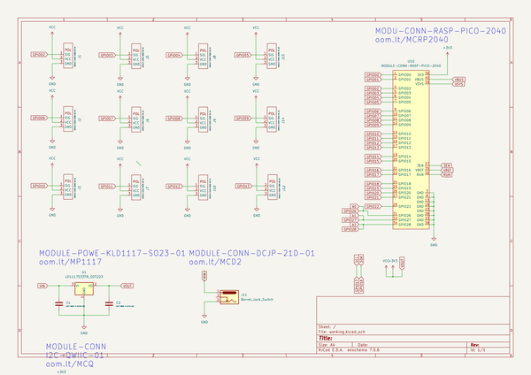
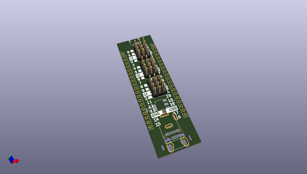
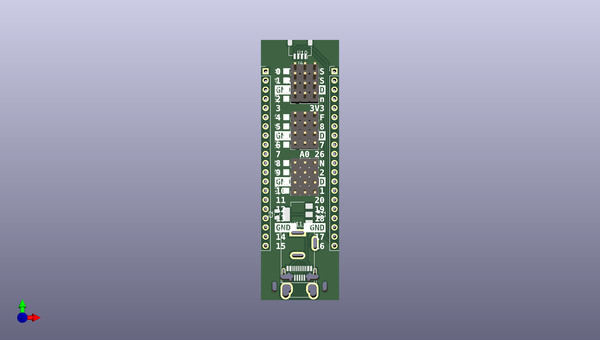
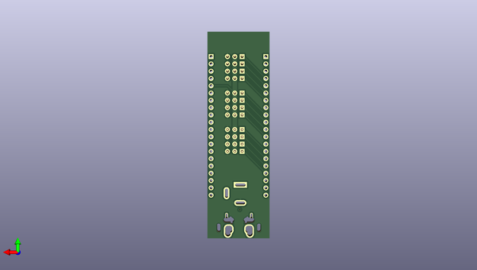

# oomlout_oobb
 
## summary 
* id: oomlout_oomlout_oobb_oobb_rasp_pico_shield_01
* user: oomlout
* name: oomlout_oobb
* board: oobb_rasp_pico_shield_01
* repo: https://github.com/oomlout/oomlout-OOBB
* src_file_repo_kicad_pcb: parts/OBBB/OOBB-RASP-PICO-SHIELD-01/OOBB-RASP-PICO-SHIELD-01.kicad_pcb
* src_file_repo_kicad_pcb_link: https://github.com/oomlout/oomlout-OOBB/tree/master/parts/OBBB/OOBB-RASP-PICO-SHIELD-01/OOBB-RASP-PICO-SHIELD-01.kicad_pcb
* src_file_repo_kicad_sch: parts/OBBB/OOBB-RASP-PICO-SHIELD-01/OOBB-RASP-PICO-SHIELD-01.kicad_sch
* src_file_repo_kicad_sch_link: https://github.com/oomlout/oomlout-OOBB/tree/master/parts/OBBB/OOBB-RASP-PICO-SHIELD-01/OOBB-RASP-PICO-SHIELD-01.kicad_sch

* src_file_repo_sch: 
*
 src_file_repo_sch_link: https://github.com/oomlout/oomlout-OOBB/tree/master/
* full details link: https://github.com/oomlout/oomlout_oomp_project_bot_v_2/tree/main/projects/oomlout_oomlout_oobb_oobb_rasp_pico_shield_01/current_version/working  

## schematic  
  
[schematic (pdf)](working_schematic.pdf)  

## pcb  
 
  
  
  
[board (pdf)](working.pdf)  

## working_bom
| Id | Designator | Footprint | Quantity | Designation | Supplier and ref |  | None | 
| --- | --- | --- | --- | --- | --- | --- | --- | 
| 1 | J14,J12,J6,J3,J1,J9,J10,J7,J5,J8,J2,J13 | MODULE-CONN-OOBB-BA-01 | 12 | MODULE-CONN-OOBB-BA-01 |  |  | [''] | 
| 2 | J11 | BarrelJack_GCT_DCJ200-10-A_Horizontal | 1 | Barrel_Jack_Switch |  |  | [''] | 
| 3 | J4 | JST_SH_SM04B-SRSS-TB_1x04-1MP_P1.00mm_Horizontal | 1 | HEAD-JSTSH-X-PI04-RS oom.lt/HSHR4 |  |  | [''] | 
| 4 | U1 | SOT-223-3_TabPin2 | 1 | LD1117S33TR_SOT223 |  |  | [''] | 
| 5 | U10 | MODULE-CONN-RASP-PICO-2040 | 1 | MODULE-CONN-RASP-PICO-2040 |  |  | [''] | 
| 6 | U2 | MODULE-CONN-USB-MEGA-01 | 1 | MODULE-CONN-USB-MEGA-01 |  |  | [''] | 
| 7 | C1 | C_0603_1608Metric | 1 | CAPC-0603-X-NF100-V50 |  |  | [''] | 
| 8 | C2 | C_0805_2012Metric | 1 | CAPC-0805-X-UF10-V10 |  |  | [''] | 

## bom_schematic
| Ref | Qnty | Value | Cmp name | Footprint | Description | Vendor | DNP | 
| --- | --- | --- | --- | --- | --- | --- | --- | 
| C1 | 1 | CAPC-0603-X-NF100-V50 | C | Capacitor_SMD:C_0603_1608Metric | Unpolarized capacitor |  |  | 
| C2 | 1 | CAPC-0805-X-UF10-V10 | C | Capacitor_SMD:C_0805_2012Metric | Unpolarized capacitor |  |  | 
| J1, J2, J3, J5, J6, J7, J8, J9, J10, J12, J13, J14 | 12 | MODULE-CONN-OOBB-BA-01 | MODULE-CONN-OOBB-BA-01 | oomlout_OOMP_modules:MODULE-CONN-OOBB-BA-01 |  |  |  | 
| J4 | 1 | HEAD-JSTSH-X-PI04-RS oom.lt/HSHR4 | Conn_01x04_MountingPin | Connector_JST:JST_SH_SM04B-SRSS-TB_1x04-1MP_P1.00mm_Horizontal | Generic connectable mounting pin connector, single row, 01x04, script generated (kicad-library-utils/schlib/autogen/connector/) |  |  | 
| J11 | 1 | Barrel_Jack_Switch | Barrel_Jack_Switch | Connector_BarrelJack:BarrelJack_GCT_DCJ200-10-A_Horizontal | DC Barrel Jack with an internal switch |  |  | 
| U1 | 1 | LD1117S33TR_SOT223 | LD1117S33TR_SOT223 | Package_TO_SOT_SMD:SOT-223-3_TabPin2 | 800mA Fixed Low Drop Positive Voltage Regulator, Fixed Output 3.3V, SOT-223 |  |  | 
| U2 | 1 | MODULE-CONN-USB-MEGA-01 | MODULE-CONN-USB-MEGA-01 | oomlout_OOMP_modules:MODULE-CONN-USB-MEGA-01 |  |  |  | 
| U10 | 1 | MODULE-CONN-RASP-PICO-2040 | MODULE-CONN-RASP-PICO-2040 | oomlout_OOMP_modules:MODULE-CONN-RASP-PICO-2040 |  |  |  | 

