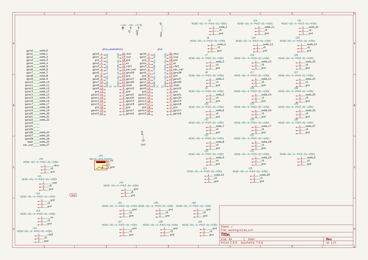
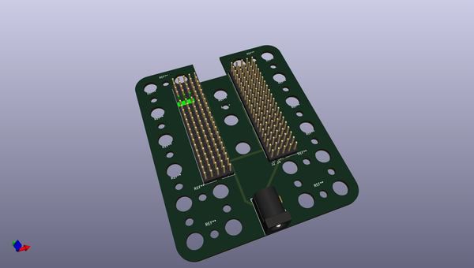
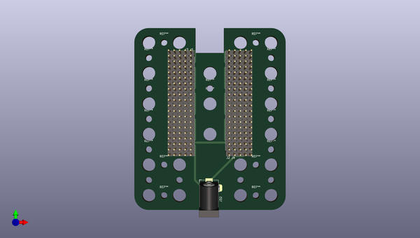
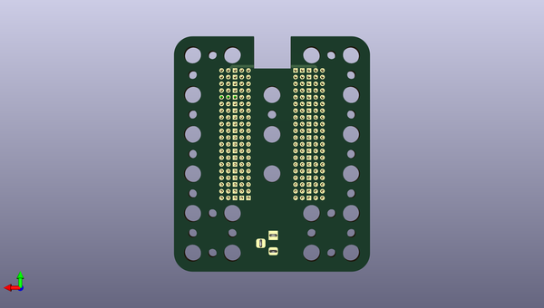

# oomlout_oobb_v3
 
## summary 
* id: oomlout_oomlout_oobb_v3_working
* user: oomlout
* name: oomlout_oobb_v3
* board: working
* repo: https://github.com/oomlout/oomlout_oobb_v3
* src_file_repo_kicad_pcb: electronics/oobb_brain_pico_01/working/working.kicad_pcb
* src_file_repo_kicad_pcb_link: https://github.com/oomlout/oomlout_oobb_v3/tree/main/electronics/oobb_brain_pico_01/working/working.kicad_pcb
* src_file_repo_kicad_sch: electronics/oobb_brain_pico_01/working/working.kicad_sch
* src_file_repo_kicad_sch_link: https://github.com/oomlout/oomlout_oobb_v3/tree/main/electronics/oobb_brain_pico_01/working/working.kicad_sch

* src_file_repo_sch: 
*
 src_file_repo_sch_link: https://github.com/oomlout/oomlout_oobb_v3/tree/main/
* full details link: https://github.com/oomlout/oomlout_oomp_project_bot_v_2/tree/main/projects/oomlout_oomlout_oobb_v3_working/current_version/working  

## schematic  
  
[schematic (pdf)](working_schematic.pdf)  

## pcb  
 
  
  
  
[board (pdf)](working.pdf)  

## working_bom
| Id | Designator | Footprint | Quantity | Designation | Supplier and ref |  | None | 
| --- | --- | --- | --- | --- | --- | --- | --- | 
| 1 | ,,,,,,,,,,,,,,,,,,,,,,, |  | 24 |  |  |  | [''] | 
| 2 | J27,J36,J8,J39,J20,J30,J5,J9,J11,J7,J6,J44,J23,J34,J21,J38,J37,J29,J16,J42,J28,J45,J15,J18,J24,J43,J13,J17,J12,J40,J25,J19,J41,J26,J22,J14,J33,J31,J35,J10 | HEAD-I01-X-PI03-01-H301 | 40 | HEAD-I01-X-PI03-01-H301 |  |  | [''] | 
| 3 | J3,J1,J4,J2 | HEAD-I01-X-PI20-01-H20 | 4 | HEAD-I01-X-PI20-01-H20 |  |  | [''] | 
| 4 | J32 | BarrelJack_Horizontal | 1 | Barrel_Jack_Switch |  |  | [''] | 

## bom_schematic
| Ref | Qnty | Value | Cmp name | Footprint | Description | Vendor | DNP | 
| --- | --- | --- | --- | --- | --- | --- | --- | 
| J1, J2, J3, J4 | 4 | HEAD-I01-X-PI20-01-H20 | HEAD-I01-X-PI20-01-H20 | oomlout_OOMP_parts:HEAD-I01-X-PI20-01-H20 | oompID: HEAD-I01-X-PI20-01;name: 2.54 mm 20 Pin Header;hexID: H20;Generic connector, single row, 01x20, script generated (kicad-library-utils/schlib/autogen/connector/) |  |  | 
| J5, J6, J7, J8, J9, J10, J11, J12, J13, J14, J15, J16, J17, J18, J19, J20, J21, J22, J23, J24, J25, J26, J27, J28, J29, J30, J31, J33, J34, J35, J36, J37, J38, J39, J40, J41, J42, J43, J44, J45 | 40 | HEAD-I01-X-PI03-01-H301 | HEAD-I01-X-PI03-01-H301 | oomlout_OOMP_parts:HEAD-I01-X-PI03-01-H301 | oompID: HEAD-I01-X-PI03-01;name: 2.54 mm 3 Pin Header;hexID: H301;Generic connector, single row, 01x03, script generated (kicad-library-utils/schlib/autogen/connector/) |  |  | 
| J32 | 1 | Barrel_Jack_Switch | Barrel_Jack_Switch | Connector_BarrelJack:BarrelJack_Horizontal | DC Barrel Jack with an internal switch |  |  | 

