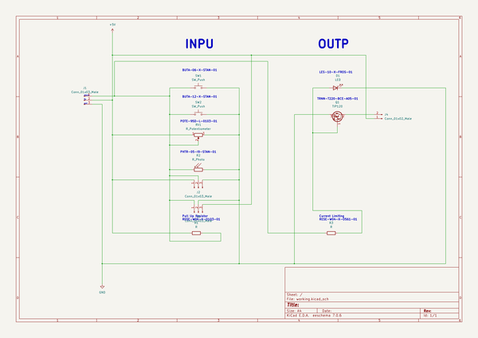
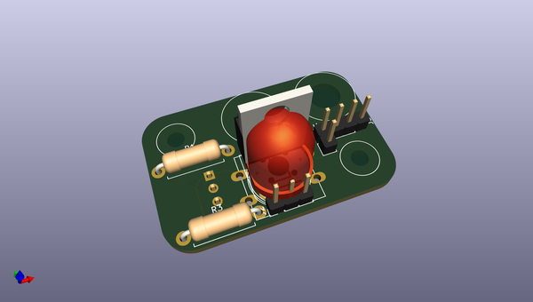
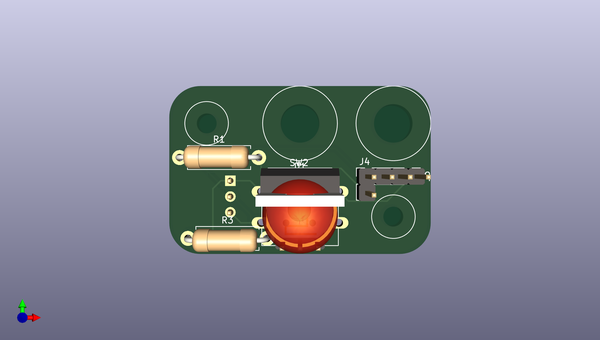
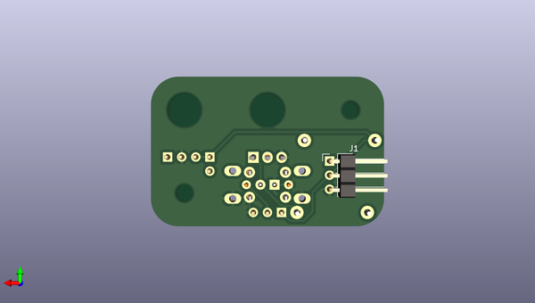

# oomlout_ooeb
 
## summary 
* id: oomlout_oomlout_ooeb_ooeb_module_pcb
* user: oomlout
* name: oomlout_ooeb
* board: ooeb_module_pcb
* repo: https://github.com/oomlout/oomlout-OOEB
* src_file_repo_kicad_pcb: parts/OOEB-XXXX-XXXX-X-PCB/pcb/OOEB-MODULE-PCB.kicad_pcb
* src_file_repo_kicad_pcb_link: https://github.com/oomlout/oomlout-OOEB/tree/master/parts/OOEB-XXXX-XXXX-X-PCB/pcb/OOEB-MODULE-PCB.kicad_pcb
* src_file_repo_kicad_sch: parts/OOEB-XXXX-XXXX-X-PCB/pcb/OOEB-MODULE-PCB.kicad_sch
* src_file_repo_kicad_sch_link: https://github.com/oomlout/oomlout-OOEB/tree/master/parts/OOEB-XXXX-XXXX-X-PCB/pcb/OOEB-MODULE-PCB.kicad_sch

* src_file_repo_sch: 
*
 src_file_repo_sch_link: https://github.com/oomlout/oomlout-OOEB/tree/master/
* full details link: https://github.com/oomlout/oomlout_oomp_project_bot_v_2/tree/main/projects/oomlout_oomlout_ooeb_ooeb_module_pcb/current_version/working  

## schematic  
  
[schematic (pdf)](working_schematic.pdf)  

## pcb  
 
  
  
  
[board (pdf)](working.pdf)  

## working_bom
| Id | Designator | Footprint | Quantity | Designation | Supplier and ref |  | None | 
| --- | --- | --- | --- | --- | --- | --- | --- | 
| 1 | Q1 | TO-220-3_Vertical | 1 | TIP120 |  |  | [''] | 
| 2 | SW2 | SW_PUSH-12mm | 1 | SW_Push |  |  | [''] | 
| 3 | REF** | OOEB-XXXX-03-02 | 1 | OOEB-XXXX-03-02 |  |  | [''] | 
| 4 | R2 | R_LDR_10x8.5mm_P7.6mm_Vertical | 1 | R_Photo |  |  | [''] | 
| 5 | R3,R1 | R_Axial_DIN0411_L9.9mm_D3.6mm_P12.70mm_Horizontal | 2 | R |  |  | [''] | 
| 6 | J2,J3 | PinHeader_1x03_P2.54mm_Vertical | 2 | Conn_01x03_Male |  |  | [''] | 
| 7 | D1 | LED_D10.0mm | 1 | LED |  |  | [''] | 
| 8 | SW1 | SW_PUSH_6mm | 1 | SW_Push |  |  | [''] | 
| 9 | J4 | PinHeader_1x02_P2.54mm_Vertical | 1 | Conn_01x02_Male |  |  | [''] | 
| 10 | J1 | PinHeader_1x03_P2.54mm_Horizontal | 1 | Conn_01x03_Male |  |  | [''] | 

## bom_schematic
| Ref | Qnty | Value | Cmp name | Footprint | Description | Vendor | DNP | 
| --- | --- | --- | --- | --- | --- | --- | --- | 
| D1 | 1 | LED | LED | LED_THT:LED_D10.0mm | Light emitting diode |  |  | 
| J1 | 1 | Conn_01x03_Male | Conn_01x03_Male | Connector_PinHeader_2.54mm:PinHeader_1x03_P2.54mm_Horizontal | Generic connector, single row, 01x03, script generated (kicad-library-utils/schlib/autogen/connector/) |  |  | 
| J2, J3 | 2 | Conn_01x03_Male | Conn_01x03_Male | Connector_PinHeader_2.54mm:PinHeader_1x03_P2.54mm_Vertical | Generic connector, single row, 01x03, script generated (kicad-library-utils/schlib/autogen/connector/) |  |  | 
| J4 | 1 | Conn_01x02_Male | Conn_01x02_Male | Connector_PinHeader_2.54mm:PinHeader_1x02_P2.54mm_Vertical | Generic connector, single row, 01x02, script generated (kicad-library-utils/schlib/autogen/connector/) |  |  | 
| Q1 | 1 | TIP120 | TIP120 | Package_TO_SOT_THT:TO-220-3_Vertical | 5A Ic, 60V Vce, Silicon Darlington Power NPN Transistor, TO-220 |  |  | 
| R1, R3 | 2 | R | R | Resistor_THT:R_Axial_DIN0411_L9.9mm_D3.6mm_P12.70mm_Horizontal | Resistor |  |  | 
| R2 | 1 | R_Photo | R_Photo | OptoDevice:R_LDR_10x8.5mm_P7.6mm_Vertical | Photoresistor |  |  | 
| RV1 | 1 | R_Potentiometer | R_Potentiometer |  | Potentiometer |  |  | 
| SW1 | 1 | SW_Push | SW_Push | Button_Switch_THT:SW_PUSH_6mm | Push button switch, generic, two pins |  |  | 
| SW2 | 1 | SW_Push | SW_Push | Button_Switch_THT:SW_PUSH-12mm | Push button switch, generic, two pins |  |  | 

