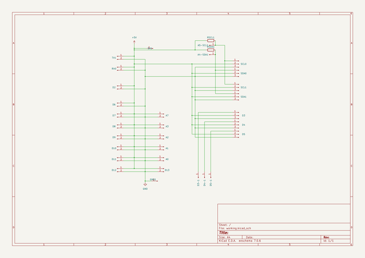
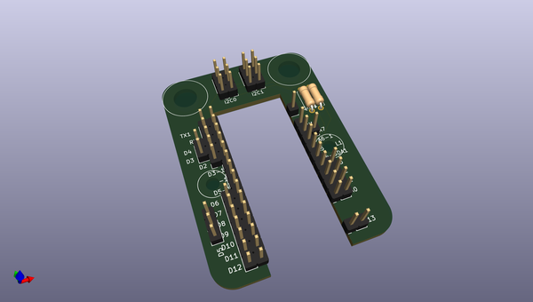
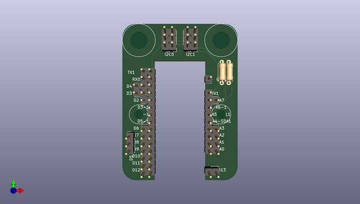
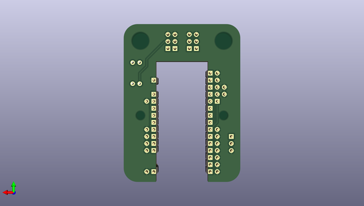

# oomlout_ooeb
 
## summary 
* id: oomlout_oomlout_ooeb_ooeb_obbb_proj_ardc_shen_stan_01
* user: oomlout
* name: oomlout_ooeb
* board: ooeb_obbb_proj_ardc_shen_stan_01
* repo: https://github.com/oomlout/oomlout-OOEB
* src_file_repo_kicad_pcb: parts/OOEB-OBBB-PROJ-ARDC-SHEN-STAN-01/pcb/OOEB-OBBB-PROJ-ARDC-SHEN-STAN-01/OOEB-OBBB-PROJ-ARDC-SHEN-STAN-01.kicad_pcb
* src_file_repo_kicad_pcb_link: https://github.com/oomlout/oomlout-OOEB/tree/master/parts/OOEB-OBBB-PROJ-ARDC-SHEN-STAN-01/pcb/OOEB-OBBB-PROJ-ARDC-SHEN-STAN-01/OOEB-OBBB-PROJ-ARDC-SHEN-STAN-01.kicad_pcb
* src_file_repo_kicad_sch: parts/OOEB-OBBB-PROJ-ARDC-SHEN-STAN-01/pcb/OOEB-OBBB-PROJ-ARDC-SHEN-STAN-01/OOEB-OBBB-PROJ-ARDC-SHEN-STAN-01.kicad_sch
* src_file_repo_kicad_sch_link: https://github.com/oomlout/oomlout-OOEB/tree/master/parts/OOEB-OBBB-PROJ-ARDC-SHEN-STAN-01/pcb/OOEB-OBBB-PROJ-ARDC-SHEN-STAN-01/OOEB-OBBB-PROJ-ARDC-SHEN-STAN-01.kicad_sch

* src_file_repo_sch: 
*
 src_file_repo_sch_link: https://github.com/oomlout/oomlout-OOEB/tree/master/
* full details link: https://github.com/oomlout/oomlout_oomp_project_bot_v_2/tree/main/projects/oomlout_oomlout_ooeb_ooeb_obbb_proj_ardc_shen_stan_01/current_version/working  

## schematic  
  
[schematic (pdf)](working_schematic.pdf)  

## pcb  
 
  
  
  
[board (pdf)](working.pdf)  

## working_bom
| Id | Designator | Footprint | Quantity | Designation | Supplier and ref |  | None | 
| --- | --- | --- | --- | --- | --- | --- | --- | 
| 1 | GND1,5V1,A6-1,A5-SCL1,D3-1,A4-SDA1,D4-1,D5-1 | PinHeader_1x01_P2.54mm_Vertical | 8 | Conn_01x01_Male |  |  | [''] | 
| 2 | D13,TX1,A0,D7,D6,D12,D11,A7,D10,A2,A3,D8,RX0,D9,D2,A1 | PinHeader_1x02_P2.54mm_Vertical | 16 | Conn_01x02_Male |  |  | [''] | 
| 3 | RSDA1,RSCL1 | R_Axial_DIN0207_L6.3mm_D2.5mm_P7.62mm_Horizontal | 2 | R |  |  | [''] | 
| 4 | I2C0,SDA0,SDA1,D5,D4,I2C1,D3 | PinHeader_1x03_P2.54mm_Vertical | 7 | Conn_01x03_Male |  |  | [''] | 
| 5 | REF** | OOEB-XXXX-04-03-ARDC | 1 | OOEB-XXXX-04-03-ARDC |  |  | [''] | 

## bom_schematic
| Ref | Qnty | Value | Cmp name | Footprint | Description | Vendor | DNP | 
| --- | --- | --- | --- | --- | --- | --- | --- | 
| 5V1 | 1 | Conn_01x01_Male | Conn_01x01_Male_1 | Connector_PinHeader_2.54mm:PinHeader_1x01_P2.54mm_Vertical | Generic connector, single row, 01x01, script generated (kicad-library-utils/schlib/autogen/connector/) |  |  | 
| A0, A1, A2, A3, A7 | 5 | Conn_01x02_Male | Conn_01x02_Male | Connector_PinHeader_2.54mm:PinHeader_1x02_P2.54mm_Vertical | Generic connector, single row, 01x02, script generated (kicad-library-utils/schlib/autogen/connector/) |  |  | 
| A4-SDA1 | 1 | Conn_01x01_Male | Conn_01x01_Male | Connector_PinHeader_2.54mm:PinHeader_1x01_P2.54mm_Vertical | Generic connector, single row, 01x01, script generated (kicad-library-utils/schlib/autogen/connector/) |  |  | 
| A5-SCL1 | 1 | Conn_01x01_Male | Conn_01x01_Male | Connector_PinHeader_2.54mm:PinHeader_1x01_P2.54mm_Vertical | Generic connector, single row, 01x01, script generated (kicad-library-utils/schlib/autogen/connector/) |  |  | 
| D2, D6, D7, D8, D9, D10, D11, D12, D13 | 9 | Conn_01x02_Male | Conn_01x02_Male | Connector_PinHeader_2.54mm:PinHeader_1x02_P2.54mm_Vertical | Generic connector, single row, 01x02, script generated (kicad-library-utils/schlib/autogen/connector/) |  |  | 
| D3, D4, D5 | 3 | Conn_01x03_Male | Conn_01x03_Male | Connector_PinHeader_2.54mm:PinHeader_1x03_P2.54mm_Vertical | Generic connector, single row, 01x03, script generated (kicad-library-utils/schlib/autogen/connector/) |  |  | 
| D3-1 | 1 | Conn_01x01_Male | Conn_01x01_Male | Connector_PinHeader_2.54mm:PinHeader_1x01_P2.54mm_Vertical | Generic connector, single row, 01x01, script generated (kicad-library-utils/schlib/autogen/connector/) |  |  | 
| D4-1 | 1 | Conn_01x01_Male | Conn_01x01_Male | Connector_PinHeader_2.54mm:PinHeader_1x01_P2.54mm_Vertical | Generic connector, single row, 01x01, script generated (kicad-library-utils/schlib/autogen/connector/) |  |  | 
| D5-1 | 1 | Conn_01x01_Male | Conn_01x01_Male | Connector_PinHeader_2.54mm:PinHeader_1x01_P2.54mm_Vertical | Generic connector, single row, 01x01, script generated (kicad-library-utils/schlib/autogen/connector/) |  |  | 
| GND1 | 1 | Conn_01x01_Male | Conn_01x01_Male_2 | Connector_PinHeader_2.54mm:PinHeader_1x01_P2.54mm_Vertical | Generic connector, single row, 01x01, script generated (kicad-library-utils/schlib/autogen/connector/) |  |  | 
| RSCL1 | 1 | R | R | Resistor_THT:R_Axial_DIN0207_L6.3mm_D2.5mm_P7.62mm_Horizontal | Resistor |  |  | 
| RSDA1 | 1 | R | R | Resistor_THT:R_Axial_DIN0207_L6.3mm_D2.5mm_P7.62mm_Horizontal | Resistor |  |  | 
| RX0 | 1 | Conn_01x02_Male | Conn_01x02_Male | Connector_PinHeader_2.54mm:PinHeader_1x02_P2.54mm_Vertical | Generic connector, single row, 01x02, script generated (kicad-library-utils/schlib/autogen/connector/) |  |  | 
| SCL0, SCL1 | 2 | Conn_01x03_Male | Conn_01x03_Male | Connector_PinHeader_2.54mm:PinHeader_1x03_P2.54mm_Vertical | Generic connector, single row, 01x03, script generated (kicad-library-utils/schlib/autogen/connector/) |  |  | 
| SDA0, SDA1 | 2 | Conn_01x03_Male | Conn_01x03_Male | Connector_PinHeader_2.54mm:PinHeader_1x03_P2.54mm_Vertical | Generic connector, single row, 01x03, script generated (kicad-library-utils/schlib/autogen/connector/) |  |  | 
| TX1 | 1 | Conn_01x02_Male | Conn_01x02_Male | Connector_PinHeader_2.54mm:PinHeader_1x02_P2.54mm_Vertical | Generic connector, single row, 01x02, script generated (kicad-library-utils/schlib/autogen/connector/) |  |  | 

