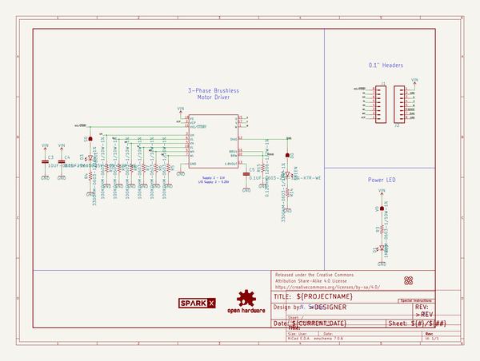
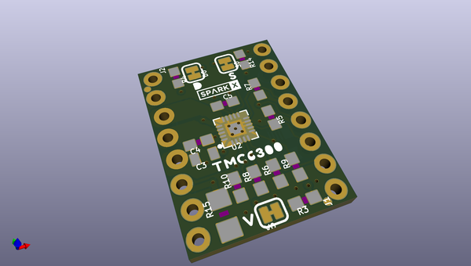
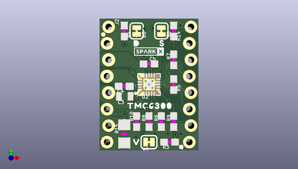
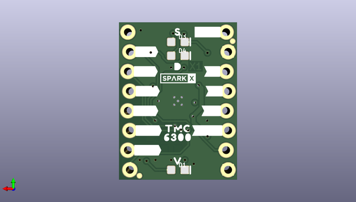

# oomlout_oomp_documentation_bot
 
## summary 
* id: oomlout_oomlout_oomp_documentation_bot_working
* user: oomlout
* name: oomlout_oomp_documentation_bot
* board: working
* repo: https://github.com/oomlout/oomlout_oomp_documentation_bot
* src_file_repo_kicad_pcb: projects/sparkfunX/Three_Phase_Motor_Driver-TMC6300/oomp_documentation/version_current/working/working.kicad_pcb
* src_file_repo_kicad_pcb_link: https://github.com/oomlout/oomlout_oomp_documentation_bot/tree/main/projects/sparkfunX/Three_Phase_Motor_Driver-TMC6300/oomp_documentation/version_current/working/working.kicad_pcb
* src_file_repo_kicad_sch: projects/sparkfunX/Three_Phase_Motor_Driver-TMC6300/oomp_documentation/version_current/working/working.kicad_sch
* src_file_repo_kicad_sch_link: https://github.com/oomlout/oomlout_oomp_documentation_bot/tree/main/projects/sparkfunX/Three_Phase_Motor_Driver-TMC6300/oomp_documentation/version_current/working/working.kicad_sch

* src_file_repo_sch: 
*
 src_file_repo_sch_link: https://github.com/oomlout/oomlout_oomp_documentation_bot/tree/main/
* full details link: https://github.com/oomlout/oomlout_oomp_project_bot_v_2/tree/main/projects/oomlout_oomlout_oomp_documentation_bot_working/current_version/working  

## schematic  
  
[schematic (pdf)](working_schematic.pdf)  

## pcb  
 
  
  
  
[board (pdf)](working.pdf)  

## working_bom
| Id | Designator | Footprint | Quantity | Designation | Supplier and ref |  | None | 
| --- | --- | --- | --- | --- | --- | --- | --- | 
| 1 | R9,R10,R8,R7,R6,R5 | 0603 | 6 | 100k |  |  | [''] | 
| 2 | U$16,U$18 | D0 | 2 |  |  |  | [''] | 
| 3 | V0,D0,S0 | SMT-JUMPER_2_NC_TRACE_SILK | 3 | JUMPER-SMT_2_NC_TRACE_SILK |  |  | [''] | 
| 4 | J1,J2 | 1X08_LOCK_NO_SILK | 2 |  |  |  | [''] | 
| 5 | U$26,U$20 | V2 | 2 |  |  |  | [''] | 
| 6 | R3 | 0603 | 1 | 1k |  |  | [''] | 
| 7 | R14,R4 | 0603 | 2 | 330 |  |  | [''] | 
| 8 | U$17 | TMC63000 | 1 |  |  |  | [''] | 
| 9 | R15 | 1206 | 1 | 0.12 |  |  | [''] | 
| 10 | C4,C5 | 0603 | 2 | 0.1uF |  |  | [''] | 
| 11 | FRAME1 | CREATIVE_COMMONS | 1 | FRAME-LETTER |  |  | [''] | 
| 12 | U$27,U$19 | S1 | 2 |  |  |  | [''] | 
| 13 | LOGO2 | ORDERING_INSTRUCTIONS | 1 | SPECIAL_INSTRUCTIONS-ORDERING |  |  | [''] | 
| 14 | C3 | 0805 | 1 | 10uF |  |  | [''] | 
| 15 | FD2,FD1,FD4,FD3 | FIDUCIAL-MICRO | 4 | FIDUCIALUFIDUCIAL |  |  | [''] | 
| 16 | U$36,U$37 | SPARKX-TINY | 2 | SPARKX-LOGO2 |  |  | [''] | 
| 17 | U2 | QFN-20 | 1 | TMC6300 |  |  | [''] | 
| 18 | U$25 | #V#7 | 1 |  |  |  | [''] | 
| 19 | D4 | LED-0603 | 1 | GREEN |  |  | [''] | 
| 20 | U$31 | #VL#3 | 1 |  |  |  | [''] | 
| 21 | U$32 | #W#8 | 1 |  |  |  | [''] | 
| 22 | U$9 | #U#6 | 1 |  |  |  | [''] | 
| 23 | D1 | LED-0603 | 1 | RED |  |  | [''] | 
| 24 | U$22 | #UL#4 | 1 |  |  |  | [''] | 
| 25 | U$33 | #WH#1 | 1 |  |  |  | [''] | 
| 26 | U$1,U$28 | #GND#1 | 2 |  |  |  | [''] | 
| 27 | U$13 | #VIO#1 | 1 |  |  |  | [''] | 
| 28 | U$15 | 63001 | 1 |  |  |  | [''] | 
| 29 | U$30 | #VH#2 | 1 |  |  |  | [''] | 
| 30 | LOGO1 | DUMMY | 1 | OSHW-LOGONO_SILK |  |  | [''] | 
| 31 | U$12 | #VCP#0 | 1 |  |  |  | [''] | 
| 32 | U$21 | #UH#5 | 1 |  |  |  | [''] | 
| 33 | U$23 | TMC0 | 1 |  |  |  | [''] | 
| 34 | U$34 | #WL#0 | 1 |  |  |  | [''] | 
| 35 | U$24 | #VIN#0 | 1 |  |  |  | [''] | 
| 36 | U$2 | #SEN#0 | 1 |  |  |  | [''] | 
| 37 | U$3 | #DIAG#0 | 1 |  |  |  | [''] | 
| 38 | D3 | LED-0603 | 1 | BLUE |  |  | [''] | 

## bom_schematic
| Ref | Qnty | Value | Cmp name | Footprint | Description | Vendor | DNP | 
| --- | --- | --- | --- | --- | --- | --- | --- | 
| C3 | 1 | 10UF-0805-25V-10% | 10UF-0805-25V-10% | working:0805 |  |  |  | 
| C4, C5 | 2 | 0.1UF-0603-25V-10%-X7R-WE | 0.1UF-0603-25V-10%-X7R-WE | working:0603 |  |  |  | 
| D0 | 1 | JUMPER-SMT_2_NC_TRACE_SILK | JUMPER-SMT_2_NC_TRACE_SILK | working:SMT-JUMPER_2_NC_TRACE_SILK |  |  |  | 
| D1 | 1 | RED | LED-RED0603 | working:LED-0603 |  |  |  | 
| D3 | 1 | BLUE | LED-BLUE0603 | working:LED-0603 |  |  |  | 
| D4 | 1 | GREEN | LED-GREEN0603 | working:LED-0603 |  |  |  | 
| FD1, FD2, FD3, FD4 | 4 | FIDUCIALUFIDUCIAL | FIDUCIALUFIDUCIAL | working:FIDUCIAL-MICRO |  |  |  | 
| FRAME1 | 1 | FRAME-LETTER | FRAME-LETTER | working:CREATIVE_COMMONS |  |  |  | 
| J1, J2 | 2 | CONN_08LOCK_NO_SILK | CONN_08LOCK_NO_SILK | working:1X08_LOCK_NO_SILK |  |  |  | 
| LOGO1 | 1 | OSHW-LOGONO_SILK | OSHW-LOGONO_SILK | working:DUMMY |  |  |  | 
| LOGO2 | 1 | SPECIAL_INSTRUCTIONS-ORDERING | SPECIAL_INSTRUCTIONS-ORDERING | working:ORDERING_INSTRUCTIONS |  |  |  | 
| R3 | 1 | 1KOHM-0603-1/10W-1% | 1KOHM-0603-1/10W-1% | working:0603 |  |  |  | 
| R4, R14 | 2 | 330OHM-0603-1/10W-1% | 330OHM-0603-1/10W-1% | working:0603 |  |  |  | 
| R5, R6, R7, R8, R9, R10 | 6 | 100KOHM-0603-1/10W-1% | 100KOHM-0603-1/10W-1% | working:0603 |  |  |  | 
| R15 | 1 | 0.12OHM-1206-1/2W-1% | 0.12OHM-1206-1/2W-1% | working:1206 |  |  |  | 
| S0 | 1 | JUMPER-SMT_2_NC_TRACE_SILK | JUMPER-SMT_2_NC_TRACE_SILK | working:SMT-JUMPER_2_NC_TRACE_SILK |  |  |  | 
| U2 | 1 | TMC6300 | TMC6300 | working:QFN-20 |  |  |  | 
| U$36, U$37 | 2 | SPARKX-LOGO2 | SPARKX-LOGO2 | working:SPARKX-TINY |  |  |  | 
| V0 | 1 | JUMPER-SMT_2_NC_TRACE_SILK | JUMPER-SMT_2_NC_TRACE_SILK | working:SMT-JUMPER_2_NC_TRACE_SILK |  |  |  | 

