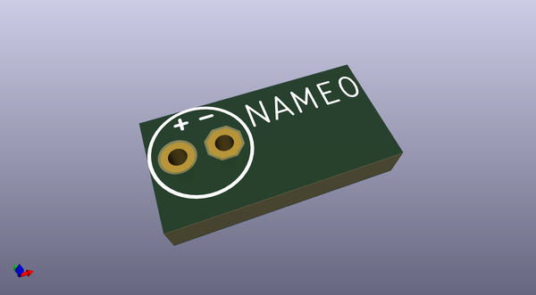

# oomlout_oomp_eda
 
## summary 
* id: oomlout_oomlout_oomp_eda_boardeagle
* user: oomlout
* name: oomlout_oomp_eda
* board: boardeagle
* repo: https://github.com/oomlout/oomlout_OOMP_eda
* src_file_repo_kicad_pcb: FOOTPRINT/eagle/Adafruit-Eagle-Library/adafruit/E2-4/kicad/boardKicad.kicad_pcb
* src_file_repo_kicad_pcb_link: https://github.com/oomlout/oomlout_OOMP_eda/tree/main/FOOTPRINT/eagle/Adafruit-Eagle-Library/adafruit/E2-4/kicad/boardKicad.kicad_pcb

* src_file_repo_sch: 
*
 src_file_repo_sch_link: https://github.com/oomlout/oomlout_OOMP_eda/tree/main/
* full details link: https://github.com/oomlout/oomlout_oomp_project_bot_v_2/tree/main/projects/oomlout_oomlout_oomp_eda_boardeagle/current_version/working  

## pcb  
 
  
  
  
[board (pdf)](working.pdf)  

## working_bom
| Id | Designator | Footprint | Quantity | Designation | Supplier and ref |  | None | 
| --- | --- | --- | --- | --- | --- | --- | --- | 
| 1 | NAME0 | E2-4 | 1 | VALUE |  |  | [''] | 

