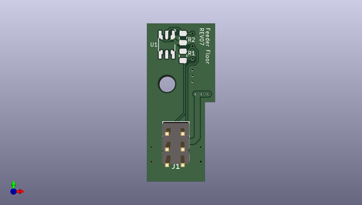

# feeder
 
## summary 
* id: opulo-inc_feeder_feederfloor
* user: opulo-inc
* name: feeder
* board: feederfloor
* repo: https://github.com/opulo-inc/feeder
* src_file_repo_kicad_pcb: pcb/feederFloor/feederFloor.kicad_pcb
* src_file_repo_kicad_pcb_link: https://github.com/opulo-inc/feeder/tree/main/pcb/feederFloor/feederFloor.kicad_pcb
* src_file_repo_kicad_sch: pcb/feederFloor/feederFloor.kicad_sch
* src_file_repo_kicad_sch_link: https://github.com/opulo-inc/feeder/tree/main/pcb/feederFloor/feederFloor.kicad_sch

* src_file_repo_sch: 
*
 src_file_repo_sch_link: https://github.com/opulo-inc/feeder/tree/main/
* full details link: https://github.com/oomlout/oomlout_oomp_project_bot_v_2/tree/main/projects/opulo-inc_feeder_feederfloor/current_version/working  

## schematic  
  
[schematic (pdf)](working_schematic.pdf)  

## pcb  
 
  
  
  
[board (pdf)](working.pdf)  

## working_bom
| Id | Designator | Footprint | Quantity | Designation | Supplier and ref |  | None | 
| --- | --- | --- | --- | --- | --- | --- | --- | 
| 1 | J1 | PinHeader_2x03_P2.54mm_Vertical | 1 | IDC |  |  | [''] | 
| 2 | H1 | MountingHole_3.2mm_M3 | 1 | MountingHole |  |  | [''] | 
| 3 | U1 | DS28E07_MULTI | 1 | DS28E07 |  |  | [''] | 
| 4 | R1 | R_0805_2012Metric | 1 | 120R |  |  | [''] | 
| 5 | R2 | R_0805_2012Metric | 1 | 1M |  |  | [''] | 
| 6 | J2 | AVX-915-005-541-Contact-Surface | 1 | Conn_01x05_Female |  |  | [''] | 

## bom_schematic
| Ref | Qnty | Value | Cmp name | Footprint | Description | Vendor | DNP | 
| --- | --- | --- | --- | --- | --- | --- | --- | 
| H1 | 1 | MountingHole | MountingHole | MountingHole:MountingHole_3.2mm_M3 | Mounting Hole without connection |  |  | 
| J1 | 1 | IDC | Conn_02x03_Odd_Even | Connector_PinHeader_2.54mm:PinHeader_2x03_P2.54mm_Vertical | Generic connector, double row, 02x03, odd/even pin numbering scheme (row 1 odd numbers, row 2 even numbers), script generated (kicad-library-utils/schlib/autogen/connector/) |  |  | 
| J2 | 1 | Conn_01x05_Female | Conn_01x05_Female | feeder:AVX-915-005-541-Contact-Surface | Generic connector, single row, 01x05, script generated (kicad-library-utils/schlib/autogen/connector/) |  |  | 
| R1 | 1 | 120R | R_Small | Resistor_SMD:R_0805_2012Metric | Resistor, small symbol |  |  | 
| R2 | 1 | 1M | R_Small | Resistor_SMD:R_0805_2012Metric | Resistor, small symbol |  |  | 
| U1 | 1 | DS28E07 | DS28E07 | feeder:DS28E07_MULTI |  |  |  | 

