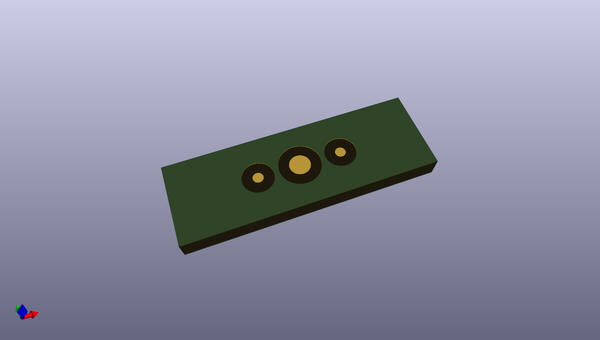
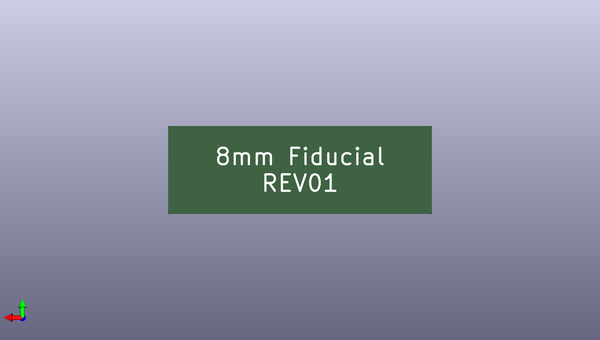

# feeder
 
## summary 
* id: opulo-inc_feeder_fiducialboard
* user: opulo-inc
* name: feeder
* board: fiducialboard
* repo: https://github.com/opulo-inc/feeder
* src_file_repo_kicad_pcb: pcb/photon-8mm-fid/fiducialBoard.kicad_pcb
* src_file_repo_kicad_pcb_link: https://github.com/opulo-inc/feeder/tree/main/pcb/photon-8mm-fid/fiducialBoard.kicad_pcb
* src_file_repo_kicad_sch: pcb/photon-8mm-fid/fiducialBoard.kicad_sch
* src_file_repo_kicad_sch_link: https://github.com/opulo-inc/feeder/tree/main/pcb/photon-8mm-fid/fiducialBoard.kicad_sch

* src_file_repo_sch: 
*
 src_file_repo_sch_link: https://github.com/opulo-inc/feeder/tree/main/
* full details link: https://github.com/oomlout/oomlout_oomp_project_bot_v_2/tree/main/projects/opulo-inc_feeder_fiducialboard/current_version/working  

## schematic  
  
[schematic (pdf)](working_schematic.pdf)  

## pcb  
 
  
  
  
[board (pdf)](working.pdf)  

## working_bom
| Id | Designator | Footprint | Quantity | Designation | Supplier and ref |  | None | 
| --- | --- | --- | --- | --- | --- | --- | --- | 
| 1 | REF** | Fiducial_1mm_Mask2mm | 1 | Fiducial_1mm_Mask2mm |  |  | [''] | 
| 2 | REF**,REF** | Fiducial_0.5mm_Mask1.5mm | 2 | Fiducial_0.5mm_Mask1.5mm |  |  | [''] | 

## bom_schematic
no data

