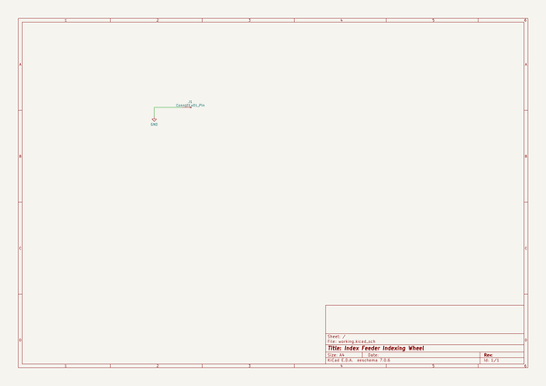
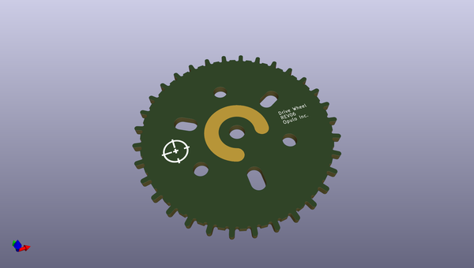
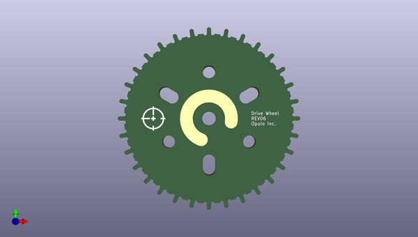
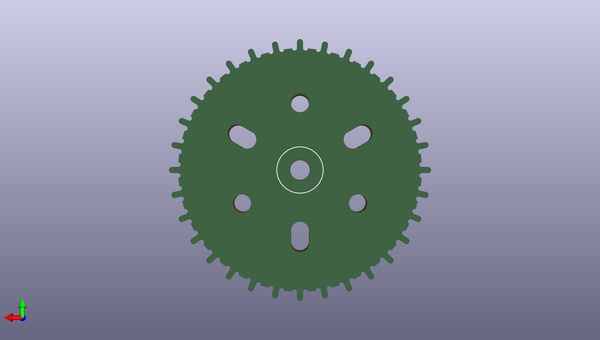

# feeder
 
## summary 
* id: opulo-inc_feeder_indexingwheel
* user: opulo-inc
* name: feeder
* board: indexingwheel
* repo: https://github.com/opulo-inc/feeder
* src_file_repo_kicad_pcb: pcb/indexingWheel/indexingWheel.kicad_pcb
* src_file_repo_kicad_pcb_link: https://github.com/opulo-inc/feeder/tree/main/pcb/indexingWheel/indexingWheel.kicad_pcb
* src_file_repo_kicad_sch: pcb/indexingWheel/indexingWheel.kicad_sch
* src_file_repo_kicad_sch_link: https://github.com/opulo-inc/feeder/tree/main/pcb/indexingWheel/indexingWheel.kicad_sch

* src_file_repo_sch: 
*
 src_file_repo_sch_link: https://github.com/opulo-inc/feeder/tree/main/
* full details link: https://github.com/oomlout/oomlout_oomp_project_bot_v_2/tree/main/projects/opulo-inc_feeder_indexingwheel/current_version/working  

## schematic  
  
[schematic (pdf)](working_schematic.pdf)  

## pcb  
 
  
  
  
[board (pdf)](working.pdf)  

## working_bom
| Id | Designator | Footprint | Quantity | Designation | Supplier and ref |  | None | 
| --- | --- | --- | --- | --- | --- | --- | --- | 
| 1 | G*** | logo | 1 | LOGO |  |  | [''] | 

## bom_schematic
| Ref | Qnty | Value | Cmp name | Footprint | Description | Vendor | DNP | 
| --- | --- | --- | --- | --- | --- | --- | --- | 
| J1 | 1 | Conn_01x01_Pin | Conn_01x01_Pin | Connector_PinHeader_1.00mm:PinHeader_1x01_P1.00mm_Horizontal | Generic connector, single row, 01x01, script generated |  |  | 

