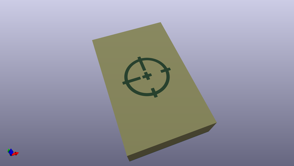
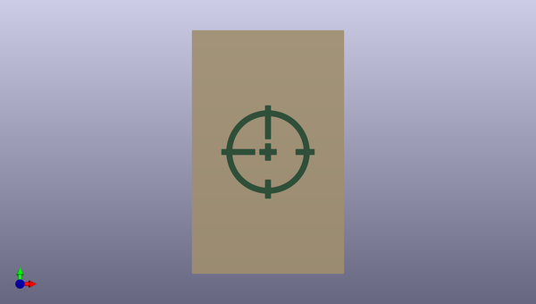
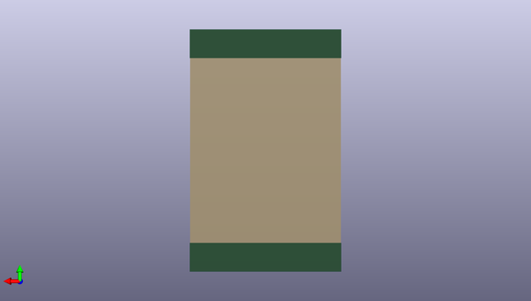

# feeder
 
## summary 
* id: opulo-inc_feeder_light_diffusion
* user: opulo-inc
* name: feeder
* board: light_diffusion
* repo: https://github.com/opulo-inc/feeder
* src_file_repo_kicad_pcb: pcb/light-diffusion/light-diffusion.kicad_pcb
* src_file_repo_kicad_pcb_link: https://github.com/opulo-inc/feeder/tree/main/pcb/light-diffusion/light-diffusion.kicad_pcb
* src_file_repo_kicad_sch: pcb/light-diffusion/light-diffusion.kicad_sch
* src_file_repo_kicad_sch_link: https://github.com/opulo-inc/feeder/tree/main/pcb/light-diffusion/light-diffusion.kicad_sch

* src_file_repo_sch: 
*
 src_file_repo_sch_link: https://github.com/opulo-inc/feeder/tree/main/
* full details link: https://github.com/oomlout/oomlout_oomp_project_bot_v_2/tree/main/projects/opulo-inc_feeder_light_diffusion/current_version/working  

## schematic  
  
[schematic (pdf)](working_schematic.pdf)  

## pcb  
 
  
  
  
[board (pdf)](working.pdf)  

## working_bom
no data

## bom_schematic
no data

