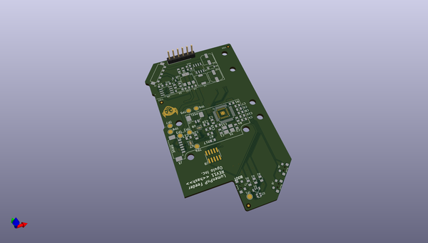

# feeder
 
## summary 
* id: opulo-inc_feeder_mobo
* user: opulo-inc
* name: feeder
* board: mobo
* repo: https://github.com/opulo-inc/feeder
* src_file_repo_kicad_pcb: pcb/mobo/mobo.kicad_pcb
* src_file_repo_kicad_pcb_link: https://github.com/opulo-inc/feeder/tree/main/pcb/mobo/mobo.kicad_pcb
* src_file_repo_kicad_sch: pcb/mobo/mobo.kicad_sch
* src_file_repo_kicad_sch_link: https://github.com/opulo-inc/feeder/tree/main/pcb/mobo/mobo.kicad_sch

* src_file_repo_sch: 
*
 src_file_repo_sch_link: https://github.com/opulo-inc/feeder/tree/main/
* full details link: https://github.com/oomlout/oomlout_oomp_project_bot_v_2/tree/main/projects/opulo-inc_feeder_mobo/current_version/working  

## schematic  
  
[schematic (pdf)](working_schematic.pdf)  

## pcb  
 
  
  
  
[board (pdf)](working.pdf)  

## working_bom
| Id | Designator | Footprint | Quantity | Designation | Supplier and ref |  | None | 
| --- | --- | --- | --- | --- | --- | --- | --- | 
| 1 | TP3 | TestPoint_Pad_D2.0mm | 1 | TP_DRIVE_M1 |  |  | [''] | 
| 2 | R9 | R_0805_2012Metric | 1 | 39k |  |  | [''] | 
| 3 | C9,C13 | C_0805_2012Metric | 2 | 10u |  |  | [''] | 
| 4 | C4,C7,C19,C3,C5,C18,C17,C20 | C_0805_2012Metric | 8 | 100n |  |  | [''] | 
| 5 | D1 | MHS110FRGBCT | 1 | LED_RGBA |  |  | [''] | 
| 6 | U7,U8 | WSON-8-1EP_2x2mm_P0.5mm_EP0.9x1.6mm | 2 | DRV8837 |  |  | [''] | 
| 7 | R5,R3,R2 | R_0805_2012Metric | 3 | 470 |  |  | [''] | 
| 8 | D9 | D_SOD-123 | 1 | MMSZ4684T1G |  |  | [''] | 
| 9 | R7,R4,R17 | R_0805_2012Metric | 3 | 10K |  |  | [''] | 
| 10 | U1 | LQFP-48_7x7mm_P0.5mm | 1 | STM32F031C6Tx |  |  | [''] | 
| 11 | U4 | SOT-223-3_TabPin2 | 1 | AP1117-33 |  |  | [''] | 
| 12 | Y1 | Crystal_SMD_3225-4Pin_3.2x2.5mm_HandSoldering | 1 | 8MHz |  |  | [''] | 
| 13 | J9 | SWD-No-Paste | 1 | SWD_10 |  |  | [''] | 
| 14 | TP8 | TestPoint_Pad_D2.0mm | 1 | TP_QUAD_B |  |  | [''] | 
| 15 | TP5 | TestPoint_Pad_D2.0mm | 1 | TP_PEEL_M2 |  |  | [''] | 
| 16 | TP7 | TestPoint_Pad_D2.0mm | 1 | TP_QUAD_A |  |  | [''] | 
| 17 | R6 | R_0805_2012Metric | 1 | 5.6k |  |  | [''] | 
| 18 | G*** | goblin | 1 | LOGO |  |  | [''] | 
| 19 | C12 | C_Elec_6.3x7.7 | 1 | 100uF |  |  | [''] | 
| 20 | C16 | C_Elec_6.3x7.7 | 1 | 470uF |  |  | [''] | 
| 21 | FID1,FID2,FID3 | Fiducial_1mm_Mask2mm | 3 | Fiducial |  |  | [''] | 
| 22 | TP1 | TestPoint_Pad_D2.0mm | 1 | TP_3V3 |  |  | [''] | 
| 23 | D2 | SOT-23 | 1 | SM712_SOT23 |  |  | [''] | 
| 24 | J6 | 1TS003B-1400-3500A-CT | 1 | SW2 |  |  | [''] | 
| 25 | TP6 | TestPoint_Pad_D2.0mm | 1 | TP_PEEL_M1 |  |  | [''] | 
| 26 | C14 | C_0805_2012Metric | 1 | 470pF |  |  | [''] | 
| 27 | J8 | UART_FRICTION_FIT | 1 | USART1 |  |  | [''] | 
| 28 | R15,R16 | R_0805_2012Metric | 2 | 20R |  |  | [''] | 
| 29 | J3 | Molex_PicoBlade_53261-0671_1x06-1MP_P1.25mm_Horizontal | 1 | DRIVE_MOTOR |  |  | [''] | 
| 30 | J7,J4 | 1TS003B-1400-3500A-CT | 2 | SW1 |  |  | [''] | 
| 31 | C6 | C_0805_2012Metric | 1 | 15pF |  |  | [''] | 
| 32 | J2 | Molex_PicoBlade_53261-0271_1x02-1MP_P1.25mm_Horizontal | 1 | PEEL_MOTOR |  |  | [''] | 
| 33 | TP4 | TestPoint_Pad_D2.0mm | 1 | TP_DRIVE_M2 |  |  | [''] | 
| 34 | U6 | SOIC-8_3.9x4.9mm_P1.27mm | 1 | MAX3078E |  |  | [''] | 
| 35 | R14 | R_0805_2012Metric | 1 | 220R |  |  | [''] | 
| 36 | R1 | R_0805_2012Metric | 1 | 1k |  |  | [''] | 
| 37 | C11,C8,C10 | C_0805_2012Metric | 3 | 4.7uF |  |  | [''] | 
| 38 | L1 | L_6.3x6.3_H3 | 1 | 220uH |  |  | [''] | 
| 39 | C1,C2 | C_0805_2012Metric | 2 | 15p |  |  | [''] | 
| 40 | J5 | AVX-9155-005-541 | 1 | SPRING_FINGERS |  |  | [''] | 
| 41 | R13 | R_0805_2012Metric | 1 | 0.33R |  |  | [''] | 
| 42 | D3 | LED_LiteOn_LTST-C19HE1WT | 1 | LED_RGBA_ALT |  |  | [''] | 
| 43 | U5 | SOIC-8_3.9x4.9mm_P1.27mm | 1 | MC34063AD |  |  | [''] | 
| 44 | TP2 | TestPoint_Pad_D2.0mm | 1 | TP_10V |  |  | [''] | 
| 45 | D6 | D_SOD-123 | 1 | 1N5819 |  |  | [''] | 
| 46 | G*** | logo_mask | 1 | LOGO |  |  | [''] | 
| 47 | J1 | PinHeader_2x05_P1.27mm_Vertical_SMD | 1 | SWD_10 |  |  | [''] | 

## bom_schematic
| Ref | Qnty | Value | Cmp name | Footprint | Description | Vendor | DNP | 
| --- | --- | --- | --- | --- | --- | --- | --- | 
| C1, C2 | 2 | 15p | C_Small | Capacitor_SMD:C_0805_2012Metric | Unpolarized capacitor, small symbol |  |  | 
| C3, C4, C5, C7, C17, C18, C19, C20 | 8 | 100n | C_Small | Capacitor_SMD:C_0805_2012Metric | Unpolarized capacitor, small symbol |  |  | 
| C6 | 1 | 15pF | C_Small | Capacitor_SMD:C_0805_2012Metric | Unpolarized capacitor, small symbol |  |  | 
| C8, C10, C11 | 3 | 4.7uF | C_Small | Capacitor_SMD:C_0805_2012Metric | Unpolarized capacitor, small symbol |  |  | 
| C9, C13 | 2 | 10u | C_Small | Capacitor_SMD:C_0805_2012Metric | Unpolarized capacitor, small symbol |  |  | 
| C12 | 1 | 100uF | C_Polarized_Small | Capacitor_SMD:C_Elec_6.3x7.7 | Polarized capacitor, small symbol |  |  | 
| C14 | 1 | 470pF | C_Small | Capacitor_SMD:C_0805_2012Metric | Unpolarized capacitor, small symbol |  |  | 
| C16 | 1 | 470uF | C_Polarized_Small | Capacitor_SMD:C_Elec_6.3x7.7 | Polarized capacitor, small symbol |  |  | 
| D1 | 1 | LED_RGBA | LED_RGBA | index:MHS110FRGBCT | RGB LED, red/green/blue/anode |  |  | 
| D2 | 1 | SM712_SOT23 | SM712_SOT23 | Package_TO_SOT_SMD:SOT-23 | 7V/12V, 600W Asymmetrical TVS Diode Array, SOT-23 |  |  | 
| D3 | 1 | LED_RGBA_ALT | LED_RGBA | LED_SMD:LED_LiteOn_LTST-C19HE1WT | RGB LED, red/green/blue/anode |  |  | 
| D6 | 1 | 1N5819 | 1N5819 | Diode_SMD:D_SOD-123 | 40V 1A Schottky Barrier Rectifier Diode, DO-41 |  |  | 
| D9 | 1 | MMSZ4684T1G | D_Zener | Diode_SMD:D_SOD-123 | Zener diode |  |  | 
| FID1, FID2, FID3 | 3 | Fiducial | Fiducial | Fiducial:Fiducial_1mm_Mask2mm | Fiducial Marker |  |  | 
| J1, J9 | 2 | SWD_10 | Conn_ARM_JTAG_SWD_10 | Connector_PinHeader_1.27mm:PinHeader_2x05_P1.27mm_Vertical_SMD | Cortex Debug Connector, standard ARM Cortex-M SWD and JTAG interface |  |  | 
| J2 | 1 | PEEL_MOTOR | Conn_01x02_Female | Connector_Molex:Molex_PicoBlade_53261-0271_1x02-1MP_P1.25mm_Horizontal | Generic connector, single row, 01x02, script generated (kicad-library-utils/schlib/autogen/connector/) |  |  | 
| J3 | 1 | DRIVE_MOTOR | Conn_01x06_Male | Connector_Molex:Molex_PicoBlade_53261-0671_1x06-1MP_P1.25mm_Horizontal | Generic connector, single row, 01x06, script generated (kicad-library-utils/schlib/autogen/connector/) |  |  | 
| J4, J7 | 2 | SW1 | Conn_01x04_Female | feeder:1TS003B-1400-3500A-CT | Generic connector, single row, 01x04, script generated (kicad-library-utils/schlib/autogen/connector/) |  |  | 
| J5 | 1 | SPRING_FINGERS | Conn_01x07_Female | feeder:AVX-9155-005-541 | Generic connector, single row, 01x07, script generated (kicad-library-utils/schlib/autogen/connector/) |  |  | 
| J6 | 1 | SW2 | Conn_01x04_Female | feeder:1TS003B-1400-3500A-CT | Generic connector, single row, 01x04, script generated (kicad-library-utils/schlib/autogen/connector/) |  |  | 
| J8 | 1 | USART1 | Conn_01x06_Female | feeder:UART_FRICTION_FIT | Generic connector, single row, 01x06, script generated (kicad-library-utils/schlib/autogen/connector/) |  |  | 
| L1 | 1 | 220uH | INDUCTOR | Inductor_SMD:L_6.3x6.3_H3 | Inductor symbol for simulation only |  |  | 
| R1 | 1 | 1k | R_Small | Resistor_SMD:R_0805_2012Metric | Resistor, small symbol |  |  | 
| R2, R3, R5 | 3 | 470 | R_Small | Resistor_SMD:R_0805_2012Metric | Resistor, small symbol |  |  | 
| R4, R7, R17 | 3 | 10K | R_Small | Resistor_SMD:R_0805_2012Metric | Resistor, small symbol |  |  | 
| R6 | 1 | 5.6k | R_Small | Resistor_SMD:R_0805_2012Metric | Resistor, small symbol |  |  | 
| R9 | 1 | 39k | R_Small | Resistor_SMD:R_0805_2012Metric | Resistor, small symbol |  |  | 
| R13 | 1 | 0.33R | R_Small | Resistor_SMD:R_0805_2012Metric | Resistor, small symbol |  |  | 
| R14 | 1 | 220R | R_Small | Resistor_SMD:R_0805_2012Metric | Resistor, small symbol |  |  | 
| R15, R16 | 2 | 20R | R_Small | Resistor_SMD:R_0805_2012Metric | Resistor, small symbol |  |  | 
| TP1 | 1 | TP_3V3 | TestPoint | TestPoint:TestPoint_Pad_D2.0mm | test point |  |  | 
| TP2 | 1 | TP_10V | TestPoint | TestPoint:TestPoint_Pad_D2.0mm | test point |  |  | 
| TP3 | 1 | TP_DRIVE_M1 | TestPoint | TestPoint:TestPoint_Pad_D2.0mm | test point |  |  | 
| TP4 | 1 | TP_DRIVE_M2 | TestPoint | TestPoint:TestPoint_Pad_D2.0mm | test point |  |  | 
| TP5 | 1 | TP_PEEL_M2 | TestPoint | TestPoint:TestPoint_Pad_D2.0mm | test point |  |  | 
| TP6 | 1 | TP_PEEL_M1 | TestPoint | TestPoint:TestPoint_Pad_D2.0mm | test point |  |  | 
| TP7 | 1 | TP_QUAD_A | TestPoint | TestPoint:TestPoint_Pad_D2.0mm | test point |  |  | 
| TP8 | 1 | TP_QUAD_B | TestPoint | TestPoint:TestPoint_Pad_D2.0mm | test point |  |  | 
| U1 | 1 | STM32F031C6Tx | STM32F031C6Tx | Package_QFP:LQFP-48_7x7mm_P0.5mm | ARM Cortex-M0 MCU, 32KB flash, 4KB RAM, 48MHz, 2-3.6V, 39 GPIO, LQFP-48 |  |  | 
| U2 | 1 | STM32F031K6Ux | STM32F031K6Ux | Package_DFN_QFN:QFN-32-1EP_5x5mm_P0.5mm_EP3.45x3.45mm | ARM Cortex-M0 MCU, 32KB flash, 4KB RAM, 48MHz, 2-3.6V, 27 GPIO, UFQFPN-32 |  | DNP | 
| U4 | 1 | AP1117-33 | AP1117-33 | Package_TO_SOT_SMD:SOT-223-3_TabPin2 | 1A Low Dropout regulator, positive, 3.3V fixed output, SOT-223 |  |  | 
| U5 | 1 | MC34063AD | MC34063AD | Package_SO:SOIC-8_3.9x4.9mm_P1.27mm | 1.5A, step-up/down/inverting switching regulator, 3-40V Vin, 100kHz, SO-8 |  |  | 
| U6 | 1 | MAX3078E | MAX3078E | Package_SO:SOIC-8_3.9x4.9mm_P1.27mm | +3.3V, ±15kV ESD-Protected, Fail-Safe, Hot-Swap, RS-485/RS-422 Transceivers, SOIC-8 |  |  | 
| U7, U8 | 2 | DRV8837 | DRV8837 | Package_SON:WSON-8-1EP_2x2mm_P0.5mm_EP0.9x1.6mm | H-Bridge driver, 1.8A, Low Voltage, PWM input, WSON-8 |  |  | 
| Y1 | 1 | 8MHz | Crystal_GND24_Small | Crystal:Crystal_SMD_3225-4Pin_3.2x2.5mm_HandSoldering | Four pin crystal, GND on pins 2 and 4, small symbol |  |  | 

