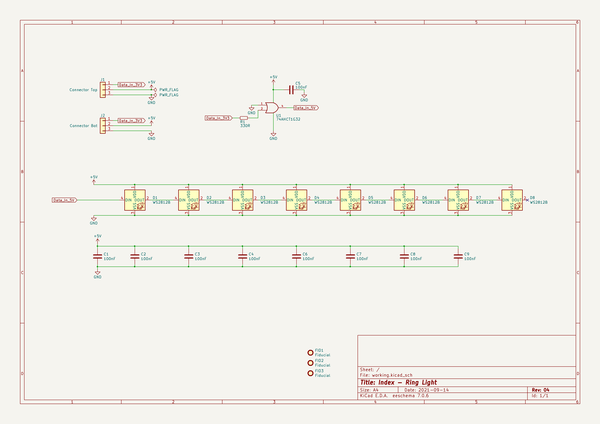
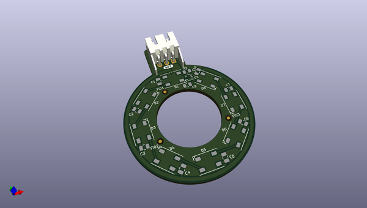
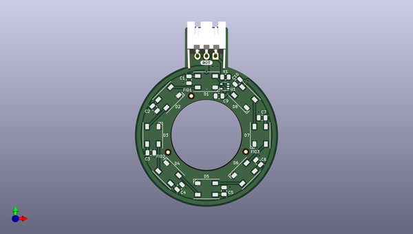
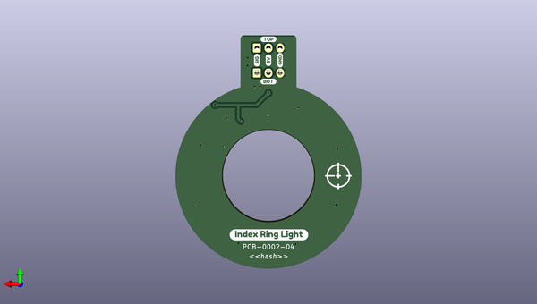

# lumenpnp
 
## summary 
* id: opulo-inc_lumenpnp_ringlight
* user: opulo-inc
* name: lumenpnp
* board: ringlight
* repo: https://github.com/opulo-inc/lumenpnp
* src_file_repo_kicad_pcb: pnp/pcb/ring-light/ringLight.kicad_pcb
* src_file_repo_kicad_pcb_link: https://github.com/opulo-inc/lumenpnp/tree/main/pnp/pcb/ring-light/ringLight.kicad_pcb
* src_file_repo_kicad_sch: pnp/pcb/ring-light/ringLight.kicad_sch
* src_file_repo_kicad_sch_link: https://github.com/opulo-inc/lumenpnp/tree/main/pnp/pcb/ring-light/ringLight.kicad_sch

* src_file_repo_sch: 
*
 src_file_repo_sch_link: https://github.com/opulo-inc/lumenpnp/tree/main/
* full details link: https://github.com/oomlout/oomlout_oomp_project_bot_v_2/tree/main/projects/opulo-inc_lumenpnp_ringlight/current_version/working  

## schematic  
  
[schematic (pdf)](working_schematic.pdf)  

## pcb  
 
  
  
  
[board (pdf)](working.pdf)  

## working_bom
| Id | Designator | Footprint | Quantity | Designation | Supplier and ref |  | None | 
| --- | --- | --- | --- | --- | --- | --- | --- | 
| 1 | D1,D2,D3,D4,D5,D6,D7,D8 | LED_WS2812B_PLCC4_5.0x5.0mm_P3.2mm | 8 | WS2812B |  |  | [''] | 
| 2 | FID1,FID2,FID3 | Fiducial_1mm_Mask2mm | 3 | Fiducial |  |  | [''] | 
| 3 | C1,C3,C5,C7,C6,C2,C4,C10,C9 | C_0805_2012Metric | 9 | 100nF |  |  | [''] | 
| 4 | J2 | JST_XH_S3B-XH-A-1_1x03_P2.50mm_Horizontal | 1 | Connector Horizontal |  |  | [''] | 
| 5 | R1 | R_0805_2012Metric | 1 | 330R |  |  | [''] | 
| 6 | U1 | SOT-353_SC-70-5 | 1 | 74AHCT1G32 |  |  | [''] | 
| 7 | J1 | JST_XH_B3B-XH-A_1x03_P2.50mm_Vertical | 1 | Connector Vertical |  |  | [''] | 

## bom_schematic
| Ref | Qnty | Value | Cmp name | Footprint | Description | Vendor | DNP | 
| --- | --- | --- | --- | --- | --- | --- | --- | 
| C1, C2, C3, C4, C5, C6, C7, C8, C9 | 9 | 100nF | C | Capacitor_SMD:C_0805_2012Metric | Unpolarized capacitor |  |  | 
| D1, D2, D3, D4, D5, D6, D7, D8 | 8 | WS2812B | WS2812B | LED_SMD:LED_WS2812B_PLCC4_5.0x5.0mm_P3.2mm | RGB LED with integrated controller |  |  | 
| FID1, FID2, FID3 | 3 | Fiducial | Fiducial | Fiducial:Fiducial_1mm_Mask2mm | Fiducial Marker |  |  | 
| J1 | 1 | Connector Top | Conn_01x03 | Connector_JST:JST_XH_B3B-XH-A_1x03_P2.50mm_Vertical | Generic connector, single row, 01x03, script generated (kicad-library-utils/schlib/autogen/connector/) |  |  | 
| J2 | 1 | Connector Bot | Conn_01x03 | Connector_JST:JST_XH_S3B-XH-A-1_1x03_P2.50mm_Horizontal | Generic connector, single row, 01x03, script generated (kicad-library-utils/schlib/autogen/connector/) |  |  | 
| R1 | 1 | 330R | R_Small | Resistor_SMD:R_0805_2012Metric | Resistor, small symbol |  |  | 
| U1 | 1 | 74AHCT1G32 | 74AHCT1G32 | Package_TO_SOT_SMD:SOT-353_SC-70-5 | Single OR Gate, Low-Voltage CMOS |  |  | 

