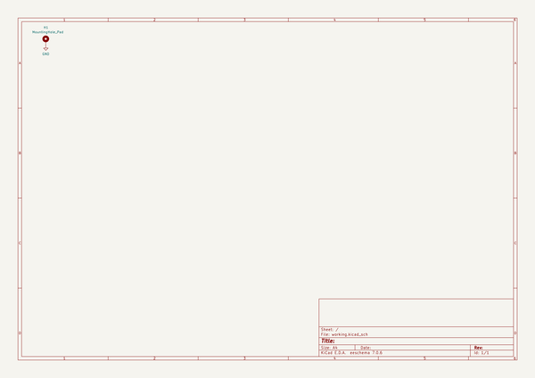
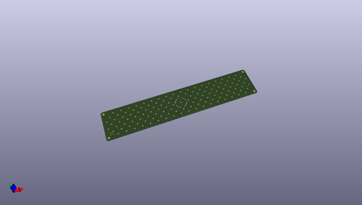
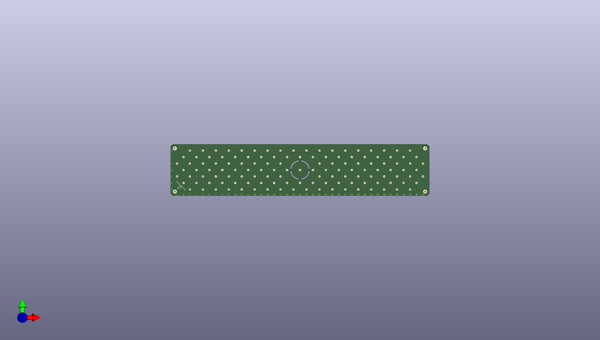
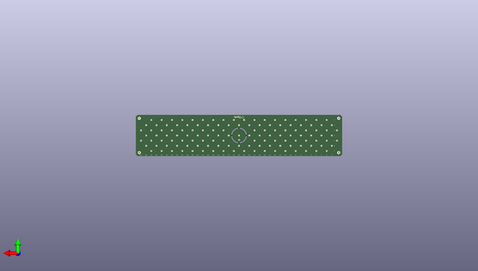

# lumenpnp
 
## summary 
* id: opulo-inc_lumenpnp_staging_plate
* user: opulo-inc
* name: lumenpnp
* board: staging_plate
* repo: https://github.com/opulo-inc/lumenpnp
* src_file_repo_kicad_pcb: pnp/pcb/staging-plate/staging-plate.kicad_pcb
* src_file_repo_kicad_pcb_link: https://github.com/opulo-inc/lumenpnp/tree/main/pnp/pcb/staging-plate/staging-plate.kicad_pcb
* src_file_repo_kicad_sch: pnp/pcb/staging-plate/staging-plate.kicad_sch
* src_file_repo_kicad_sch_link: https://github.com/opulo-inc/lumenpnp/tree/main/pnp/pcb/staging-plate/staging-plate.kicad_sch

* src_file_repo_sch: 
*
 src_file_repo_sch_link: https://github.com/opulo-inc/lumenpnp/tree/main/
* full details link: https://github.com/oomlout/oomlout_oomp_project_bot_v_2/tree/main/projects/opulo-inc_lumenpnp_staging_plate/current_version/working  

## schematic  
  
[schematic (pdf)](working_schematic.pdf)  

## pcb  
 
  
  
  
[board (pdf)](working.pdf)  

## working_bom
| Id | Designator | Footprint | Quantity | Designation | Supplier and ref |  | None | 
| --- | --- | --- | --- | --- | --- | --- | --- | 
| 1 | ,,,,,,,,,,,,,,,,,,,,,,,,,,,,,,,,,,,,,,,,,,,,,,,,,,,,,,,,,,,,,,,,,,,,,,,,,,,,,,,,,,,,,,,,,,,,,,,,,,,,,,,,,,,,,,,,,,,,,,,,,,,,,, |  | 127 |  |  |  | [''] | 
| 2 | mouse-bite-2mm-slot,mouse-bite-2mm-slot,mouse-bite-2mm-slot,mouse-bite-2mm-slot | mouse-bite-2mm-slot-4mm | 4 | VAL** |  |  | [''] | 
| 3 | H1 | MountingHole_5.3mm_M5_DIN965_Pad | 1 | MountingHole_Pad |  |  | [''] | 
| 4 | G*** | logo_mask | 1 | LOGO |  |  | [''] | 
| 5 | G*** | goblin-tiny | 1 | LOGO |  |  | [''] | 

## bom_schematic
| Ref | Qnty | Value | Cmp name | Footprint | Description | Vendor | DNP | 
| --- | --- | --- | --- | --- | --- | --- | --- | 
| H1 | 1 | MountingHole_Pad | MountingHole_Pad | MountingHole:MountingHole_5.3mm_M5_DIN965_Pad | Mounting Hole with connection |  |  | 

