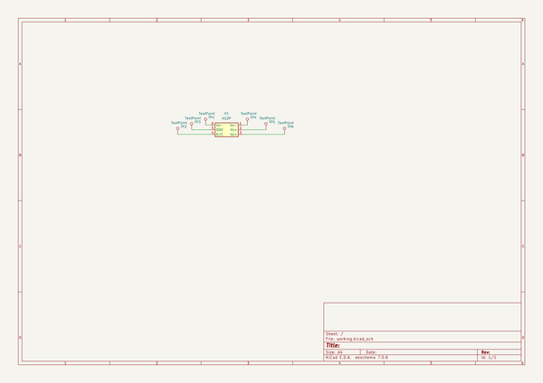
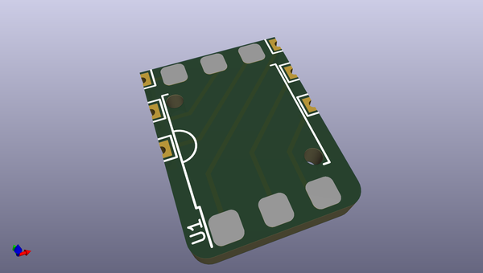
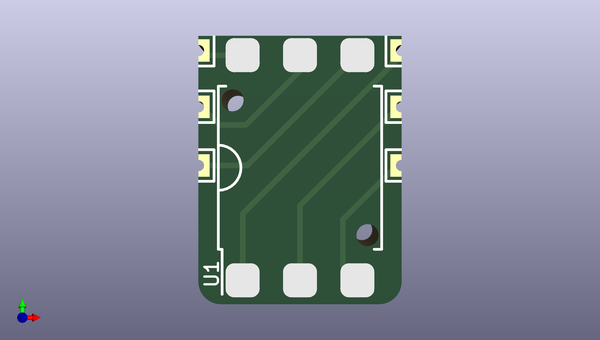
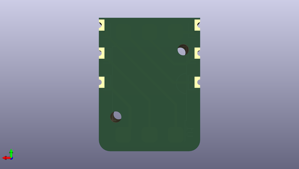

# lumenpnp
 
## summary 
* id: opulo-inc_lumenpnp_vac_adapter
* user: opulo-inc
* name: lumenpnp
* board: vac_adapter
* repo: https://github.com/opulo-inc/lumenpnp
* src_file_repo_kicad_pcb: pnp/pcb/vac-interposer/vac-adapter.kicad_pcb
* src_file_repo_kicad_pcb_link: https://github.com/opulo-inc/lumenpnp/tree/main/pnp/pcb/vac-interposer/vac-adapter.kicad_pcb
* src_file_repo_kicad_sch: pnp/pcb/vac-interposer/vac-adapter.kicad_sch
* src_file_repo_kicad_sch_link: https://github.com/opulo-inc/lumenpnp/tree/main/pnp/pcb/vac-interposer/vac-adapter.kicad_sch

* src_file_repo_sch: 
*
 src_file_repo_sch_link: https://github.com/opulo-inc/lumenpnp/tree/main/
* full details link: https://github.com/oomlout/oomlout_oomp_project_bot_v_2/tree/main/projects/opulo-inc_lumenpnp_vac_adapter/current_version/working  

## schematic  
  
[schematic (pdf)](working_schematic.pdf)  

## pcb  
 
  
  
  
[board (pdf)](working.pdf)  

## working_bom
| Id | Designator | Footprint | Quantity | Designation | Supplier and ref |  | None | 
| --- | --- | --- | --- | --- | --- | --- | --- | 
| 1 | TP3,TP5,TP1,TP4,TP6,TP2 | TestPoint_THTPad_1.0x1.0mm_Drill0.5mm | 6 | TestPoint |  |  | [''] | 
| 2 | U1 | SO-6_7x7mm_P2.54mm | 1 | XGZP |  |  | [''] | 

## bom_schematic
| Ref | Qnty | Value | Cmp name | Footprint | Description | Vendor | DNP | 
| --- | --- | --- | --- | --- | --- | --- | --- | 
| TP1, TP2, TP3, TP4, TP5, TP6 | 6 | TestPoint | TestPoint | TestPoint:TestPoint_THTPad_1.0x1.0mm_Drill0.5mm | test point |  |  | 
| U1 | 1 | XGZP | XGZP | index:SO-6_7x7mm_P2.54mm | XGZP Pressure Sensor (SOP6) |  |  | 

