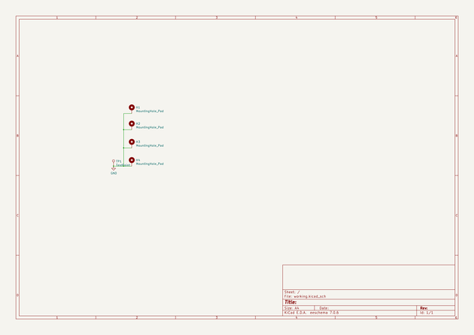
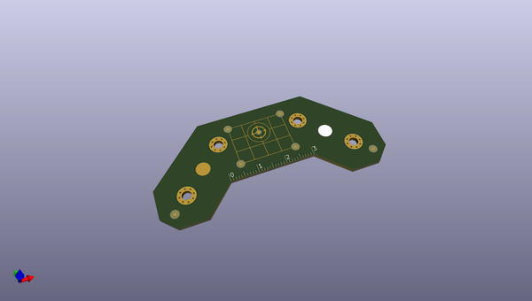
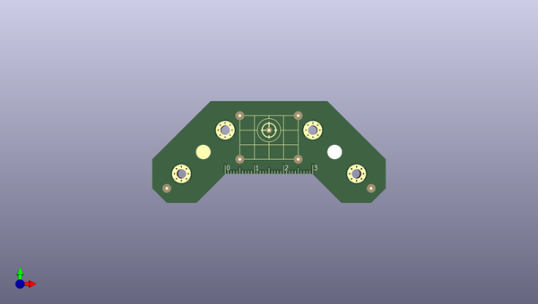
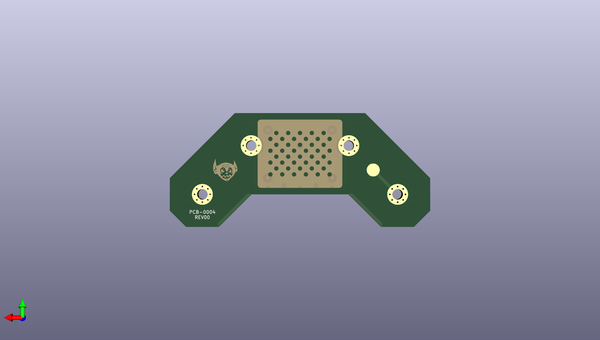

# lumenpnp_archive
 
## summary 
* id: opulo-inc_lumenpnp_archive_datum
* user: opulo-inc
* name: lumenpnp_archive
* board: datum
* repo: https://github.com/opulo-inc/lumenpnp-archive
* src_file_repo_kicad_pcb: pnp/pcb/datum/datum.kicad_pcb
* src_file_repo_kicad_pcb_link: https://github.com/opulo-inc/lumenpnp-archive/tree/master/pnp/pcb/datum/datum.kicad_pcb
* src_file_repo_kicad_sch: pnp/pcb/datum/datum.kicad_sch
* src_file_repo_kicad_sch_link: https://github.com/opulo-inc/lumenpnp-archive/tree/master/pnp/pcb/datum/datum.kicad_sch

* src_file_repo_sch: 
*
 src_file_repo_sch_link: https://github.com/opulo-inc/lumenpnp-archive/tree/master/
* full details link: https://github.com/oomlout/oomlout_oomp_project_bot_v_2/tree/main/projects/opulo-inc_lumenpnp_archive_datum/current_version/working  

## schematic  
  
[schematic (pdf)](working_schematic.pdf)  

## pcb  
 
  
  
  
[board (pdf)](working.pdf)  

## working_bom
| Id | Designator | Footprint | Quantity | Designation | Supplier and ref |  | None | 
| --- | --- | --- | --- | --- | --- | --- | --- | 
| 1 | REF**,REF**,REF**,REF**,REF**,REF** | Fiducial_1mm_Mask3mm | 6 | Fiducial_1mm_Mask3mm |  |  | [''] | 
| 2 | G*** | logo_mask | 1 | LOGO |  |  | [''] | 
| 3 | REF** | Fiducial_1mm_Mask2mm | 1 | Fiducial_1mm_Mask2mm |  |  | [''] | 
| 4 | REF** | 30mm-ruler | 1 | Metric_Ruler_90mm |  |  | [''] | 
| 5 | G*** | cal-dot-grid | 1 | LOGO |  |  | [''] | 
| 6 | G*** | goblin | 1 | LOGO |  |  | [''] | 

## bom_schematic
| Ref | Qnty | Value | Cmp name | Footprint | Description | Vendor | DNP | 
| --- | --- | --- | --- | --- | --- | --- | --- | 
| H1, H2, H3, H4 | 4 | MountingHole_Pad | MountingHole_Pad | MountingHole:MountingHole_3.2mm_M3_Pad_Via | Mounting Hole with connection |  |  | 
| TP1 | 1 | TestPoint | TestPoint | TestPoint:TestPoint_Pad_D4.0mm | test point |  |  | 

