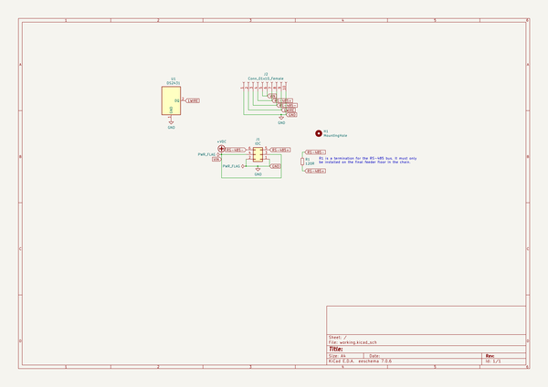
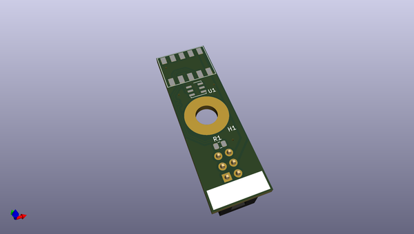
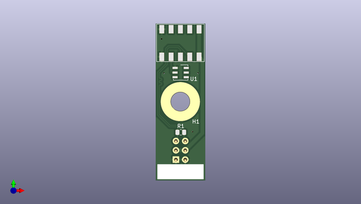
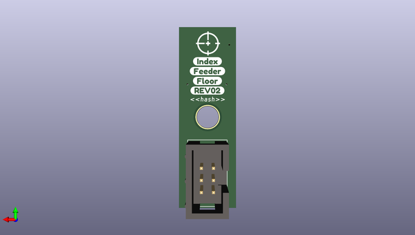

# lumenpnp_archive
 
## summary 
* id: opulo-inc_lumenpnp_archive_feederfloor
* user: opulo-inc
* name: lumenpnp_archive
* board: feederfloor
* repo: https://github.com/opulo-inc/lumenpnp-archive
* src_file_repo_kicad_pcb: feeder/pcb/feederFloor/feederFloor.kicad_pcb
* src_file_repo_kicad_pcb_link: https://github.com/opulo-inc/lumenpnp-archive/tree/master/feeder/pcb/feederFloor/feederFloor.kicad_pcb
* src_file_repo_kicad_sch: feeder/pcb/feederFloor/feederFloor.kicad_sch
* src_file_repo_kicad_sch_link: https://github.com/opulo-inc/lumenpnp-archive/tree/master/feeder/pcb/feederFloor/feederFloor.kicad_sch

* src_file_repo_sch: 
*
 src_file_repo_sch_link: https://github.com/opulo-inc/lumenpnp-archive/tree/master/
* full details link: https://github.com/oomlout/oomlout_oomp_project_bot_v_2/tree/main/projects/opulo-inc_lumenpnp_archive_feederfloor/current_version/working  

## schematic  
  
[schematic (pdf)](working_schematic.pdf)  

## pcb  
 
  
  
  
[board (pdf)](working.pdf)  

## working_bom
| Id | Designator | Footprint | Quantity | Designation | Supplier and ref |  | None | 
| --- | --- | --- | --- | --- | --- | --- | --- | 
| 1 | J2 | 70AA-5 | 1 | Conn_01x10_Female |  |  | [''] | 
| 2 | R1 | R_0805_2012Metric | 1 | 120R |  |  | [''] | 
| 3 | U1 | TSOC-6_3.76x3.94mm_P1.27mm | 1 | DS2431 |  |  | [''] | 
| 4 | J1 | IDC-Header_2x03_P2.54mm_Vertical | 1 | IDC |  |  | [''] | 
| 5 | G*** | logo | 1 | LOGO |  |  | [''] | 

## bom_schematic
| Ref | Qnty | Value | Cmp name | Footprint | Description | Vendor | DNP | 
| --- | --- | --- | --- | --- | --- | --- | --- | 
| H1 | 1 | MountingHole | MountingHole | MountingHole:MountingHole_5.3mm_M5_Pad_TopOnly | Mounting Hole without connection |  |  | 
| J1 | 1 | IDC | Conn_02x03_Odd_Even | Connector_IDC:IDC-Header_2x03_P2.54mm_Vertical | Generic connector, double row, 02x03, odd/even pin numbering scheme (row 1 odd numbers, row 2 even numbers), script generated (kicad-library-utils/schlib/autogen/connector/) |  |  | 
| J2 | 1 | Conn_01x10_Female | Conn_01x10_Female | index:70AA-5 | Generic connector, single row, 01x10, script generated (kicad-library-utils/schlib/autogen/connector/) |  |  | 
| R1 | 1 | 120R | R_Small | Resistor_SMD:R_0805_2012Metric | Resistor, small symbol |  |  | 
| U1 | 1 | DS2431 | DS2431 | Package_SO_J-Lead:TSOC-6_3.76x3.94mm_P1.27mm |  |  |  | 

