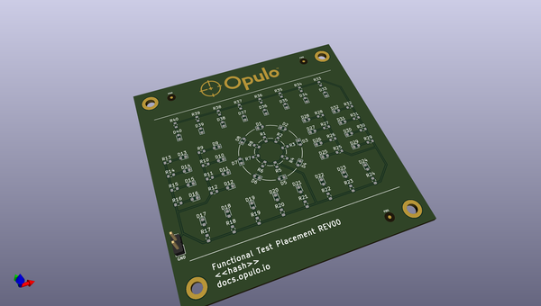
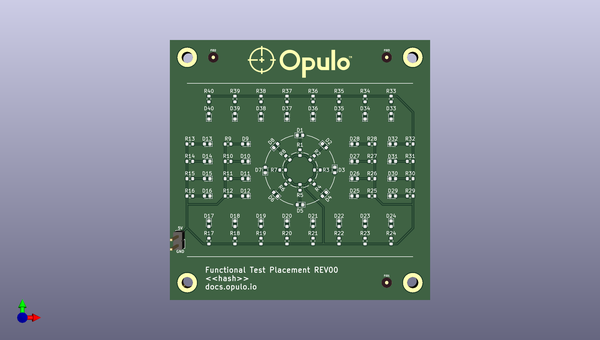
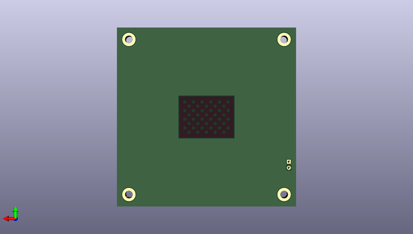

# lumenpnp_archive
 
## summary 
* id: opulo-inc_lumenpnp_archive_ftp
* user: opulo-inc
* name: lumenpnp_archive
* board: ftp
* repo: https://github.com/opulo-inc/lumenpnp-archive
* src_file_repo_kicad_pcb: pnp/pcb/ftp/ftp.kicad_pcb
* src_file_repo_kicad_pcb_link: https://github.com/opulo-inc/lumenpnp-archive/tree/master/pnp/pcb/ftp/ftp.kicad_pcb
* src_file_repo_kicad_sch: pnp/pcb/ftp/ftp.kicad_sch
* src_file_repo_kicad_sch_link: https://github.com/opulo-inc/lumenpnp-archive/tree/master/pnp/pcb/ftp/ftp.kicad_sch

* src_file_repo_sch: 
*
 src_file_repo_sch_link: https://github.com/opulo-inc/lumenpnp-archive/tree/master/
* full details link: https://github.com/oomlout/oomlout_oomp_project_bot_v_2/tree/main/projects/opulo-inc_lumenpnp_archive_ftp/current_version/working  

## schematic  
  
[schematic (pdf)](working_schematic.pdf)  

## pcb  
 
  
  
  
[board (pdf)](working.pdf)  

## working_bom
| Id | Designator | Footprint | Quantity | Designation | Supplier and ref |  | None | 
| --- | --- | --- | --- | --- | --- | --- | --- | 
| 1 | D34,D28,D2,D11,D8,D36,D15,D16,D31,D19,D6,D25,D30,D22,D21,D32,D20,D17,D26,D3,D23,D35,D10,D29,D24,D7,D18,D14,D5,D12,D39,D37,D4,D40,D1,D13,D38,D33,D27,D9 | LED_0603_1608Metric | 40 | LED_Small |  |  | [''] | 
| 2 | R16,R29,R2,R15,R24,R3,R11,R33,R18,R32,R12,R5,R13,R6,R23,R37,R9,R38,R25,R10,R4,R14,R1,R21,R36,R28,R19,R17,R39,R22,R8,R7,R35,R27,R20,R26,R34,R31,R30,R40 | R_0603_1608Metric | 40 | R_Small |  |  | [''] | 
| 3 | J1 | PinHeader_1x02_P2.54mm_Vertical | 1 | Conn_01x02_Male |  |  | [''] | 
| 4 | FID3,FID1,FID2 | Fiducial_1mm_Mask3mm | 3 | Fiducial |  |  | [''] | 
| 5 | G*** | cal-dot-grid | 1 | LOGO |  |  | [''] | 

## bom_schematic
| Ref | Qnty | Value | Cmp name | Footprint | Description | Vendor | DNP | 
| --- | --- | --- | --- | --- | --- | --- | --- | 
| D1, D2, D3, D4, D5, D6, D7, D8, D9, D10, D11, D12, D13, D14, D15, D16, D17, D18, D19, D20, D21, D22, D23, D24, D25, D26, D27, D28, D29, D30, D31, D32, D33, D34, D35, D36, D37, D38, D39, D40 | 40 | LED_Small | LED_Small | LED_SMD:LED_0603_1608Metric | Light emitting diode, small symbol |  |  | 
| FID1, FID2, FID3 | 3 | Fiducial | Fiducial | Fiducial:Fiducial_1mm_Mask3mm | Fiducial Marker |  |  | 
| J1 | 1 | Conn_01x02_Male | Conn_01x02_Male | Connector_PinHeader_2.54mm:PinHeader_1x02_P2.54mm_Vertical | Generic connector, single row, 01x02, script generated (kicad-library-utils/schlib/autogen/connector/) |  |  | 
| R1, R2, R3, R4, R5, R6, R7, R8, R9, R10, R11, R12, R13, R14, R15, R16, R17, R18, R19, R20, R21, R22, R23, R24, R25, R26, R27, R28, R29, R30, R31, R32, R33, R34, R35, R36, R37, R38, R39, R40 | 40 | R_Small | R_Small | Resistor_SMD:R_0603_1608Metric | Resistor, small symbol |  |  | 

