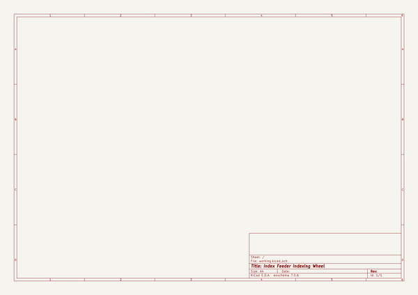
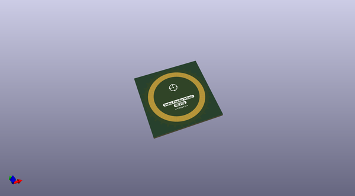

# lumenpnp_archive
 
## summary 
* id: opulo-inc_lumenpnp_archive_indexingwheel
* user: opulo-inc
* name: lumenpnp_archive
* board: indexingwheel
* repo: https://github.com/opulo-inc/lumenpnp-archive
* src_file_repo_kicad_pcb: feeder/pcb/indexingWheel/indexingWheel.kicad_pcb
* src_file_repo_kicad_pcb_link: https://github.com/opulo-inc/lumenpnp-archive/tree/master/feeder/pcb/indexingWheel/indexingWheel.kicad_pcb
* src_file_repo_kicad_sch: feeder/pcb/indexingWheel/indexingWheel.kicad_sch
* src_file_repo_kicad_sch_link: https://github.com/opulo-inc/lumenpnp-archive/tree/master/feeder/pcb/indexingWheel/indexingWheel.kicad_sch

* src_file_repo_sch: 
*
 src_file_repo_sch_link: https://github.com/opulo-inc/lumenpnp-archive/tree/master/
* full details link: https://github.com/oomlout/oomlout_oomp_project_bot_v_2/tree/main/projects/opulo-inc_lumenpnp_archive_indexingwheel/current_version/working  

## schematic  
  
[schematic (pdf)](working_schematic.pdf)  

## pcb  
 
  
  
  
[board (pdf)](working.pdf)  

## working_bom
| Id | Designator | Footprint | Quantity | Designation | Supplier and ref |  | None | 
| --- | --- | --- | --- | --- | --- | --- | --- | 
| 1 | G***,G*** | logo | 2 | LOGO |  |  | [''] | 

## bom_schematic
no data

