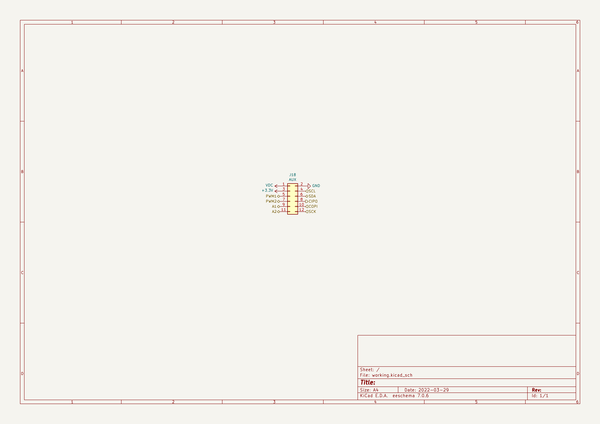
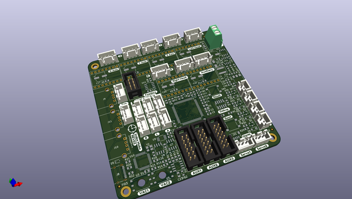
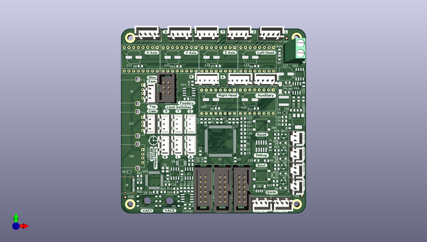
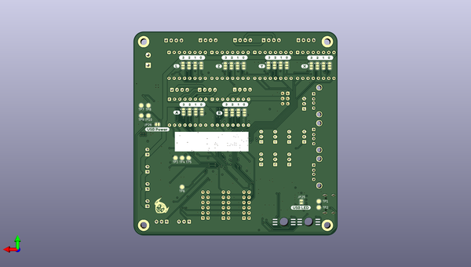

# lumenpnp_archive
 
## summary 
* id: opulo-inc_lumenpnp_archive_mobo
* user: opulo-inc
* name: lumenpnp_archive
* board: mobo
* repo: https://github.com/opulo-inc/lumenpnp-archive
* src_file_repo_kicad_pcb: pnp/pcb/mobo/mobo.kicad_pcb
* src_file_repo_kicad_pcb_link: https://github.com/opulo-inc/lumenpnp-archive/tree/master/pnp/pcb/mobo/mobo.kicad_pcb
* src_file_repo_kicad_sch: pnp/pcb/mobo/aux_header.kicad_sch
* src_file_repo_kicad_sch_link: https://github.com/opulo-inc/lumenpnp-archive/tree/master/pnp/pcb/mobo/aux_header.kicad_sch

* src_file_repo_sch: 
*
 src_file_repo_sch_link: https://github.com/opulo-inc/lumenpnp-archive/tree/master/
* full details link: https://github.com/oomlout/oomlout_oomp_project_bot_v_2/tree/main/projects/opulo-inc_lumenpnp_archive_mobo/current_version/working  

## schematic  
  
[schematic (pdf)](working_schematic.pdf)  

## pcb  
 
  
  
  
[board (pdf)](working.pdf)  

## working_bom
| Id | Designator | Footprint | Quantity | Designation | Supplier and ref |  | None | 
| --- | --- | --- | --- | --- | --- | --- | --- | 
| 1 | H1,H3,H2,H4 | MountingHole_3.2mm_M3_DIN965_Pad | 4 | MountingHole |  |  | [''] | 
| 2 | D6,D8,D7,D9 | D_SOD-123F | 4 | SM4007 |  |  | [''] | 
| 3 | Q1,Q2,Q3,Q4 | SOT-23 | 4 | AO3400A |  |  | [''] | 
| 4 | R30,R36,R34,R32 | R_0805_2012Metric | 4 | 36k |  |  | [''] | 
| 5 | J9 | USB_A_Stewart_SS-52100-001_Horizontal | 1 | Bottom Camera |  |  | [''] | 
| 6 | J11 | USB_A_Stewart_SS-52100-001_Horizontal | 1 | Top Camera |  |  | [''] | 
| 7 | J10 | USB_A_Stewart_SS-52100-001_Horizontal | 1 | AUX USB |  |  | [''] | 
| 8 | U10 | LQFP-48_7x7mm_P0.5mm | 1 | FE1.1 |  |  | [''] | 
| 9 | U5,U3 | SO-6_7x7mm_P2.54mm | 2 | XGZP101SB1 |  |  | [''] | 
| 10 | J8 | USB_C_Receptacle_Palconn_UTC16-G | 1 | Host |  |  | [''] | 
| 11 | R35,R31,R33,R29,R23 | R_0805_2012Metric | 5 | 560 |  |  | [''] | 
| 12 | A6,A2,A1,A3,A5,A4 | Pololu_Breakout-16_15.2x20.3mm | 6 | Motor_Driver |  |  | [''] | 
| 13 | M2,M1,M3,M4 | JST_XH_B4B-XH-A_1x04_P2.50mm_Vertical | 4 | Stepper_Motor |  |  | [''] | 
| 14 | C22,C18,C19,C27,C17,C20,C21 | CP_Elec_6.3x7.7 | 7 | 100u |  |  | [''] | 
| 15 | R11,R6,R7,R8,R10,R9 | R_0805_2012Metric | 6 | 1k |  |  | [''] | 
| 16 | D2,D1 | LED_0805_2012Metric | 2 | Yellow |  |  | [''] | 
| 17 | J12 | TerminalBlock_Phoenix_MKDS-1,5-2_1x02_P5.00mm_Horizontal | 1 | Power |  |  | [''] | 
| 18 | R24,R3,R5,R4,R26 | R_0805_2012Metric | 5 | 10k |  |  | [''] | 
| 19 | M7,M5 | JST_XH_B4B-XH-A_1x04_P2.50mm_Vertical | 2 | MOTOR1 |  |  | [''] | 
| 20 | M8,M6 | JST_XH_B4B-XH-A_1x04_P2.50mm_Vertical | 2 | MOTOR2 |  |  | [''] | 
| 21 | U11 | SO-8_3.9x4.9mm_P1.27mm | 1 | FDS4435BZ |  |  | [''] | 
| 22 | J3 | JST_XH_B3B-XH-A_1x03_P2.50mm_Vertical | 1 | Y_LIMIT |  |  | [''] | 
| 23 | J4 | JST_XH_B3B-XH-A_1x03_P2.50mm_Vertical | 1 | Z_LIMIT |  |  | [''] | 
| 24 | J5 | JST_XH_B3B-XH-A_1x03_P2.50mm_Vertical | 1 | L_LIMIT |  |  | [''] | 
| 25 | J6 | JST_XH_B3B-XH-A_1x03_P2.50mm_Vertical | 1 | R_LIMIT |  |  | [''] | 
| 26 | J18,J19,J20 | IDC-Header_2x06_P2.54mm_Vertical | 3 | AUX |  |  | [''] | 
| 27 | L1 | L_Coilcraft_XAL60xx_6.36x6.56mm | 1 | 12u |  |  | [''] | 
| 28 | U14 | SOIC-8_3.9x4.9mm_P1.27mm | 1 | MAX3078E |  |  | [''] | 
| 29 | J17 | IDC-Header_2x03_P2.54mm_Vertical | 1 | Feeders |  |  | [''] | 
| 30 | J16 | JST_XH_B3B-XH-A_1x03_P2.50mm_Vertical | 1 | SERVO2 |  |  | [''] | 
| 31 | G*** | logo | 1 | LOGO |  |  | [''] | 
| 32 | J15 | JST_XH_B3B-XH-A_1x03_P2.50mm_Vertical | 1 | SERVO1 |  |  | [''] | 
| 33 | D3 | D_SMA | 1 | SS34 |  |  | [''] | 
| 34 | C5,C37,C8,C9,C12,C13,C10,C23,C16,C32,C15,C11,C25 | C_0805_2012Metric | 13 | 100n |  |  | [''] | 
| 35 | C7,C1,C3,C6,C14 | C_0805_2012Metric | 5 | 2.2u |  |  | [''] | 
| 36 | R1,R2,R14,R12 | R_0805_2012Metric | 4 | 4.7k |  |  | [''] | 
| 37 | C2,C4 | C_0805_2012Metric | 2 | 10p |  |  | [''] | 
| 38 | Y1 | Crystal_SMD_3225-4Pin_3.2x2.5mm | 1 | 8MHz |  |  | [''] | 
| 39 | J7 | JST_XH_B3B-XH-A_1x03_P2.50mm_Vertical | 1 | A_LIMIT |  |  | [''] | 
| 40 | J23,J24,J25,J22 | JST_XH_B2B-XH-A_1x02_P2.50mm_Vertical | 4 | Mosfet |  |  | [''] | 
| 41 | J2 | JST_XH_B3B-XH-A_1x03_P2.50mm_Vertical | 1 | X_LIMIT |  |  | [''] | 
| 42 | D4,D5 | D_SOD-323 | 2 | CUS10S30 |  |  | [''] | 
| 43 | J14 | JST_XH_B3B-XH-A_1x03_P2.50mm_Vertical | 1 | UPWARDS_LIGHT |  |  | [''] | 
| 44 | J21 | JST_SH_BM04B-SRSS-TB_1x04-1MP_P1.00mm_Vertical | 1 | qwiic |  |  | [''] | 
| 45 | U1 | LQFP-100_14x14mm_P0.5mm | 1 | STM32F407VETx |  |  | [''] | 
| 46 | R15,R21,R13 | R_0805_2012Metric | 3 | 2.7k |  |  | [''] | 
| 47 | R16,R17 | R_0805_2012Metric | 2 | 402 |  |  | [''] | 
| 48 | R19,R18 | R_0805_2012Metric | 2 | 27R |  |  | [''] | 
| 49 | R20,R22 | R_0805_2012Metric | 2 | 5.1k |  |  | [''] | 
| 50 | R28 | R_0805_2012Metric | 1 | 120 |  |  | [''] | 
| 51 | U2 | SOIC-8_3.9x4.9mm_P1.27mm | 1 | TL072 |  |  | [''] | 
| 52 | Y2 | Crystal_SMD_3225-4Pin_3.2x2.5mm | 1 | 12MHz |  |  | [''] | 
| 53 | U7,U8 | SOIC-8_3.9x4.9mm_P1.27mm | 2 | INA128 |  |  | [''] | 
| 54 | U13 | SOT-223-3_TabPin2 | 1 | AP1117-33 |  |  | [''] | 
| 55 | J13 | JST_XH_B3B-XH-A_1x03_P2.50mm_Vertical | 1 | DOWNWARDS_LIGHT |  |  | [''] | 
| 56 | C29,C28 | C_0805_2012Metric | 2 | 10n |  |  | [''] | 
| 57 | U9 | MSOP-8_3x3mm_P0.65mm | 1 | MCP3426-xMS |  |  | [''] | 
| 58 | C26,C36,C24 | C_0805_2012Metric | 3 | 10u |  |  | [''] | 
| 59 | SW1,SW2 | SW_SPST_B3S-1000 | 2 | SW_Push |  |  | [''] | 
| 60 | J1 | PinHeader_2x05_P1.27mm_Vertical_SMD | 1 | SWD Header |  |  | [''] | 
| 61 | U12 | SOIC-8_3.9x4.9mm_P1.27mm | 1 | TPS54331 |  |  | [''] | 
| 62 | C31 | C_0805_2012Metric | 1 | 22p |  |  | [''] | 
| 63 | FB2,FB1 | L_0805_2012Metric | 2 | 2.5k |  |  | [''] | 
| 64 | C30 | C_0805_2012Metric | 1 | 2.2n |  |  | [''] | 
| 65 | R25 | R_0805_2012Metric | 1 | 12.1k |  |  | [''] | 
| 66 | R27 | R_0805_2012Metric | 1 | 1.91k |  |  | [''] | 
| 67 | C33,C34,C35 | C_0805_2012Metric | 3 | 22u |  |  | [''] | 
| 68 | G*** | qwicc_logo | 1 | LOGO |  |  | [''] | 
| 69 | FID1,FID2,FID3 | Fiducial_1mm_Mask2mm | 3 | Fiducial |  |  | [''] | 
| 70 | U4,U6 | 2SMPP-03 | 2 | 2SMPP-03 |  |  | [''] | 
| 71 | JP26 | SolderJumper-2_P1.3mm_Bridged_RoundedPad1.0x1.5mm | 1 | EN_VBUS |  |  | [''] | 
| 72 | JP25 | SolderJumper-2_P1.3mm_Bridged_RoundedPad1.0x1.5mm | 1 | USB_LED |  |  | [''] | 
| 73 | JP17,JP13,JP21,JP9,JP1,JP5 | SolderJumper-3_P1.3mm_Open_RoundedPad1.0x1.5mm | 6 | CFG0 |  |  | [''] | 
| 74 | JP20,JP16,JP4,JP12,JP8,JP24 | SolderJumper-3_P1.3mm_Bridged12_RoundedPad1.0x1.5mm | 6 | CFG3 |  |  | [''] | 
| 75 | JP19,JP15,JP3,JP11,JP23,JP7 | SolderJumper-3_P1.3mm_Open_RoundedPad1.0x1.5mm | 6 | CFG1 |  |  | [''] | 
| 76 | JP18,JP14,JP22,JP2,JP10,JP6 | SolderJumper-3_P1.3mm_Bridged23_RoundedPad1.0x1.5mm | 6 | CFG2 |  |  | [''] | 
| 77 | G*** | goblin | 1 | LOGO |  |  | [''] | 
| 78 | TP1 | TestPoint_Pad_D2.0mm | 1 | MD-_TestPoint |  |  | [''] | 
| 79 | TP2 | TestPoint_Pad_D2.0mm | 1 | MD+_TestPoint |  |  | [''] | 
| 80 | TP3 | TestPoint_Pad_D2.0mm | 1 | RESET_TestPoint |  |  | [''] | 
| 81 | TP4 | TestPoint_Pad_D2.0mm | 1 | SWCLK_TestPoint |  |  | [''] | 
| 82 | TP5 | TestPoint_Pad_D2.0mm | 1 | SWDIO_TestPoint |  |  | [''] | 
| 83 | TP6 | TestPoint_Pad_D2.0mm | 1 | BOOT0_TestPoint |  |  | [''] | 
| 84 | TP7 | TestPoint_Pad_D2.0mm | 1 | GND_TestPoint |  |  | [''] | 
| 85 | TP10 | TestPoint_Pad_D2.0mm | 1 | 3V3_TestPoint |  |  | [''] | 
| 86 | TP8 | TestPoint_Pad_D2.0mm | 1 | VDC_TestPoint |  |  | [''] | 
| 87 | TP9 | TestPoint_Pad_D2.0mm | 1 | 5V_TestPoint |  |  | [''] | 

## bom_schematic
| Ref | Qnty | Value | Cmp name | Footprint | Description | Vendor | DNP | 
| --- | --- | --- | --- | --- | --- | --- | --- | 
| J18 | 1 | AUX | Conn_02x06_Odd_Even | Connector_IDC:IDC-Header_2x06_P2.54mm_Vertical | Generic connector, double row, 02x06, odd/even pin numbering scheme (row 1 odd numbers, row 2 even numbers), script generated (kicad-library-utils/schlib/autogen/connector/) |  |  | 

