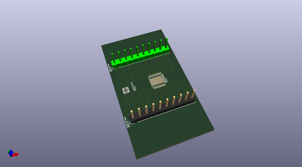
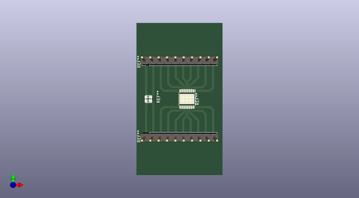

# lumenpnp_archive
 
## summary 
* id: opulo-inc_lumenpnp_archive_motordriveropticalsensorbreakout
* user: opulo-inc
* name: lumenpnp_archive
* board: motordriveropticalsensorbreakout
* repo: https://github.com/opulo-inc/lumenpnp-archive
* src_file_repo_kicad_pcb: feeder/prototyping/motorDriverOpticalSensorBreakout/motorDriverOpticalSensorBreakout.kicad_pcb
* src_file_repo_kicad_pcb_link: https://github.com/opulo-inc/lumenpnp-archive/tree/master/feeder/prototyping/motorDriverOpticalSensorBreakout/motorDriverOpticalSensorBreakout.kicad_pcb
* src_file_repo_kicad_sch: feeder/pcb/mobo/mobo.kicad_sch
* src_file_repo_kicad_sch_link: https://github.com/opulo-inc/lumenpnp-archive/tree/master/feeder/pcb/mobo/mobo.kicad_sch

* src_file_repo_sch: 
*
 src_file_repo_sch_link: https://github.com/opulo-inc/lumenpnp-archive/tree/master/
* full details link: https://github.com/oomlout/oomlout_oomp_project_bot_v_2/tree/main/projects/opulo-inc_lumenpnp_archive_motordriveropticalsensorbreakout/current_version/working  

## pcb  
 
  
  
  
[board (pdf)](working.pdf)  

## working_bom
| Id | Designator | Footprint | Quantity | Designation | Supplier and ref |  | None | 
| --- | --- | --- | --- | --- | --- | --- | --- | 
| 1 | REF** | VCNT2020 | 1 | VCNT2020 |  |  | [''] | 
| 2 | REF** | HTSSOP-16-1EP_4.4x5mm_P0.65mm_EP3.4x5mm | 1 | HTSSOP-16-1EP_4.4x5mm_P0.65mm_EP3.4x5mm |  |  | [''] | 
| 3 | REF**,REF** | PinHeader_1x10_P2.54mm_Vertical | 2 | PinHeader_1x10_P2.54mm_Vertical |  |  | [''] | 

