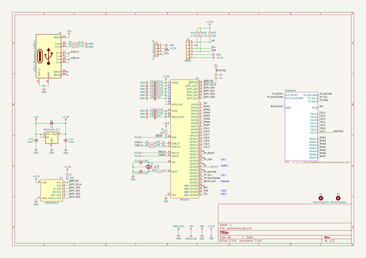
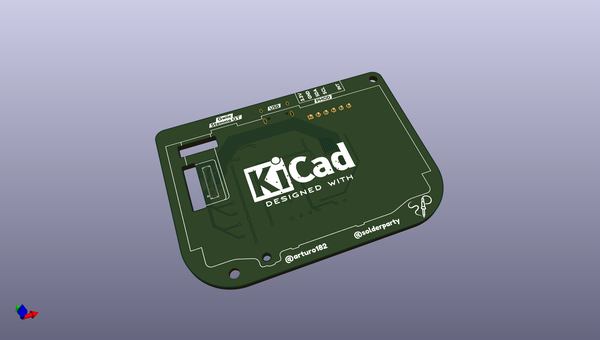
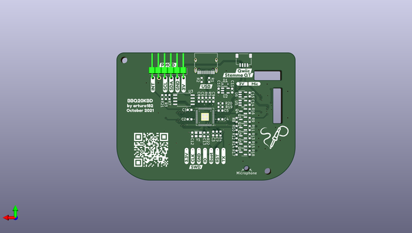

# bbq20kbd_hw
 
## summary 
* id: solderparty_bbq20kbd_hw_bbq20_keyboard
* user: solderparty
* name: bbq20kbd_hw
* board: bbq20_keyboard
* repo: https://github.com/solderparty/bbq20kbd_hw
* src_file_repo_kicad_pcb: bbq20_keyboard.kicad_pcb
* src_file_repo_kicad_pcb_link: https://github.com/solderparty/bbq20kbd_hw/tree/main/bbq20_keyboard.kicad_pcb
* src_file_repo_kicad_sch: bbq20_keyboard.kicad_sch
* src_file_repo_kicad_sch_link: https://github.com/solderparty/bbq20kbd_hw/tree/main/bbq20_keyboard.kicad_sch

* src_file_repo_sch: 
*
 src_file_repo_sch_link: https://github.com/solderparty/bbq20kbd_hw/tree/main/
* full details link: https://github.com/oomlout/oomlout_oomp_project_bot_v_2/tree/main/projects/solderparty_bbq20kbd_hw_bbq20_keyboard/current_version/working  

## schematic  
  
[schematic (pdf)](working_schematic.pdf)  

## pcb  
 
  
  
  
[board (pdf)](working.pdf)  

## working_bom
| Id | Designator | Footprint | Quantity | Designation | Supplier and ref |  | None | 
| --- | --- | --- | --- | --- | --- | --- | --- | 
| 1 | G*** | SolderParty-New-Logo_7.5x6.4mm_SilkScreen | 1 | LOGO |  |  | [''] | 
| 2 | U4 | BM20B(0.8)-40DS-0.4V | 1 | BBQ20KBD |  |  | [''] | 
| 3 | R5,R6 | R_0603_1608Metric | 2 | 27R |  |  | [''] | 
| 4 | C15,C8,C2,C7,C3,C1,C4,C14,C5 | C_0603_1608Metric | 9 | 0.1uF |  |  | [''] | 
| 5 | H2,H1 | MountingHole_2.7mm_M2.5 | 2 | MountingHole |  |  | [''] | 
| 6 | R11,R21,R15,R17,R16,R8,R18,R12,R4,R7,R13,R14,R10,R9 | R_0603_1608Metric | 14 | 10K |  |  | [''] | 
| 7 | Q4,Q3,Q1,Q5,Q2,Q6 | SOT-23 | 6 | BSS138 |  |  | [''] | 
| 8 | R19,R20 | R_0603_1608Metric | 2 | 4.7K |  |  | [''] | 
| 9 | C10,C11 | C_0603_1608Metric | 2 | 10uF |  |  | [''] | 
| 10 | C12,C13 | C_0603_1608Metric | 2 | 12pF |  |  | [''] | 
| 11 | U3 | SSOP-8_5.25x5.24mm_P1.27mm | 1 | GD25Q16xS |  |  | [''] | 
| 12 | U1 | QFN-56_EP_7x7_Pitch0.4mm | 1 | RP2040 |  |  | [''] | 
| 13 | R22,R3 | R_0603_1608Metric | 2 | 1K |  |  | [''] | 
| 14 | U5 | SOT-23-5 | 1 | ME6212C18M5G |  |  | [''] | 
| 15 | TP6 | TestPoint_Pad_D1.5mm | 1 | TP_3V3 |  |  | [''] | 
| 16 | U2 | SOT-23-5 | 1 | AP2112K-3.3 |  |  | [''] | 
| 17 | J1 | JST_SH_SM04B-SRSS-TB_1x04-1MP_P1.00mm_Horizontal | 1 | Conn_Stemma_QT |  |  | [''] | 
| 18 | G*** | SolderParty-New-Logo_12.5x10.6mm_SilkScreen | 1 | LOGO |  |  | [''] | 
| 19 | D1 | D_SOD-323 | 1 | D_Schottky_Small |  |  | [''] | 
| 20 | C6,C9 | C_0603_1608Metric | 2 | 1uF |  |  | [''] | 
| 21 | J2 | PMODPinHeader_1x06_P2.54mm_Horizontal | 1 | PMOD |  |  | [''] | 
| 22 | R1,R2 | R_0603_1608Metric | 2 | 5.1K |  |  | [''] | 
| 23 | J3 | USB_C_Receptacle_HRO_TYPE-C-31-M-12 | 1 | USB_C_Receptacle_USB2.0 |  |  | [''] | 
| 24 | Y1 | Crystal_SMD_2520-4Pin_2.5x2.0mm | 1 | XYDBPCNANF-12MHZ |  |  | [''] | 
| 25 | U6 | SOT-23-5 | 1 | ME6212C28M5G |  |  | [''] | 

## bom_schematic
| Ref | Qnty | Value | Cmp name | Footprint | Description | Vendor | DNP | 
| --- | --- | --- | --- | --- | --- | --- | --- | 
| C1, C2, C3, C4, C5, C7, C8 | 7 | 0.1uF | C_Small | Capacitor_SMD:C_0603_1608Metric | Unpolarized capacitor, small symbol |  |  | 
| C6, C9 | 2 | 1uF | C_Small | Capacitor_SMD:C_0603_1608Metric | Unpolarized capacitor, small symbol |  |  | 
| C10, C11 | 2 | 10uF | C_Small | Capacitor_SMD:C_0603_1608Metric | Unpolarized capacitor, small symbol |  |  | 
| C12, C13 | 2 | 12pF | C_Small | Capacitor_SMD:C_0603_1608Metric | Unpolarized capacitor, small symbol |  |  | 
| D1 | 1 | D_Schottky_Small | D_Schottky_Small | Diode_SMD:D_SOD-323 | Schottky diode, small symbol |  |  | 
| H1, H2 | 2 | MountingHole | MountingHole | MountingHole:MountingHole_2.7mm_M2.5 | Mounting Hole without connection |  |  | 
| J1 | 1 | Conn_Stemma_QT | Conn_01x04 | Connector_JST:JST_SH_SM04B-SRSS-TB_1x04-1MP_P1.00mm_Horizontal | Generic connector, single row, 01x04, script generated (kicad-library-utils/schlib/autogen/connector/) |  |  | 
| J2 | 1 | PMOD | Conn_01x06 | Connector_PinHeader_2.54mm_Extra:PMODPinHeader_1x06_P2.54mm_Horizontal | Generic connector, single row, 01x06, script generated (kicad-library-utils/schlib/autogen/connector/) |  |  | 
| J3 | 1 | USB_C_Receptacle_USB2.0 | USB_C_Receptacle_USB2.0 | Connector_USB:USB_C_Receptacle_HRO_TYPE-C-31-M-12 | USB 2.0-only Type-C Receptacle connector |  |  | 
| R1, R2 | 2 | 5.1K | R_Small | Resistor_SMD:R_0603_1608Metric | Resistor, small symbol |  |  | 
| R3, R22 | 2 | 1K | R_Small | Resistor_SMD:R_0603_1608Metric | Resistor, small symbol |  |  | 
| R4, R7, R21 | 3 | 10K | R_Small | Resistor_SMD:R_0603_1608Metric | Resistor, small symbol |  |  | 
| R5, R6 | 2 | 27R | R_Small | Resistor_SMD:R_0603_1608Metric | Resistor, small symbol |  |  | 
| R19, R20 | 2 | 4.7K | R_Small | Resistor_SMD:R_0603_1608Metric | Resistor, small symbol |  |  | 
| U1 | 1 | RP2040 | RP2040 | Package_DFN_QFN_Extra:QFN-56_EP_7x7_Pitch0.4mm |  |  |  | 
| U2 | 1 | AP2112K-3.3 | AP2112K-3.3 | Package_TO_SOT_SMD:SOT-23-5 | 600mA low dropout linear regulator, with enable pin, 3.8V-6V input voltage range, 3.3V fixed positive output, SOT-23-5 |  |  | 
| U3 | 1 | GD25Q16xS | W25Q64JV | Package_SO:SSOP-8_5.25x5.24mm_P1.27mm |  |  |  | 
| Y1 | 1 | XYDBPCNANF-12MHZ | Crystal_GND24_Small | Crystal:Crystal_SMD_2520-4Pin_2.5x2.0mm | Four pin crystal, GND on pins 2 and 4, small symbol |  |  | 

