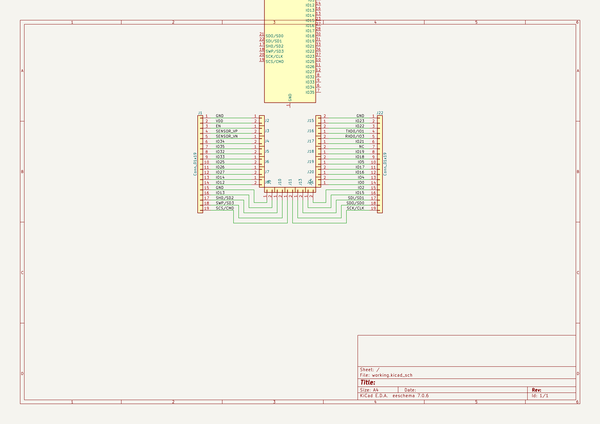
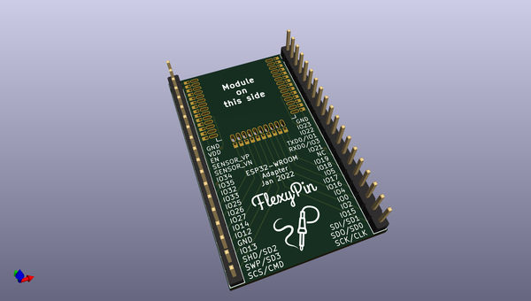
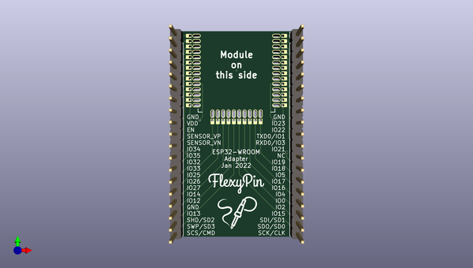
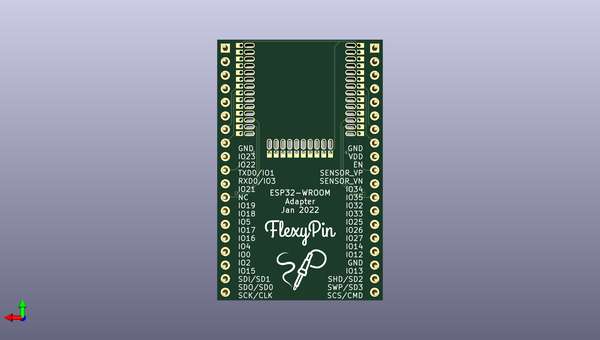

# flexypin_adapters_hw
 
## summary 
* id: solderparty_flexypin_adapters_hw_esp32_wroom_flexypin
* user: solderparty
* name: flexypin_adapters_hw
* board: esp32_wroom_flexypin
* repo: https://github.com/solderparty/flexypin_adapters_hw
* src_file_repo_kicad_pcb: ESP32-WROOM_flexypin/ESP32-WROOM_flexypin.kicad_pcb
* src_file_repo_kicad_pcb_link: https://github.com/solderparty/flexypin_adapters_hw/tree/main/ESP32-WROOM_flexypin/ESP32-WROOM_flexypin.kicad_pcb
* src_file_repo_kicad_sch: ESP32-WROOM_flexypin/ESP32-WROOM_flexypin.kicad_sch
* src_file_repo_kicad_sch_link: https://github.com/solderparty/flexypin_adapters_hw/tree/main/ESP32-WROOM_flexypin/ESP32-WROOM_flexypin.kicad_sch

* src_file_repo_sch: 
*
 src_file_repo_sch_link: https://github.com/solderparty/flexypin_adapters_hw/tree/main/
* full details link: https://github.com/oomlout/oomlout_oomp_project_bot_v_2/tree/main/projects/solderparty_flexypin_adapters_hw_esp32_wroom_flexypin/current_version/working  

## schematic  
  
[schematic (pdf)](working_schematic.pdf)  

## pcb  
 
  
  
  
[board (pdf)](working.pdf)  

## working_bom
| Id | Designator | Footprint | Quantity | Designation | Supplier and ref |  | None | 
| --- | --- | --- | --- | --- | --- | --- | --- | 
| 1 | J22,J1 | PinHeader_1x19_P2.54mm_Vertical | 2 | Conn_01x19 |  |  | [''] | 
| 2 | J14,J4,J7,J11,J5,J6,J17,J16,J18,J19,J2,J3,J21,J15,J13,J10,J8,J20,J9 | FlexyPin_1x02_P1.27mm | 19 | Conn_01x02 |  |  | [''] | 
| 3 | G***,G*** | SolderParty-New-Logo_10x8.5mm_SilkScreen | 2 | LOGO |  |  | [''] | 
| 4 | REF** | Fiducial_0.5mm_Mask1.5mm | 1 | Fiducial_0.5mm_Mask1.5mm |  |  | [''] | 

## bom_schematic
| Ref | Qnty | Value | Cmp name | Footprint | Description | Vendor | DNP | 
| --- | --- | --- | --- | --- | --- | --- | --- | 
| J1, J22 | 2 | Conn_01x19 | Conn_01x19 | Connector_PinHeader_2.54mm:PinHeader_1x19_P2.54mm_Vertical | Generic connector, single row, 01x19, script generated (kicad-library-utils/schlib/autogen/connector/) |  |  | 
| J2, J3, J4, J5, J6, J7, J8, J9, J10, J11, J13, J14, J15, J16, J17, J18, J19, J20, J21 | 19 | Conn_01x02 | Conn_01x02 | FlexyPin:FlexyPin_1x02_P1.27mm | Generic connector, single row, 01x02, script generated (kicad-library-utils/schlib/autogen/connector/) |  |  | 
| U1 | 1 | ESP32-WROOM-32 | ESP32-WROOM-32 | RF_Module:ESP32-WROOM-32 | RF Module, ESP32-D0WDQ6 SoC, Wi-Fi 802.11b/g/n, Bluetooth, BLE, 32-bit, 2.7-3.6V, onboard antenna, SMD |  |  | 

