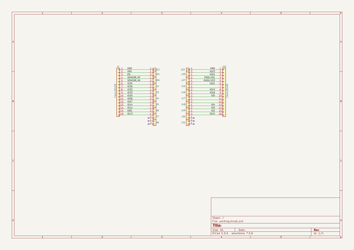
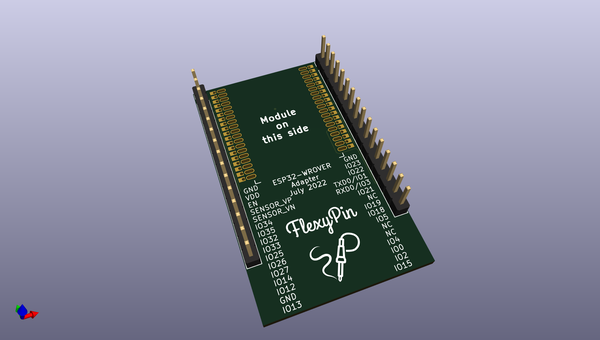
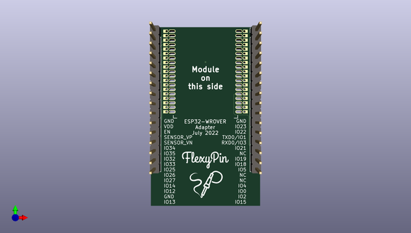
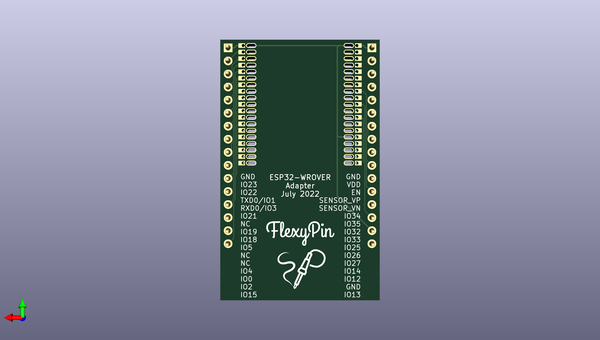

# flexypin_adapters_hw
 
## summary 
* id: solderparty_flexypin_adapters_hw_esp32_wrover_flexypin
* user: solderparty
* name: flexypin_adapters_hw
* board: esp32_wrover_flexypin
* repo: https://github.com/solderparty/flexypin_adapters_hw
* src_file_repo_kicad_pcb: ESP32-WROVER_flexypin/ESP32-WROVER_flexypin.kicad_pcb
* src_file_repo_kicad_pcb_link: https://github.com/solderparty/flexypin_adapters_hw/tree/main/ESP32-WROVER_flexypin/ESP32-WROVER_flexypin.kicad_pcb
* src_file_repo_kicad_sch: ESP32-WROVER_flexypin/ESP32-WROVER_flexypin.kicad_sch
* src_file_repo_kicad_sch_link: https://github.com/solderparty/flexypin_adapters_hw/tree/main/ESP32-WROVER_flexypin/ESP32-WROVER_flexypin.kicad_sch

* src_file_repo_sch: 
*
 src_file_repo_sch_link: https://github.com/solderparty/flexypin_adapters_hw/tree/main/
* full details link: https://github.com/oomlout/oomlout_oomp_project_bot_v_2/tree/main/projects/solderparty_flexypin_adapters_hw_esp32_wrover_flexypin/current_version/working  

## schematic  
  
[schematic (pdf)](working_schematic.pdf)  

## pcb  
 
  
  
  
[board (pdf)](working.pdf)  

## working_bom
| Id | Designator | Footprint | Quantity | Designation | Supplier and ref |  | None | 
| --- | --- | --- | --- | --- | --- | --- | --- | 
| 1 | J22,J1 | PinHeader_1x16_P2.54mm_Vertical | 2 | Conn_01x16 |  |  | [''] | 
| 2 | J4,J7,J5,J6,J24,J17,J27,J16,J18,J19,J2,J3,J21,J15,J8,J25,J20,J26 | FlexyPin_1x02_P1.27mm | 18 | Conn_01x02 |  |  | [''] | 
| 3 | J12,J23 | FlexyPin_1x01_P1.27mm | 2 | Conn_01x01 |  |  | [''] | 
| 4 | G***,G*** | SolderParty-New-Logo_10x8.5mm_SilkScreen | 2 | LOGO |  |  | [''] | 
| 5 | REF** | Fiducial_0.5mm_Mask1.5mm | 1 | Fiducial_0.5mm_Mask1.5mm |  |  | [''] | 

## bom_schematic
| Ref | Qnty | Value | Cmp name | Footprint | Description | Vendor | DNP | 
| --- | --- | --- | --- | --- | --- | --- | --- | 
| J1, J22 | 2 | Conn_01x16 | Conn_01x16 | Connector_PinHeader_2.54mm:PinHeader_1x16_P2.54mm_Vertical | Generic connector, single row, 01x16, script generated (kicad-library-utils/schlib/autogen/connector/) |  |  | 
| J2, J3, J4, J5, J6, J7, J8, J15, J16, J17, J18, J19, J20, J21, J24, J25, J26, J27 | 18 | Conn_01x02 | Conn_01x02 | FlexyPin:FlexyPin_1x02_P1.27mm | Generic connector, single row, 01x02, script generated (kicad-library-utils/schlib/autogen/connector/) |  |  | 
| J12, J23 | 2 | Conn_01x01 | Conn_01x01 | FlexyPin:FlexyPin_1x01_P1.27mm | Generic connector, single row, 01x01, script generated (kicad-library-utils/schlib/autogen/connector/) |  |  | 

