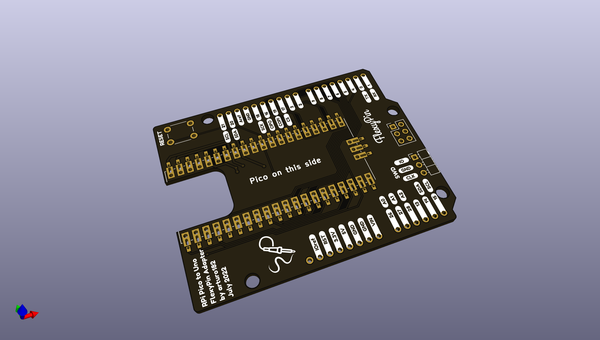
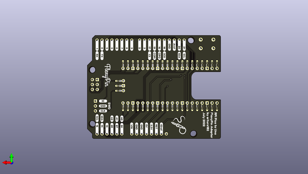

# flexypin_adapters_hw
 
## summary 
* id: solderparty_flexypin_adapters_hw_rpi_pico_uno_flexypin
* user: solderparty
* name: flexypin_adapters_hw
* board: rpi_pico_uno_flexypin
* repo: https://github.com/solderparty/flexypin_adapters_hw
* src_file_repo_kicad_pcb: rpi_pico_uno_flexypin/rpi_pico_uno_flexypin.kicad_pcb
* src_file_repo_kicad_pcb_link: https://github.com/solderparty/flexypin_adapters_hw/tree/main/rpi_pico_uno_flexypin/rpi_pico_uno_flexypin.kicad_pcb
* src_file_repo_kicad_sch: rpi_pico_uno_flexypin/rpi_pico_uno_flexypin.kicad_sch
* src_file_repo_kicad_sch_link: https://github.com/solderparty/flexypin_adapters_hw/tree/main/rpi_pico_uno_flexypin/rpi_pico_uno_flexypin.kicad_sch

* src_file_repo_sch: 
*
 src_file_repo_sch_link: https://github.com/solderparty/flexypin_adapters_hw/tree/main/
* full details link: https://github.com/oomlout/oomlout_oomp_project_bot_v_2/tree/main/projects/solderparty_flexypin_adapters_hw_rpi_pico_uno_flexypin/current_version/working  

## schematic  
  
[schematic (pdf)](working_schematic.pdf)  

## pcb  
 
  
  
  
[board (pdf)](working.pdf)  

## working_bom
| Id | Designator | Footprint | Quantity | Designation | Supplier and ref |  | None | 
| --- | --- | --- | --- | --- | --- | --- | --- | 
| 1 | J5 | PinHeader_2x03_P2.54mm_Vertical | 1 | Conn_SPI |  |  | [''] | 
| 2 | J4 | PinHeader_1x03_P2.54mm_Horizontal | 1 | Conn_01x03 |  |  | [''] | 
| 3 | J3,J1 | FlexyPin_1x20_P2.54mm | 2 | Conn_01x20 |  |  | [''] | 
| 4 | U1 | RaspberryPi_Pico | 1 | RaspberryPi_Pico |  |  | [''] | 
| 5 | J8 | PinSocket_1x10_P2.54mm_Vertical | 1 | Conn_01x10 |  |  | [''] | 
| 6 | J2 | FlexyPin_1x03_P2.54mm | 1 | Conn_01x03 |  |  | [''] | 
| 7 | SW1 | SW_PUSH_6mm | 1 | SW_RST |  |  | [''] | 
| 8 | G***,G*** | SolderParty-New-Logo_10x8.5mm_SilkScreen | 2 | LOGO |  |  | [''] | 
| 9 | J7 | PinSocket_1x06_P2.54mm_Vertical | 1 | Conn_01x06 |  |  | [''] | 
| 10 | J9,J6 | PinSocket_1x08_P2.54mm_Vertical | 2 | Conn_01x08 |  |  | [''] | 

## bom_schematic
| Ref | Qnty | Value | Cmp name | Footprint | Description | Vendor | DNP | 
| --- | --- | --- | --- | --- | --- | --- | --- | 
| J1, J3 | 2 | Conn_01x20 | Conn_01x20 | FlexyPin:FlexyPin_1x20_P2.54mm | Generic connector, single row, 01x20, script generated (kicad-library-utils/schlib/autogen/connector/) |  |  | 
| J2 | 1 | Conn_01x03 | Conn_01x03 | FlexyPin:FlexyPin_1x03_P2.54mm | Generic connector, single row, 01x03, script generated (kicad-library-utils/schlib/autogen/connector/) |  |  | 
| J4 | 1 | Conn_01x03 | Conn_01x03 | Connector_PinHeader_2.54mm:PinHeader_1x03_P2.54mm_Horizontal | Generic connector, single row, 01x03, script generated (kicad-library-utils/schlib/autogen/connector/) |  |  | 
| J5 | 1 | Conn_SPI | Conn_02x03_Odd_Even | Connector_PinHeader_2.54mm:PinHeader_2x03_P2.54mm_Vertical | Generic connector, double row, 02x03, odd/even pin numbering scheme (row 1 odd numbers, row 2 even numbers), script generated (kicad-library-utils/schlib/autogen/connector/) |  |  | 
| J6, J9 | 2 | Conn_01x08 | Conn_01x08 | Connector_PinSocket_2.54mm:PinSocket_1x08_P2.54mm_Vertical | Generic connector, single row, 01x08, script generated (kicad-library-utils/schlib/autogen/connector/) |  |  | 
| J7 | 1 | Conn_01x06 | Conn_01x06 | Connector_PinSocket_2.54mm:PinSocket_1x06_P2.54mm_Vertical | Generic connector, single row, 01x06, script generated (kicad-library-utils/schlib/autogen/connector/) |  |  | 
| J8 | 1 | Conn_01x10 | Conn_01x10 | Connector_PinSocket_2.54mm:PinSocket_1x10_P2.54mm_Vertical | Generic connector, single row, 01x10, script generated (kicad-library-utils/schlib/autogen/connector/) |  |  | 
| SW1 | 1 | SW_RST | SW_SPST | Button_Switch_THT:SW_PUSH_6mm | Single Pole Single Throw (SPST) switch |  |  | 
| U1 | 1 | RaspberryPi_Pico | RaspberryPi_Pico | Module_Extra:RaspberryPi_Pico |  |  |  | 

