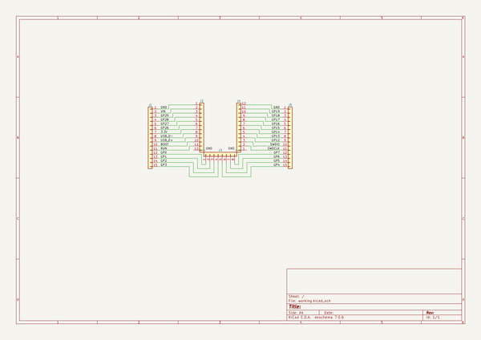
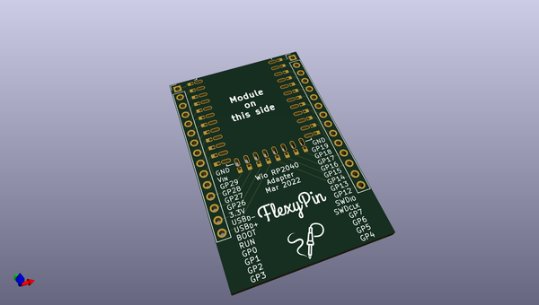
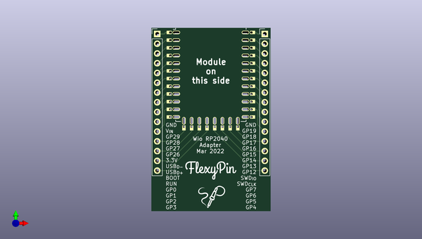
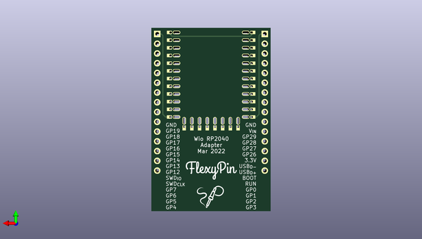

# flexypin_adapters_hw
 
## summary 
* id: solderparty_flexypin_adapters_hw_wio_rp2040_flexypin
* user: solderparty
* name: flexypin_adapters_hw
* board: wio_rp2040_flexypin
* repo: https://github.com/solderparty/flexypin_adapters_hw
* src_file_repo_kicad_pcb: Wio-RP2040_flexypin/Wio-RP2040_flexypin.kicad_pcb
* src_file_repo_kicad_pcb_link: https://github.com/solderparty/flexypin_adapters_hw/tree/main/Wio-RP2040_flexypin/Wio-RP2040_flexypin.kicad_pcb
* src_file_repo_kicad_sch: Wio-RP2040_flexypin/Wio-RP2040_flexypin.kicad_sch
* src_file_repo_kicad_sch_link: https://github.com/solderparty/flexypin_adapters_hw/tree/main/Wio-RP2040_flexypin/Wio-RP2040_flexypin.kicad_sch

* src_file_repo_sch: 
*
 src_file_repo_sch_link: https://github.com/solderparty/flexypin_adapters_hw/tree/main/
* full details link: https://github.com/oomlout/oomlout_oomp_project_bot_v_2/tree/main/projects/solderparty_flexypin_adapters_hw_wio_rp2040_flexypin/current_version/working  

## schematic  
  
[schematic (pdf)](working_schematic.pdf)  

## pcb  
 
  
  
  
[board (pdf)](working.pdf)  

## working_bom
| Id | Designator | Footprint | Quantity | Designation | Supplier and ref |  | None | 
| --- | --- | --- | --- | --- | --- | --- | --- | 
| 1 | J1,J5 | PinHeader_1x15_P2.54mm_Vertical | 2 | Conn_01x15 |  |  | [''] | 
| 2 | G***,G*** | SolderParty-New-Logo_7.5x6.4mm_SilkScreen | 2 | LOGO |  |  | [''] | 
| 3 | J4,J2 | FlexyPin_1x12_P2.00mm | 2 | Conn_01x12 |  |  | [''] | 
| 4 | J3 | FlexyPin_1x08_P2.00mm | 1 | Conn_01x08 |  |  | [''] | 

## bom_schematic
| Ref | Qnty | Value | Cmp name | Footprint | Description | Vendor | DNP | 
| --- | --- | --- | --- | --- | --- | --- | --- | 
| J1, J5 | 2 | Conn_01x15 | Conn_01x15 | Connector_PinHeader_2.54mm:PinHeader_1x15_P2.54mm_Vertical | Generic connector, single row, 01x15, script generated (kicad-library-utils/schlib/autogen/connector/) |  |  | 
| J2, J4 | 2 | Conn_01x12 | Conn_01x12 | FlexyPin:FlexyPin_1x12_P2.00mm | Generic connector, single row, 01x12, script generated (kicad-library-utils/schlib/autogen/connector/) |  |  | 
| J3 | 1 | Conn_01x08 | Conn_01x08 | FlexyPin:FlexyPin_1x08_P2.00mm | Generic connector, single row, 01x08, script generated (kicad-library-utils/schlib/autogen/connector/) |  |  | 

