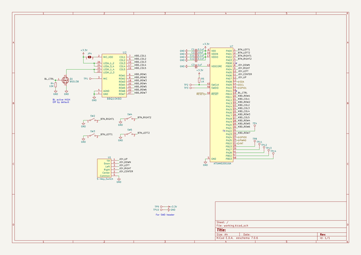
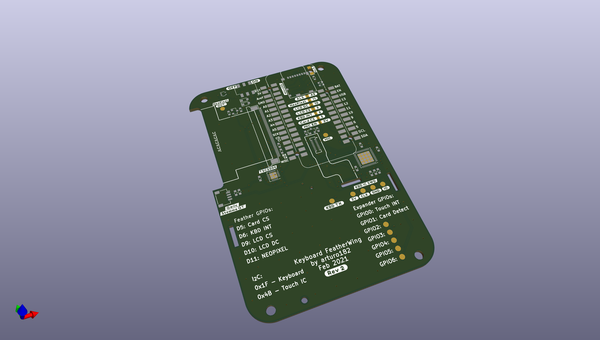
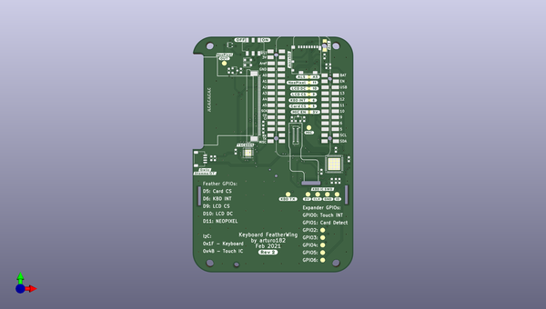
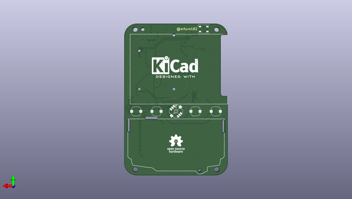

# keyboard_featherwing_hw
 
## summary 
* id: solderparty_keyboard_featherwing_hw_keyboard_featherwing
* user: solderparty
* name: keyboard_featherwing_hw
* board: keyboard_featherwing
* repo: https://github.com/solderparty/keyboard_featherwing_hw
* src_file_repo_kicad_pcb: keyboard_featherwing.kicad_pcb
* src_file_repo_kicad_pcb_link: https://github.com/solderparty/keyboard_featherwing_hw/tree/master/keyboard_featherwing.kicad_pcb
* src_file_repo_kicad_sch: keyboard.kicad_sch
* src_file_repo_kicad_sch_link: https://github.com/solderparty/keyboard_featherwing_hw/tree/master/keyboard.kicad_sch

* src_file_repo_sch: 
*
 src_file_repo_sch_link: https://github.com/solderparty/keyboard_featherwing_hw/tree/master/
* full details link: https://github.com/oomlout/oomlout_oomp_project_bot_v_2/tree/main/projects/solderparty_keyboard_featherwing_hw_keyboard_featherwing/current_version/working  

## schematic  
  
[schematic (pdf)](working_schematic.pdf)  

## pcb  
 
  
  
  
[board (pdf)](working.pdf)  

## working_bom
| Id | Designator | Footprint | Quantity | Designation | Supplier and ref |  | None | 
| --- | --- | --- | --- | --- | --- | --- | --- | 
| 1 | J7 | JST_SH_SM04B-SRSS-TB_1x04-1MP_P1.00mm_Horizontal | 1 | Conn_Stemma_QT |  |  | [''] | 
| 2 | R10,R8,R6,R4,R3,R9 | R_0603_1608Metric | 6 | 10K |  |  | [''] | 
| 3 | SW1 | K3-x245S | 1 | SK-3245S-Lx-B |  |  | [''] | 
| 4 | C6,C11,C12,C1,C4 | C_0603_1608Metric | 5 | 0.1uF |  |  | [''] | 
| 5 | R2,R1 | R_0603_1608Metric | 2 | 4.7K |  |  | [''] | 
| 6 | U4 | ER-CON50HT-1 | 1 | ER-TFT02X |  |  | [''] | 
| 7 | U3 | QFN-20-1EP_4x4mm_P0.5mm_EP2.7x2.7mm | 1 | TSC2004IR |  |  | [''] | 
| 8 | C3 | C_0603_1608Metric | 1 | 1uF |  |  | [''] | 
| 9 | R5 | R_0603_1608Metric | 1 | 1K |  |  | [''] | 
| 10 | U2 | BM14B(0.8)-24DS-0.4V(53) | 1 | BBQ10KBD |  |  | [''] | 
| 11 | C5,C2 | C_0603_1608Metric | 2 | 10uF |  |  | [''] | 
| 12 | Q1,Q2 | SOT-23 | 2 | BSS138 |  |  | [''] | 
| 13 | D3,D2 | D_SOD-323_HandSoldering | 2 | S1JHE |  |  | [''] | 
| 14 | U8 | SOT-353_SC-70-5 | 1 | 74AHCT1G125 |  |  | [''] | 
| 15 | U6 | FeatherWing | 1 | Adafruit_Feather_2X |  |  | [''] | 
| 16 | R7 | R_0603_1608Metric | 1 | 10R |  |  | [''] | 
| 17 | U7 | QFN-48-1EP_7x7mm_P0.5mm_EP5.15x5.15mm | 1 | ATSAMD20G16A |  |  | [''] | 
| 18 | J3 | microSD_HC_Molex_104031-0811 | 1 | Micro_SD_Card_Det |  |  | [''] | 
| 19 | Q3 | Everlight_PT26-21C | 1 | PT26-21C |  |  | [''] | 
| 20 | JP4 | SolderJumper-2_P1.3mm_Open_RoundedPad1.0x1.5mm | 1 | SB_MIC_VDD |  |  | [''] | 
| 21 | SW2 | RMT-CZ66 | 1 | SW_RIGHT1 |  |  | [''] | 
| 22 | SW4 | RMT-CZ66 | 1 | SW_RIGHT2 |  |  | [''] | 
| 23 | SW5 | RMT-CZ66 | 1 | SW_LEFT2 |  |  | [''] | 
| 24 | U1 | SF303GJ26 | 1 | 5-Way_Switch |  |  | [''] | 
| 25 | REF** | Fiducial_0.5mm_Dia_1mm_Outer | 1 | Fiducial_0.5mm_Dia_1mm_Outer |  |  | [''] | 
| 26 | SW3 | RMT-CZ66 | 1 | SW_LEFT1 |  |  | [''] | 
| 27 | D1 | LED_WS2812B_PLCC4_5.0x5.0mm_P3.2mm | 1 | WS2812B |  |  | [''] | 

## bom_schematic
| Ref | Qnty | Value | Cmp name | Footprint | Description | Vendor | DNP | 
| --- | --- | --- | --- | --- | --- | --- | --- | 
| C1, C11, C12 | 3 | 0.1uF | C_Small | Capacitor_SMD:C_0603_1608Metric | Unpolarized capacitor, small symbol |  |  | 
| C2 | 1 | 10uF | C_Small | Capacitor_SMD:C_0603_1608Metric | Unpolarized capacitor, small symbol |  |  | 
| C3 | 1 | 1uF | C_Small | Capacitor_SMD:C_0603_1608Metric | Unpolarized capacitor, small symbol |  |  | 
| JP4 | 1 | SB_MIC_VDD | SolderJumper_2_Open | Jumper:SolderJumper-2_P1.3mm_Open_RoundedPad1.0x1.5mm | Solder Jumper, 2-pole, open |  |  | 
| Q1 | 1 | BSS138 | BSS138 | Package_TO_SOT_SMD:SOT-23 | 50V Vds, 0.22A Id, N-Channel MOSFET, SOT-23 |  |  | 
| R4 | 1 | 10K | R_Small | Resistor_SMD:R_0603_1608Metric | Resistor, small symbol |  |  | 
| R5 | 1 | 1K | R_Small | Resistor_SMD:R_0603_1608Metric | Resistor, small symbol |  |  | 
| SW2 | 1 | SW_RIGHT1 | SW_SPST | Button_Switch_SMD_Extra:RMT-CZ66 | Single Pole Single Throw (SPST) switch |  |  | 
| SW3 | 1 | SW_LEFT1 | SW_SPST | Button_Switch_SMD_Extra:RMT-CZ66 | Single Pole Single Throw (SPST) switch |  |  | 
| SW4 | 1 | SW_RIGHT2 | SW_SPST | Button_Switch_SMD_Extra:RMT-CZ66 | Single Pole Single Throw (SPST) switch |  |  | 
| SW5 | 1 | SW_LEFT2 | SW_SPST | Button_Switch_SMD_Extra:RMT-CZ66 | Single Pole Single Throw (SPST) switch |  |  | 
| U1 | 1 | 5-Way_Switch | 5-Way_Switch | Button_Switch_SMD_Extra:SF303GJ26 |  |  |  | 
| U2 | 1 | BBQ10KBD | BBQ10KBD | Connector_Hirose_Extra:BM14B(0.8)-24DS-0.4V(53) |  |  |  | 
| U7 | 1 | ATSAMD20G16A | ATSAMD20G16A | Package_DFN_QFN:QFN-48-1EP_7x7mm_P0.5mm_EP5.15x5.15mm |  |  |  | 

