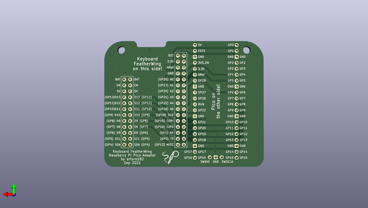

# keyboard_featherwing_pico_adapter
 
## summary 
* id: solderparty_keyboard_featherwing_pico_adapter_kfw_pico_adapter
* user: solderparty
* name: keyboard_featherwing_pico_adapter
* board: kfw_pico_adapter
* repo: https://github.com/solderparty/keyboard_featherwing_pico_adapter
* src_file_repo_kicad_pcb: kfw_pico_adapter.kicad_pcb
* src_file_repo_kicad_pcb_link: https://github.com/solderparty/keyboard_featherwing_pico_adapter/tree/main/kfw_pico_adapter.kicad_pcb
* src_file_repo_kicad_sch: kfw_pico_adapter.kicad_sch
* src_file_repo_kicad_sch_link: https://github.com/solderparty/keyboard_featherwing_pico_adapter/tree/main/kfw_pico_adapter.kicad_sch

* src_file_repo_sch: 
*
 src_file_repo_sch_link: https://github.com/solderparty/keyboard_featherwing_pico_adapter/tree/main/
* full details link: https://github.com/oomlout/oomlout_oomp_project_bot_v_2/tree/main/projects/solderparty_keyboard_featherwing_pico_adapter_kfw_pico_adapter/current_version/working  

## schematic  
  
[schematic (pdf)](working_schematic.pdf)  

## pcb  
 
  
  
  
[board (pdf)](working.pdf)  

## working_bom
| Id | Designator | Footprint | Quantity | Designation | Supplier and ref |  | None | 
| --- | --- | --- | --- | --- | --- | --- | --- | 
| 1 | J2 | PinHeader_2x16_P2.54mm_Vertical | 1 | Conn_Left |  |  | [''] | 
| 2 | J3 | PinHeader_2x12_P2.54mm_Vertical | 1 | Conn_Right |  |  | [''] | 
| 3 | G*** | SolderParty-New-Logo_15x12.7mm_SilkScreen | 1 | LOGO |  |  | [''] | 
| 4 | U1 | RaspberryPi_Pico | 1 | RaspberryPi_Pico |  |  | [''] | 
| 5 | G*** | SolderParty-New-Logo_7.5x6.4mm_SilkScreen | 1 | LOGO |  |  | [''] | 

## bom_schematic
| Ref | Qnty | Value | Cmp name | Footprint | Description | Vendor | DNP | 
| --- | --- | --- | --- | --- | --- | --- | --- | 
| J2 | 1 | Conn_Left | Conn_02x16_Odd_Even | Connector_PinHeader_2.54mm:PinHeader_2x16_P2.54mm_Vertical | Generic connector, double row, 02x16, odd/even pin numbering scheme (row 1 odd numbers, row 2 even numbers), script generated (kicad-library-utils/schlib/autogen/connector/) |  |  | 
| J3 | 1 | Conn_Right | Conn_02x12_Odd_Even | Connector_PinHeader_2.54mm:PinHeader_2x12_P2.54mm_Vertical | Generic connector, double row, 02x12, odd/even pin numbering scheme (row 1 odd numbers, row 2 even numbers), script generated (kicad-library-utils/schlib/autogen/connector/) |  |  | 
| U1 | 1 | RaspberryPi_Pico | RaspberryPi_Pico | Module_Extra:RaspberryPi_Pico |  |  |  | 

