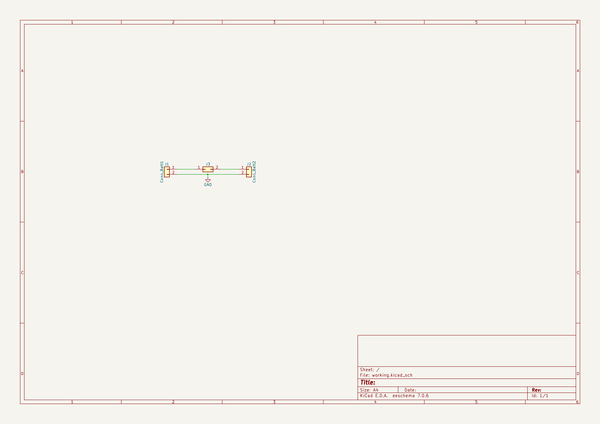
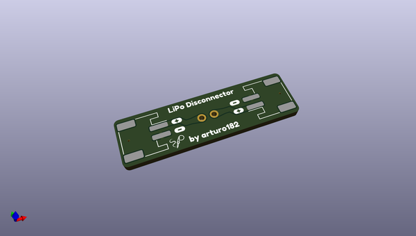
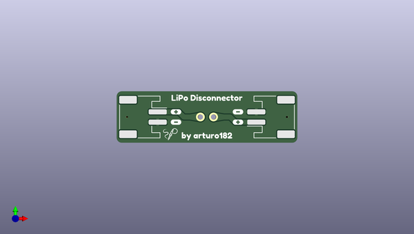
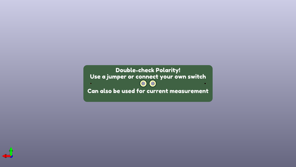

# lipo_disconnector_hw
 
## summary 
* id: solderparty_lipo_disconnector_hw_lipo_disconnector
* user: solderparty
* name: lipo_disconnector_hw
* board: lipo_disconnector
* repo: https://github.com/solderparty/lipo_disconnector_hw
* src_file_repo_kicad_pcb: lipo_disconnector.kicad_pcb
* src_file_repo_kicad_pcb_link: https://github.com/solderparty/lipo_disconnector_hw/tree/main/lipo_disconnector.kicad_pcb
* src_file_repo_kicad_sch: lipo_disconnector.kicad_sch
* src_file_repo_kicad_sch_link: https://github.com/solderparty/lipo_disconnector_hw/tree/main/lipo_disconnector.kicad_sch

* src_file_repo_sch: 
*
 src_file_repo_sch_link: https://github.com/solderparty/lipo_disconnector_hw/tree/main/
* full details link: https://github.com/oomlout/oomlout_oomp_project_bot_v_2/tree/main/projects/solderparty_lipo_disconnector_hw_lipo_disconnector/current_version/working  

## schematic  
  
[schematic (pdf)](working_schematic.pdf)  

## pcb  
 
  
  
  
[board (pdf)](working.pdf)  

## working_bom
| Id | Designator | Footprint | Quantity | Designation | Supplier and ref |  | None | 
| --- | --- | --- | --- | --- | --- | --- | --- | 
| 1 | J3 | PinHeader_1x02_P2.54mm_Vertical | 1 | Conn_Jumper |  |  | [''] | 
| 2 | J1 | JST_PH_S2B-PH-SM4-TB_1x02-1MP_P2.00mm_Horizontal | 1 | Conn_Batt1 |  |  | [''] | 
| 3 | G*** | SolderParty-New-Logo_3x2.5mm_SilkScreen | 1 | LOGO |  |  | [''] | 
| 4 | J2 | JST_PH_S2B-PH-SM4-TB_1x02-1MP_P2.00mm_Horizontal | 1 | Conn_Batt2 |  |  | [''] | 

## bom_schematic
| Ref | Qnty | Value | Cmp name | Footprint | Description | Vendor | DNP | 
| --- | --- | --- | --- | --- | --- | --- | --- | 
| J1 | 1 | Conn_Batt1 | Conn_01x02 | Connector_JST:JST_PH_S2B-PH-SM4-TB_1x02-1MP_P2.00mm_Horizontal | Generic connector, single row, 01x02, script generated (kicad-library-utils/schlib/autogen/connector/) |  |  | 
| J2 | 1 | Conn_Batt2 | Conn_01x02 | Connector_JST:JST_PH_S2B-PH-SM4-TB_1x02-1MP_P2.00mm_Horizontal | Generic connector, single row, 01x02, script generated (kicad-library-utils/schlib/autogen/connector/) |  |  | 
| J3 | 1 | Conn_Jumper | Conn_02x01 | Connector_PinHeader_2.54mm:PinHeader_1x02_P2.54mm_Vertical | Generic connector, double row, 02x01, this symbol is compatible with counter-clockwise, top-bottom and odd-even numbering schemes., script generated (kicad-library-utils/schlib/autogen/connector/) |  |  | 

