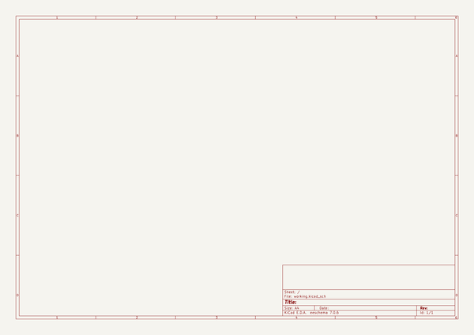

# pcb_holder_ruler
 
## summary 
* id: solderparty_pcb_holder_ruler_jig_25mm_1_6mm
* user: solderparty
* name: pcb_holder_ruler
* board: jig_25mm_1_6mm
* repo: https://github.com/solderparty/pcb_holder_ruler
* src_file_repo_kicad_pcb: jig_25mm_1.2mm.kicad_pcb
* src_file_repo_kicad_pcb_link: https://github.com/solderparty/pcb_holder_ruler/tree/main/jig_25mm_1.2mm.kicad_pcb
* src_file_repo_kicad_sch: pcb_stencil_jig.kicad_sch
* src_file_repo_kicad_sch_link: https://github.com/solderparty/pcb_holder_ruler/tree/main/pcb_stencil_jig.kicad_sch

* src_file_repo_sch: 
*
 src_file_repo_sch_link: https://github.com/solderparty/pcb_holder_ruler/tree/main/
* full details link: https://github.com/oomlout/oomlout_oomp_project_bot_v_2/tree/main/projects/solderparty_pcb_holder_ruler_jig_25mm_1_6mm/current_version/working  

## schematic  
  
[schematic (pdf)](working_schematic.pdf)  

## pcb  
 
  
  
  
[board (pdf)](working.pdf)  

## working_bom
| Id | Designator | Footprint | Quantity | Designation | Supplier and ref |  | None | 
| --- | --- | --- | --- | --- | --- | --- | --- | 
| 1 | G***,G*** | SolderParty-New-Logo_10x8.5mm_SilkScreen | 2 | LOGO |  |  | [''] | 
| 2 | PowerDI-5,PowerDI-5 | D_PowerDI-5 | 2 | D_PowerDI-5 |  |  | [''] | 
| 3 | SMA,SMA | D_SMA | 2 | D_SMA |  |  | [''] | 
| 4 | SOD-110,SOD-110 | D_SOD-110 | 2 | D_SOD-110 |  |  | [''] | 
| 5 | SOD-323,SOD-323 | D_SOD-323 | 2 | D_SOD-323 |  |  | [''] | 
| 6 | SOD-128,SOD-128 | D_SOD-128 | 2 | D_SOD-128 |  |  | [''] | 
| 7 | SOD-523,SOD-523 | D_SOD-523 | 2 | D_SOD-523 |  |  | [''] | 
| 8 | SMB,SMB | D_SMB | 2 | D_SMB |  |  | [''] | 
| 9 | SOD-923,SOD-923 | D_SOD-923 | 2 | D_SOD-923 |  |  | [''] | 
| 10 | SMC,SMC | D_SMC | 2 | D_SMC |  |  | [''] | 
| 11 | PowerDI-123,PowerDI-123 | D_PowerDI-123 | 2 | D_PowerDI-123 |  |  | [''] | 
| 12 | SOD-123,SOD-123 | D_SOD-123 | 2 | D_SOD-123 |  |  | [''] | 
| 13 | SMF,SMF | D_SMF | 2 | D_SMF |  |  | [''] | 

## bom_schematic
no data

