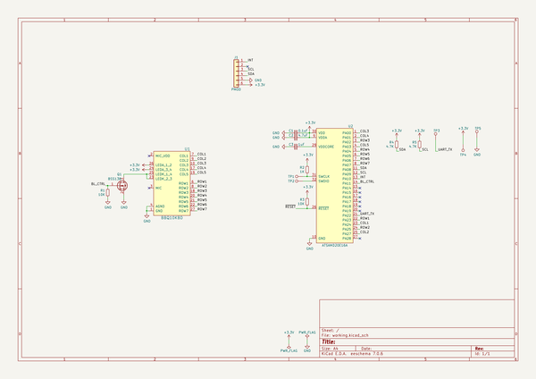
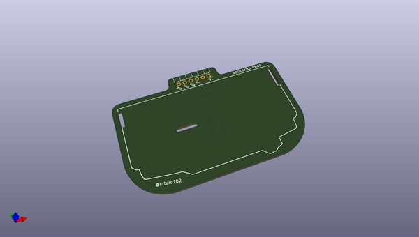
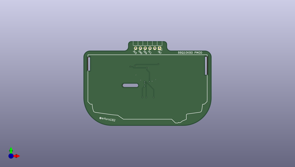
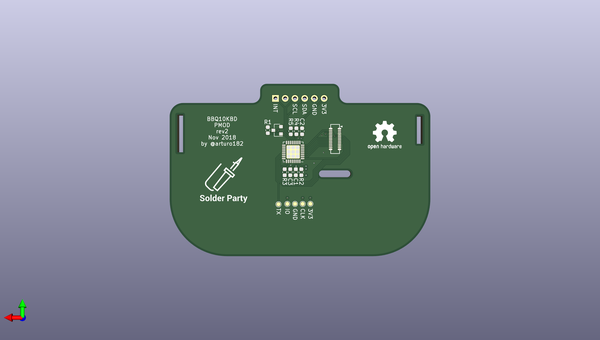

# pmod_bbq10_keyboard
 
## summary 
* id: solderparty_pmod_bbq10_keyboard_bbq10_keyboard
* user: solderparty
* name: pmod_bbq10_keyboard
* board: bbq10_keyboard
* repo: https://github.com/solderparty/pmod_bbq10_keyboard
* src_file_repo_kicad_pcb: bbq10_keyboard.kicad_pcb
* src_file_repo_kicad_pcb_link: https://github.com/solderparty/pmod_bbq10_keyboard/tree/master/bbq10_keyboard.kicad_pcb

* src_file_repo_sch: bbq10_keyboard.sch
*
 src_file_repo_sch_link: https://github.com/solderparty/pmod_bbq10_keyboard/tree/master/bbq10_keyboard.sch
* full details link: https://github.com/oomlout/oomlout_oomp_project_bot_v_2/tree/main/projects/solderparty_pmod_bbq10_keyboard_bbq10_keyboard/current_version/working  

## schematic  
  
[schematic (pdf)](working_schematic.pdf)  

## pcb  
 
  
  
  
[board (pdf)](working.pdf)  

## working_bom
| Id | Designator | Footprint | Quantity | Designation | Supplier and ref |  | None | 
| --- | --- | --- | --- | --- | --- | --- | --- | 
| 1 | J1 | PMODPinHeader_1x06_P2.54mm_Horizontal | 1 | PMOD |  |  | [''] | 
| 2 | REF** | BBQ10KBD | 1 | BBQ10KBD |  |  | [''] | 
| 3 | C1 | C_0603_1608Metric | 1 | 0.1uF |  |  | [''] | 
| 4 | C2 | C_0603_1608Metric | 1 | 4.7uF |  |  | [''] | 
| 5 | C3 | C_0603_1608Metric | 1 | 1uF |  |  | [''] | 
| 6 | Q1 | SOT-23 | 1 | BSS138 |  |  | [''] | 
| 7 | R2 | R_0603_1608Metric | 1 | 1K |  |  | [''] | 
| 8 | R3,R1 | R_0603_1608Metric | 2 | 10K |  |  | [''] | 
| 9 | R5,R4 | R_0603_1608Metric | 2 | 4.7K |  |  | [''] | 
| 10 | U1 | BM14B(0.8)-24DS-0.4V(53) | 1 | BBQ10KBD |  |  | [''] | 
| 11 | U2 | QFN-32-1EP_5x5mm_P0.5mm_EP3.45x3.45mm | 1 | ATSAMD20E16A |  |  | [''] | 
| 12 | G*** | SolderParty-Logo_14.6x13.5mm_SilkScreen | 1 | LOGO |  |  | [''] | 

## bom_schematic
| Ref | Qnty | Value | Cmp name | Footprint | Description | Vendor | DNP | 
| --- | --- | --- | --- | --- | --- | --- | --- | 
| C1 | 1 | 0.1uF | C_Small | Capacitor_SMD:C_0603_1608Metric | Unpolarized capacitor, small symbol |  |  | 
| C2 | 1 | 4.7uF | C_Small | Capacitor_SMD:C_0603_1608Metric | Unpolarized capacitor, small symbol |  |  | 
| C3 | 1 | 1uF | C_Small | Capacitor_SMD:C_0603_1608Metric | Unpolarized capacitor, small symbol |  |  | 
| J1 | 1 | PMOD | Conn_01x06 | Connector_PinHeader_2.54mm_Extra:PMODPinHeader_1x06_P2.54mm_Horizontal | Generic connector, single row, 01x06, script generated (kicad-library-utils/schlib/autogen/connector/) |  |  | 
| Q1 | 1 | BSS138 | BSS138 | Package_TO_SOT_SMD:SOT-23 | 50V Vds, 0.22A Id, N-Channel MOSFET, SOT-23 |  |  | 
| R1, R3 | 2 | 10K | R_Small | Resistor_SMD:R_0603_1608Metric | Resistor, small symbol |  |  | 
| R2 | 1 | 1K | R_Small | Resistor_SMD:R_0603_1608Metric | Resistor, small symbol |  |  | 
| R4, R5 | 2 | 4.7K | R_Small | Resistor_SMD:R_0603_1608Metric | Resistor, small symbol |  |  | 
| TP1 | 1 | TP_SWCLK | TestPoint | TestPoint:TestPoint_Pad_D1.0mm | test point |  |  | 
| TP2 | 1 | TP_SWDIO | TestPoint | TestPoint:TestPoint_Pad_D1.0mm | test point |  |  | 
| TP3 | 1 | UART_TX | TestPoint | TestPoint:TestPoint_Pad_D1.0mm | test point |  |  | 
| TP4 | 1 | VDD | TestPoint | TestPoint:TestPoint_Pad_D1.0mm | test point |  |  | 
| TP5 | 1 | GND | TestPoint | TestPoint:TestPoint_Pad_D1.0mm | test point |  |  | 
| U1 | 1 | BBQ10KBD | BBQ10KBD | Connector_Hirose_Extra:BM14B(0.8)-24DS-0.4V(53) |  |  |  | 
| U2 | 1 | ATSAMD20E16A | ATSAMD20E16A | Package_DFN_QFN:QFN-32-1EP_5x5mm_P0.5mm_EP3.45x3.45mm |  |  |  | 

