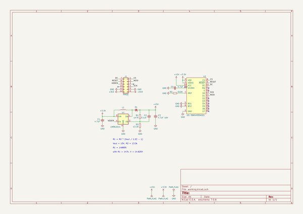
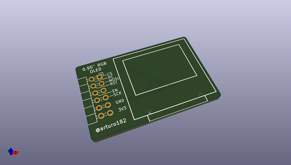
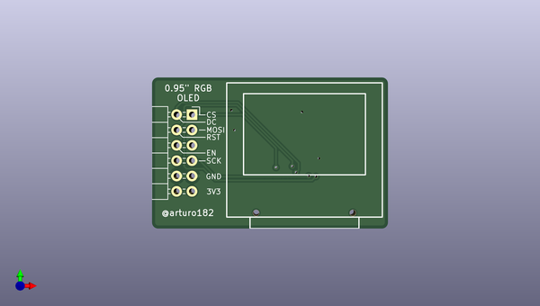
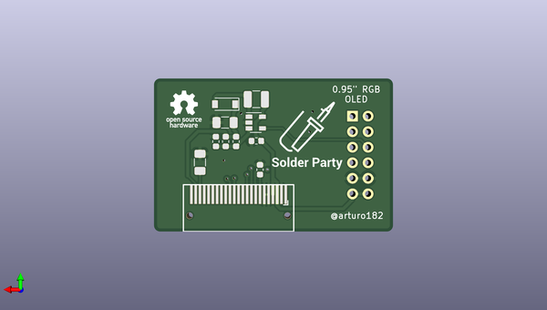

# pmod_rgb_oled_0_95in
 
## summary 
* id: solderparty_pmod_rgb_oled_0_95in_rgb_oled_0_95in
* user: solderparty
* name: pmod_rgb_oled_0_95in
* board: rgb_oled_0_95in
* repo: https://github.com/solderparty/pmod_rgb_oled_0.95in
* src_file_repo_kicad_pcb: rgb_oled_0.95in.kicad_pcb
* src_file_repo_kicad_pcb_link: https://github.com/solderparty/pmod_rgb_oled_0.95in/tree/master/rgb_oled_0.95in.kicad_pcb

* src_file_repo_sch: rgb_oled_0.95in.sch
*
 src_file_repo_sch_link: https://github.com/solderparty/pmod_rgb_oled_0.95in/tree/master/rgb_oled_0.95in.sch
* full details link: https://github.com/oomlout/oomlout_oomp_project_bot_v_2/tree/main/projects/solderparty_pmod_rgb_oled_0_95in_rgb_oled_0_95in/current_version/working  

## schematic  
  
[schematic (pdf)](working_schematic.pdf)  

## pcb  
 
  
  
  
[board (pdf)](working.pdf)  

## working_bom
| Id | Designator | Footprint | Quantity | Designation | Supplier and ref |  | None | 
| --- | --- | --- | --- | --- | --- | --- | --- | 
| 1 | J1 | PMODHeader_2x06_P2.54mm_Horizontal | 1 | PMOD |  |  | [''] | 
| 2 | U2 | UG-9664HDDAG01 | 1 | UG-9664HDDAG01 |  |  | [''] | 
| 3 | C1 | C_0603_1608Metric | 1 | 4.7uF |  |  | [''] | 
| 4 | C2 | C_0603_1608Metric | 1 | 0.1uF |  |  | [''] | 
| 5 | C3,C4 | C_1206_3216Metric | 2 | 4.7uF 16V |  |  | [''] | 
| 6 | D1 | D_SOD-123 | 1 | MBR0520LT1G |  |  | [''] | 
| 7 | L1 | L_1210_3225Metric | 1 | 10uH, 0.48A |  |  | [''] | 
| 8 | R1 | C_0603_1608Metric | 1 | 147k |  |  | [''] | 
| 9 | R2 | C_0603_1608Metric | 1 | 13.3k |  |  | [''] | 
| 10 | R3 | C_0603_1608Metric | 1 | 510K |  |  | [''] | 
| 11 | U1 | SOT-23-5 | 1 | LMR62014 |  |  | [''] | 
| 12 | G*** | SolderParty-Logo_13.5x12.6mm_SilkScreen | 1 | LOGO |  |  | [''] | 

## bom_schematic
| Ref | Qnty | Value | Cmp name | Footprint | Description | Vendor | DNP | 
| --- | --- | --- | --- | --- | --- | --- | --- | 
| C1 | 1 | 4.7uF | C_Small | Capacitor_SMD:C_0603_1608Metric | Unpolarized capacitor, small symbol |  |  | 
| C2 | 1 | 0.1uF | C_Small | Capacitor_SMD:C_0603_1608Metric | Unpolarized capacitor, small symbol |  |  | 
| C3, C4 | 2 | 4.7uF 16V | C_Small | Capacitor_SMD:C_1206_3216Metric | Unpolarized capacitor, small symbol |  |  | 
| D1 | 1 | MBR0520LT1G | D_Schottky_Small | Diode_SMD:D_SOD-123 | Schottky diode, small symbol |  |  | 
| J1 | 1 | PMOD | Conn_02x06_Top_Bottom | Connector_PinHeader_2.54mm_Extra:PMODHeader_2x06_P2.54mm_Horizontal | Generic connector, double row, 02x06, top/bottom pin numbering scheme (row 1: 1...pins_per_row, row2: pins_per_row+1 ... num_pins), script generated (kicad-library-utils/schlib/autogen/connector/) |  |  | 
| L1 | 1 | 10uH, 0.48A | L | Inductor_SMD:L_1210_3225Metric | Inductor |  |  | 
| R1 | 1 | 147k | R_Small | Capacitor_SMD:C_0603_1608Metric | Resistor, small symbol |  |  | 
| R2 | 1 | 13.3k | R_Small | Capacitor_SMD:C_0603_1608Metric | Resistor, small symbol |  |  | 
| R3 | 1 | 510K | R_Small | Capacitor_SMD:C_0603_1608Metric | Resistor, small symbol |  |  | 
| U1 | 1 | LMR62014 | LMR62014XMF | Package_TO_SOT_SMD:SOT-23-5 | 1.4A, 20Vout Step-Up Voltage Regulator, 1.6MHz Frequency, SOT-23-5 |  |  | 
| U2 | 1 | UG-9664HDDAG01 | UG-9664HDDAG01 | Display_Graphics_Extra:UG-9664HDDAG01 |  |  |  | 

